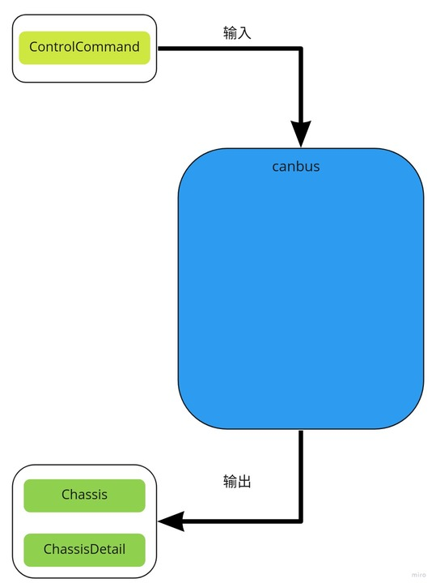
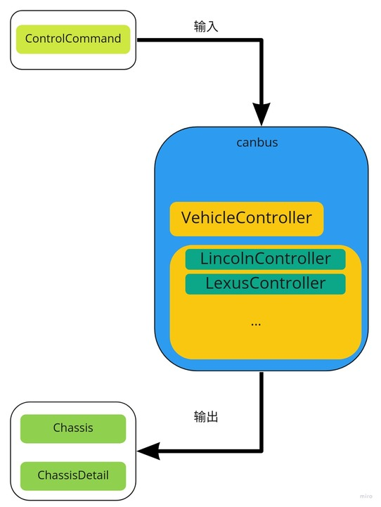

# Dig into Apollo - Canbus 

> 黑发不知勤学早，白首方悔读书迟。


## Table of Contents
- [Canbus模块介绍](#introduction)
- [Canbus模块主流程](#main)


<a name="introduction" />

## Canbus模块介绍
我们先看下什么是Canbus: 控制器局域网 (Controller Area Network，简称CAN或者CAN bus) 是一种车用总线标准。被设计用于在不需要主机（Host）的情况下，允许网络上的节点相互通信。采用广播机制，并利用标识符来定义内容和消息的优先顺序，使得canbus的扩展性良好，同时不基于特殊类型（Host）的节点，增加了升级网络的便利性。  
这里的Canbus模块其实可以称为**Chassis模块**，主要的作用是反馈车当前的状态（航向，角度，速度等信息），并且发送控制命令到车，**可以说Canbus模块是车和自动软件之间的桥梁**。  

那么canbus模块的输入是什么？输出又是什么？  
  
可以看到canbus模块：
* **输入:**
1. ControlCommand

* **输出:**
1. Chassis
2. ChassisDetail
即canbus模块的输入是控制模块发送的控制命令，输出车身当前的信息，这里apollo的上层模块被当做一个can_client来处理，实现收发canbus上的消息。

Canbus模块的目录结构如下：  
```
├── BUILD                    // bazel编译文件
├── canbus_component.cc      // canbus主入口
├── canbus_component.h       
├── canbus_test.cc           // canbus测试
├── common                   //
├── conf                     // 配置文件
├── dag                      // dag依赖
├── launch                   // launch加载
├── proto                    // protobuf文件
├── testdata                 // 测试数据
├── tools                    // 工具
└── vehicle                  //   
```
下面我们来分析下Canbus模块的执行流程。


<a name="main" />

## Canbus模块主流程
canbus的主流程在文件"canbus_component.cc"中，canbus模块为定时触发模块，每10ms执行一次，发布chassis信息:   
```c++
bool CanbusComponent::Proc() {
  PublishChassis();
  if (FLAGS_enable_chassis_detail_pub) {
    PublishChassisDetail();
  }
  return true;
}
```
由于不同型号的车辆的canbus命令不一样，在"/vehicle"中适配了不同型号车辆的canbus格式，所有的车辆都继承自一个Vehicle_controller基类，通过对Vehicle_controller的抽象来发送和读取canbus信息。  
  


## VehicleController


<a name="reference" />

## Reference
[Controller Area Network (CAN BUS) 通訊​協定​原理​概述](https://www.ni.com/zh-tw/innovations/white-papers/06/controller-area-network--can--overview.html)  
