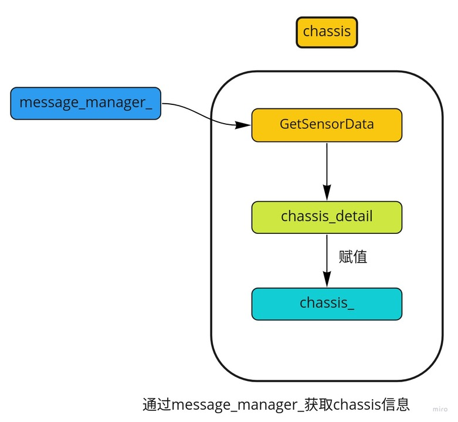

# Dig into Apollo - Canbus 

> 黑发不知勤学早，白首方悔读书迟。


## Table of Contents
- [Canbus模块介绍](#introduction)
- [Canbus模块主流程](#main)


<a name="introduction" />

## Canbus模块介绍
我们先看下什么是Canbus： 控制器局域网 (Controller Area Network，简称CAN或者CAN bus) 是一种车用总线标准。被设计用于在不需要主机（Host）的情况下，允许网络上的节点相互通信。采用广播机制，并利用标识符来定义内容和消息的优先顺序，使得canbus的扩展性良好，同时不基于特殊类型（Host）的节点，增加了升级网络的便利性。  
这里的**Canbus模块其实可以称为Chassis模块**，主要的作用是反馈车当前的状态（航向，角度，速度等信息），并且发送控制命令到车线控底盘，**可以说Canbus模块是车和自动驾驶软件之间的桥梁**。由于这个模块和"drivers/canbus"的联系紧密，因此也一起在这里介绍。  
Canbus模块是车和自动驾驶软件之间的桥梁，通过canbus驱动(drivers/canbus)来实现将车身信息发送给apollo上层软件，同时接收控制命令，发送给汽车线控底盘实现对汽车的控制。  

那么canbus模块的输入是什么？输出是什么呢？  
  
可以看到canbus模块：
* **输入** - 1. ControlCommand（控制命令）
* **输出** - 1. Chassis（汽车底盘信息）, 2. ChassisDetail（汽车底盘信息详细信息）  

Canbus模块的输入是control模块发送的控制命令，输出汽车底盘信息，这里apollo的上层模块被当做一个can_client来处理，实现接收和发送canbus上的消息。

Canbus模块的目录结构如下：  
```
├── BUILD                    // bazel编译文件
├── canbus_component.cc      // canbus主入口
├── canbus_component.h       
├── canbus_test.cc           // canbus测试
├── common                   // gflag配置
├── conf                     // 配置文件
├── dag                      // dag依赖
├── launch                   // launch加载
├── proto                    // protobuf文件
├── testdata                 // 测试数据
├── tools                    // 遥控汽车和测试canbus总线工具
└── vehicle                  //   
```
接着我们来分析下Canbus模块的执行流程。


<a name="main" />

## Canbus模块主流程
Canbus模块的主流程在文件"canbus_component.cc"中，canbus模块为定时触发，每10ms执行一次，发布chassis信息，而ControlCommand则是每次读取到之后触发回调"OnControlCommand"，发送"control_command"到线控底盘。       
```c++
bool CanbusComponent::Proc() {
  PublishChassis();
  if (FLAGS_enable_chassis_detail_pub) {
    PublishChassisDetail();
  }
  return true;
}
```
由于不同型号的车辆的canbus命令不一样，在"/vehicle"中适配了不同型号车辆的canbus消息格式，所有的车都继承自Vehicle_controller基类，通过对Vehicle_controller的抽象来发送和读取canbus信息。  
  


#### 车辆工厂模式(VehicleFactory)
在vehicle中可以适配不同的车型，而每种车型都对应一个vehicle_controller，创建每种车辆的控制器(VehicleController)和消息管理(MessageManager)流程如下： 
  
VehicleFactory类通过创建不同的类型AbstractVehicleFactory，每个车型自己的Factory在创建出对应的VehicleController和MessageManager，用林肯来举例子就是： VehicleFactory创建LincolnVehicleFactory，之后通过CreateMessageManager和CreateVehicleController创建对应的控制器（LincolnController）和消息管理器（LincolnMessageManager）。  
上述代码流程用到了设计模式的工厂模式，通过车辆工厂创造不同的车辆类型。  


## 车辆控制器(LincolnController)
下面以林肯来介绍LincolnController，以及如何接收chassis信息，其它的车型可以以此类推，下面主要分为2部分介绍，第一部分为controller的init->start->stop流程，第二部分为chassis信息获取：
  
可以看到control模块初始化(init)的过程获取了发送的消息的格式，通过can_sender应该发送那些消息，而启动(start)之后启动一个看门狗，检查canbus消息格式是否正确，最后关闭(stop)模块则是结束看门狗进程。  

  
而chassis的获取则是通过message_manager_获取chassis_detail，之后对chassis进行赋值。


## Canbus(驱动程序)
上层的canbus就介绍完成了，而canbus的发送(CanSender)和接收(CanReceiver)，还有消息管理(MessageManager)都是在"drivers/canbus"中实现的。  

## 消息管理器(MessageManager)
MessageManager是如何获取消息的呢？  
首先MessageManager主要的实现就是解析canbus数据，而具体的接收和发送则是在"CanReceiver"和"CanSender"中，拿接收消息举例子，也就是说CanReceiver收到消息后，会调用MessageManager中的parse去解析消息，消息的解析协议在"modules/canbus/vehicle/lincoln/protocol"中，每个消息把自己对应的信息塞到"chassis_detail"中完成了消息的接收。  
  


<a name="reference" />

## Reference
[Controller Area Network (CAN BUS) 通訊​協定​原理​概述](https://www.ni.com/zh-tw/innovations/white-papers/06/controller-area-network--can--overview.html)  
