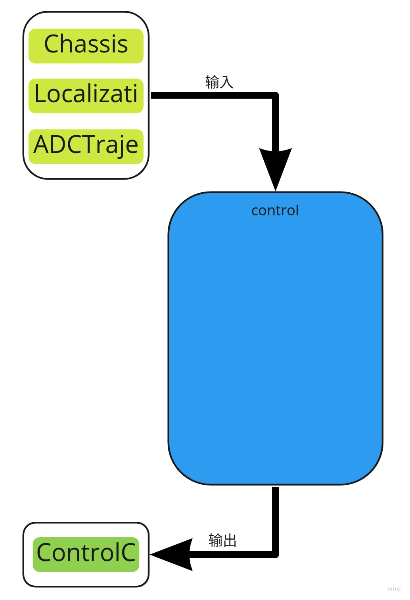
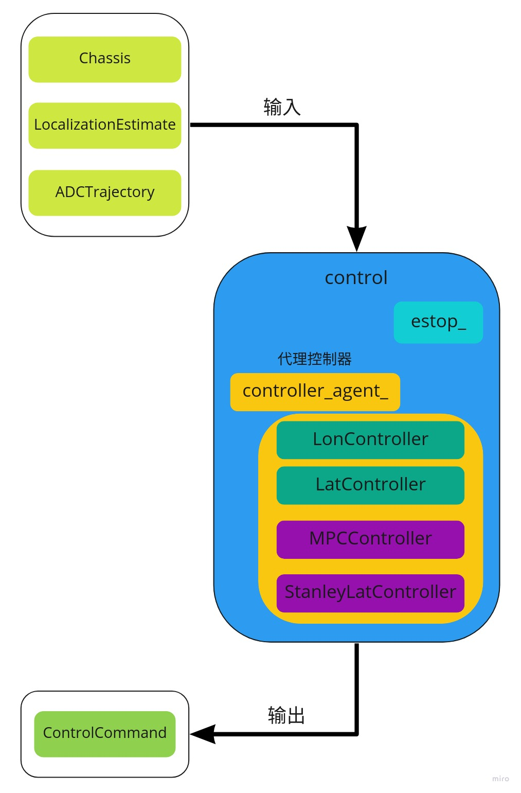
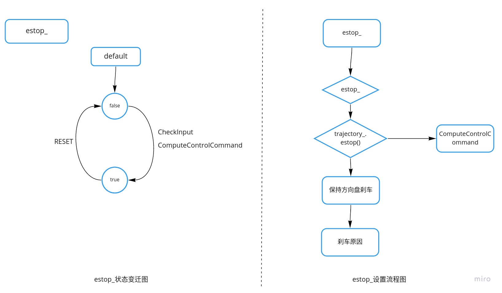
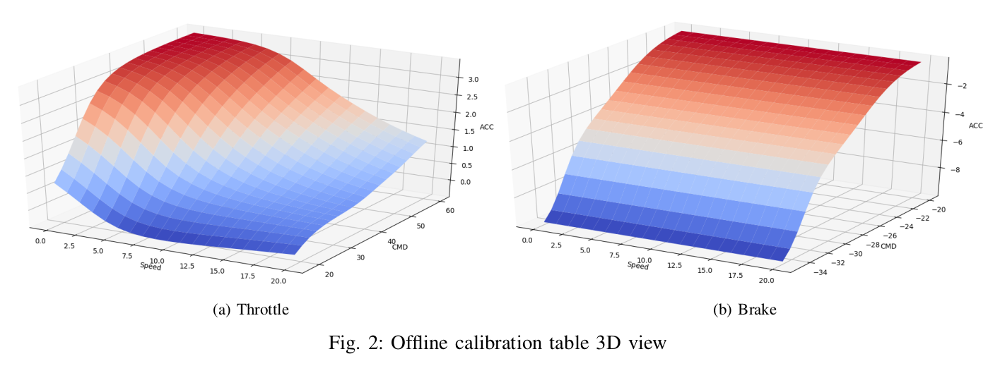
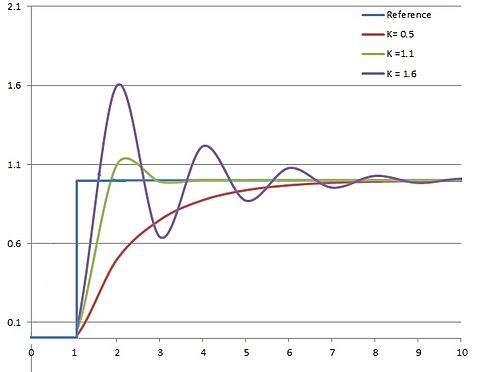

# Dig into Apollo - Control 

## Table of Contents
- [Control模块简介](#introduction)

  

<a name="introduction" />

## Control模块简介
Apollo控制模块的逻辑相对比较简单，控制模块的作用主要是**根据规划(planning)模块生成的轨迹，计算出汽车能够识别的油门，刹车和方向盘信号，控制汽车按照规定的轨迹行驶**。主要是根据汽车动力和运动学的知识，对汽车进行建模，实现对汽车的控制。目前apollo主要用到了2种控制方式：PID控制和模型控制。   
 
首先我们需要搞清楚control模块的输入是什么，输出是什么？  
    
可以看到control模块：
* **输入** - Chassis(车辆状态信息), LocalizationEstimate(位置信息), ADCTrajectory(planning模块规划的轨迹)
* **输出** - ControlCommand(油门，刹车，方向盘)

Control模块的目录结构如下：  
```
├── BUILD      // bazel编译文件
├── common     // PID和控制器的具体实现     --- 算法具体实现
├── conf       // 配置文件                 --- 配置文件
├── control_component.cc  // 模块入口
├── control_component.h   
├── control_component_test.cc
├── controller           // 控制器         --- 具体的控制器实现
├── dag                  // dag依赖
├── integration_tests    // 测试
├── launch               // launch加载
├── proto                // protobuf文件，主要各个控制器的配置数据结构
├── testdata             // 测试数据
└── tools                // 根据类
```

下面我们来分析下control模块的执行流程。

## Control主流程
Control模块的入口在"control_component.cc"中，和其他的模块一样，Control模块注册为一个cyber的模块，其中control模块为定时模块，也就是每隔10ms执行一次命令。这里需要注意了planning模块的输出是100ms一次，也就是说100ms才给出一条曲线，而control模块会根据这条曲线，每10ms处理一次，控制汽车按照指定的速度到达指定的位置。  
Control模块执行的主函数是"ControlComponent::Proc()"即每10ms调用一次该函数，处理的流程在该函数中：  
```c++
bool ControlComponent::Proc() {
  // 1. 读取输入数据，通过拷贝读取输入信息
  chassis_reader_->Observe();
  const auto &chassis_msg = chassis_reader_->GetLatestObserved();
  if (chassis_msg == nullptr) {
    AERROR << "Chassis msg is not ready!";
    return false;
  }

  OnChassis(chassis_msg);

  ...
  const auto &trajectory_msg = trajectory_reader_->GetLatestObserved();

  ...
  const auto &localization_msg = localization_reader_->GetLatestObserved();


  ControlCommand control_command;
  // 2. 生成控制命令
  Status status = ProduceControlCommand(&control_command);

  ...

  common::util::FillHeader(node_->Name(), &control_command);
  // 3. 发送控制命令
  control_cmd_writer_->Write(std::make_shared<ControlCommand>(control_command));

  return true;
}
```
上述的流程大概分为3个部分：
1. **读取输入数据**
2. **生成控制命令**
3. **发送控制命令**  

生成控制命令的核心函数在"ProduceControlCommand"中，其实这个函数中包含了参数检查和_estop(紧急情况)的处理，真正生成命令的函数只有一行:  
```c++
    Status status_compute = controller_agent_.ComputeControlCommand(
        &local_view_.localization, &local_view_.chassis,
        &local_view_.trajectory, control_command);
```

#### 控制器注册
最后通过"controller_agent_"产生控制命令，而"controller_agent_"是一个代理控制器，由于有多个控制器，其他的控制器通过注册到代理控制器，从而实现多个控制器的调用（是否用到了设计模式的代理模式）：  
  
其中控制器包括：
* 纵向控制
* 横向控制
* 模型预测控制
* Stanley横向控制
> Stanley横向控制可以[参考](https://www.ri.cmu.edu/pub_files/2009/2/Automatic_Steering_Methods_for_Autonomous_Automobile_Path_Tracking.pdf)  

那么这些控制器是如何注册到"controller_agent_"的呢？  
```c++
// 1. 在ControlComponent::Init()中调用初始化
bool ControlComponent::Init() {
  // 注册控制器
  if (!controller_agent_.Init(&control_conf_).ok()) {
    monitor_logger_buffer_.ERROR("Control init controller failed! Stopping...");
    return false;
  }
}

// 2. 在ControllerAgent类中注册和初始化
Status ControllerAgent::Init(const ControlConf *control_conf) {
  // 注册控制器
  RegisterControllers(control_conf);
  // 实例化控制器
  CHECK(InitializeConf(control_conf).ok()) << "Fail to initialize config.";
  // 控制器初始化
  for (auto &controller : controller_list_) {
    if (controller == NULL || !controller->Init(control_conf_).ok()) {
      if (controller != NULL) {
        AERROR << "Controller <" << controller->Name() << "> init failed!";
        return Status(ErrorCode::CONTROL_INIT_ERROR,
                      "Failed to init Controller:" + controller->Name());
      } else {
        return Status(ErrorCode::CONTROL_INIT_ERROR,
                      "Failed to init Controller");
      }
    }
    AINFO << "Controller <" << controller->Name() << "> init done!";
  }
  return Status::OK();
}
```
上面就是control模块的主流程，我们接着介绍下control模块中的"pad message"和"estop_"，然后再介绍各个控制器的具体实现。  

#### Pad消息
Pad消息通过发送状态来控制control模块的模式，其中"DrivingAction"一共有3种状态，在"pad_msg.proto"中:
```
enum DrivingAction {
  STOP = 0;
  START = 1;
  RESET = 2;
};
```
在control模块中只能使用pad "RESET"来清空"estop_"的状态。实际上control模块会判断"driving_mode"来决定是否启动自动驾驶，而"driving_mode"是通过pad信息发送状态给"canbus"模块来控制的，这会在canbus模块分析中详细介绍。  
总之pad信息的2个作用是:  
1. **发送消息给canbus模块，来控制driving_mode，control模块判断当前driving_mode的状态来决定是否启动自动驾驶**
2. **通过reset来清空estop_的状态**

那么"estop_"有什么作用呢？  
#### estop_标志位
estop_标志位的作用是判断control模块是否处于紧急状态，而触发紧急停车。那么在哪些状态下，"estop_"为真，汽车进入紧急停车状态呢？  
1. 输入错误(CheckInput返回false)
2. 计算控制命令失败(ComputeControlCommand失败)
3. planning模块直接给出是否紧急停车   
下面是"estop_"的状态变迁图和紧急停车流程:  
  

紧急停车的流程很好理解，我们学驾照的时候都知道，紧急停车的时候不能够狂打方向盘，特别是高速的时候，容易侧翻，因此这里的紧急停车流程也是保持方向盘，然后紧急制动。  


首先我们把汽车的控制分为横向控制和纵向控制2部分，其中纵向控制控制通过油门和刹车控制车在纵向的加减速，而横向控制则通过控制方向盘的转动来控制前轮的方向，从而控制汽车行驶的方向。  
## LonController控制器
纵向控制器，主要是通过油门和刹车控制车纵向的速度。汽车的纵向模型比较简单，我们可以通过经典力学对汽车进行建模，汽车的纵向受力很简单，如果是前轮驱动，那么前轮提供一个向前的滚动摩擦，后轮有一个滚动摩擦阻力再加上风阻，如果有坡度则再加上重力分量，这就构成了汽车的纵向受力模型：  
  
纵向控制要实现的目标是让汽车在指定的时间内到达指定的地点，因此首先是保证位置准确，如果能够直接通过油门去控制汽车的位置，那么采用单一的PID环就够了，重点是位置是和速度与时间相关的。因此先通过位置PID得到需要的速度，然后再通过速度PID得到需要多大油门，这样的方式叫做串级PID控制器。通过2级PID来控制汽车的速度，从而确定需要踩多少的油门，在现在自动驾驶普遍是电动汽车的情况下，汽车的动力实际上由内燃机换成了电动马达，这种控制方式完全可以由伺服控制器来解决，传统的伺服控制器实现了位置控制，速度控制，可以把汽车的控制模块直接由伺服控制器来替代（也许可以解放汽车的控制，如果是线性的电机，那么其实很好办，油门可以直接对应为电机的电流，而电流对应电机输出的扭矩大小）。单汽车有个最大的不同点是后退需要换倒车档。
下面是串级PID的示意图，其中先根据位置误差得到速度，然后根据速度误差得到油门和刹车，同时在汽车有俯仰角度（即汽车行驶在有坡度的路面上）这时候会对PID提供重力分量的补偿：  
      

#### 校准表
知道速度之后我们可以根据当前速度的误差，来确定是增大油门或者是刹车，而油门和速度的关系是如何对应的呢，也就是当你发现速度相差为3km/h，你应该踩多大油门呢？当然你可以先假设一个值，比如油门增加2，如果速度低了你在增加到3，总之根据一个经验值，然后再通过PID算法去调节，那怎么去拟合速度和油门的曲线呢？  
我们需要控制汽车到达某个速度，根据牛顿经典力学，只需要知道汽车的初速度和加速度，就可以知道物体一段时候后的速度。因此我们只需要找到速度，加速度和油门的关系，就可以通过控制汽车的加速度来让汽车达到某个速度。也就是对速度加速度和油门的关系进行建模，得到它们之间的关系，Apollo采用的是在实际的汽车行驶过程中记录不同速度下，不同的油门值汽车的加速度是多大，从而得到一张表格，最后通过查表的方式来得到具体的油门和刹车值大小。  
    
这个表的生成需要测试每种油门以及每种速度下的表现，但是表不可能列出无限种数据，因此最后还是需要通过插值的方式来得到最后的结果。  

#### PID参数调节
什么样的PID参数比较合适？这一部分可以参考WIKI百科的PID参数动画。调试参数的方法是先调节速度环，再调节位置环；先调节比例系数，在调节积分系数。  
  
另外关于PID控制的时候，正常情况下是没有问题，如果遇到路面不平的情况，相当于一张巨人的大手在拨弄小车，这样就对PID引入了一个震荡反馈，震荡的引入之后系统是否能够保持稳态呢，这就是PID控制需要研究的范围？？？

## LatController控制器
纵向控制主要是控制速度，而横向控制主要是控制路径，即在方向盘转角一定的情况下，汽车行驶的路径是固定的，速度的快慢只是影响汽车行驶的时间，纵向控制在转弯时候的受力模型有改变吗？？？


## 问题
1. 遇到上坡\下坡的情况，原来的系数表就只能提供一个参考，如何提供补偿，PID的每次输入都是从表中查询还是根据调节的结果来的？
2. 遇到下雨的时候，路面的摩擦系数改变和上述问题一样
3. 遇到长下坡，PID调节是否会和人一样“不能长时间踩脚踏板”
4. 转弯的场景是否适合这个参数？
5. 是否所有的场景都适合这个参数？比如自主泊车的情况？
6. 提供的是TrajectoryPoint，里面包含距离，速度，加速度和时间，这3者只要知道2者即可以了。控制的时候如何选择的颗粒度？比如提供的轨迹的时间间隔是否固定，是否每次都需要control模块自己调节（在时间间隔比较长的情况下），PID每次只能参考一个标准，这里是以距离为准，还是已速度为准？如果是，速度还有何意义？planning生成的TrajectoryPoint是否符合物理学规律？


## Reference
[Apollo代码学习(一)—控制模块概述](https://blog.csdn.net/u013914471/article/details/82775091)  
[百度Apollo 2.0 车辆控制算法之LQR控制算法解读](https://blog.csdn.net/weijimin1/article/details/85794084)  
[Apollo代码学习(五)—横纵向控制](https://blog.csdn.net/u013914471/article/details/83748571)  
[Apollo自动驾驶入门课程第⑩讲 — 控制（下）](https://blog.csdn.net/cg129054036/article/details/83413482)  
[how_to_tune_control_parameters](https://github.com/ApolloAuto/apollo/blob/master/docs/howto/how_to_tune_control_parameters.md)  
[throttle-affect-the-rpm-of-an-engine](https://www.physicsforums.com/threads/how-does-the-throttle-affect-the-rpm-of-an-engine.832029/)  
[PID_controller](https://en.wikipedia.org/wiki/PID_controller)  
[Stanley横向控制](https://www.ri.cmu.edu/pub_files/2009/2/Automatic_Steering_Methods_for_Autonomous_Automobile_Path_Tracking.pdf)   


https://www.mathworks.com/help/mpc/ug/adaptive-cruise-control-using-model-predictive-controller.html  
http://ctms.engin.umich.edu/CTMS/index.php?example=CruiseControl&section=SystemModeling  
https://www.mathworks.com/help/physmod/sdl/ug/about-the-complete-vehicle-model.html  
https://www.mathworks.com/help/physmod/sdl/ug/control-vehicle-throttle-input-using-a-powertrain-blockset-driver.html  

