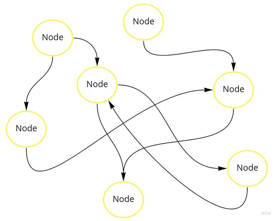
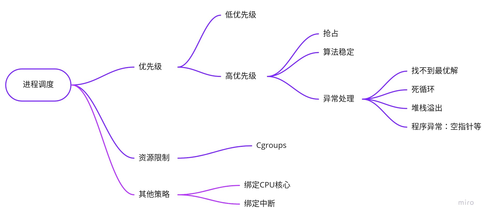

# Dig into Apollo - Cyber 

## Table of Contents
- [How do you design cyber?](#how)
- [需求分析](#requirements)
- [系统设计](#design)
  - [随意的假设](#hypothesis)
  - [多节点](#multinode)
  - [通信方式](#communication)
  - [资源调度](#schedule)
    - [linux进程调度](#linux_schedule)
    - [无人驾驶线程调度](#auto_schedule)
  - [软件复用](#reuse)
  - [快速测试](#test)
- [其他](#other)
  - [云平台](#cloud)
- [Reference](#reference)
  

<a name="how" />

## How do you design cyber?

无人驾驶车借鉴了很多机器人领域的技术，我们可以把无人车看做一个轮式机器人。Apollo的计算平台之前一直采用的是ROS，3.5版本用Cyber替换了这一架构，那么如果让我们来重新设计这一个框架，我们需要支持哪些特性呢，我们如何去实现它呢？  

* 我们需要一个什么样的系统？  
* 如何保证系统的稳定性和灵活性？  
* 如何来调试和维护这样复杂的系统？  

<a name="requirements" />

## 需求分析

我们先借鉴下ROS的思路：  
**分布式计算** 现代机器人系统往往需要多个计算机同时运行多个进程，例如：
* 一些机器人搭载多台计算机，每台计算机用于控制机器人的部分驱动器或传感器；
* 即使只有一台计算机，通常仍将程序划分为独立运行且相互协作的小的模块来完成复杂的控制任务，这也是常见的做法；
* 当多个机器人需要协同完成一个任务时，往往需要互相通信来支撑任务的完成；

> 单计算机或者多计算机不同进程间的通信问题是上述例子中的主要挑战。ROS为实现上述通信提供两种相对简单、完备的机制。

**软件复用** 随着机器人研究的快速推进，诞生了一批应对导航、路径规划、建图等通用任务的算法。当然，任何一个算法实用的前提是其能够应用于新的领域，且不必重复实现。事实上，如何将现有算法快速移植到不同系统一直是一个挑战，ROS 通过以下两种方法解决这个问题。
* ROS 标准包（Standard Packages）提供稳定、可调式的各类重要机器人算法实现。
* ROS通信接口正在成为机器人软件互操作的事实标准，也就是说绝大部分最新的硬件驱动和最前沿的算法实现都可以在ROS中找到。例如，在ROS的官方网页上有着大量的开源软件库，这些软件使用ROS通用接口，从而避免为了集成它们而重新开发新的接口程序。
> 综上所述，开发人员将更多的时间用于新思想和新算法的设计与实现，尽量避免重复实现已有的研究结果。

**快速测试** 为机器人开发软件比其他软件开发更具挑战性，主要是因为调试准备时间长，且调试过程复杂。况且，因为硬件维修、经费有限等因素，不一定随时有机器人可供使用。ROS提供两种策略来解决上述问题。
* 精心设计的ROS系统框架将底层硬件控制模块和顶层数据处理与决策模块分离，从而可以使用模拟器替代底层硬件模块，独立测试顶层部分，提高测试效率。
* ROS 另外提供了一种简单的方法可以在调试过程中记录传感器数据及其他类型的消息数据，并在试验后按时间戳回放。通过这种方式，每次运行机器人可以获得更多的测试机会。例如，可以记录传感器的数据，并通过多次回放测试不同的数据处理算法。在 ROS 术语中，这类记录的数据叫作包（bag），一个被称为rosbag的工具可以用于记录和回放包数据。
* 用户通常通过台式机、笔记本或者移动设备发送指令控制机器人，这种人机交互接口可以认为是机器人软件的一部分。
> 采用上述方案的一个最大优势是实现代码的“无缝连接”，因为实体机器人、仿真器和回放的包可以提供同样（至少是非常类似）的接口，上层软件不需要修改就可以与它们进行交互，实际上甚至不需要知道操作的对象是不是实体机器人。


参考上述实现，我们可以把需求细化为以下几个方面：  
  

> 实际上Apollo主要用到了ROS消息通信的功能，同时也用到了录制bag包等一些工具类。所以目前Cyber的首要设计就是替换ROS消息通信的功能。

<a name="design" />

## 系统设计

<a name="hypothesis" />

#### 随意的假设

按照上述需求，我们可以随便假想，或者根据自己的理解先画出系统的草图，这里我们要实现一个分布式的系统：  
  
1. 上述的系统是一个分布式系统，每个节点作为一个Node。
2. 上述系统每个节点之间都可以相互通信，一个节点下线，不会导致到整个系统瘫痪。
3. 上述系统可以灵活的增加删除节点。

那么我们再看下其他的设计方式：  
  
上述系统采用了集中式的消息管理，每个节点之间通讯必须经过主节点来转发对应的消息，如果主节点下线，那么所有的节点都会通信失败，导致系统瘫痪。
1. 上述系统是一个分布式系统，每个节点作为一个Node。
2. 上述系统每个节点通过主节点通信，主节点下线会导致系统奔溃。
3. 上述系统可以灵活的增加删除节点。
对上述系统，一个补救措施就是在增加一个主节点，作为备份，当主节点下线时，启动备份主节点。

> 这2种方式的主要区别就是通信方式的区别。

当然集中式的消息管理是否有好处呢？集中式的消息处理天然支持管理节点的功能，而点对点的消息处理不支持。例如：
* 当一个节点有10s没有发送消息，那么集中式的消息可以监控并且知道这个节点是否出故障了；
* 集中式的消息可以知道哪些节点在线去找到这些节点，这在多机网络通信的时候很管用，节点只需要注册自己的IP地址，然后由管理节点告诉你去哪里拿到消息。

  

上述只是一个初步的想法，那么基于上面的启发，我们针对上述的每项需求，完成我们的系统设计。  
  

我们接下来详细的分析每个需求：  
<a name="multinode" />

## 多节点
1. 节点管理
2. 节点依赖

<a name="communication" />

## 通信方式
1. 点对点
2. 采用共享内存的方式可以提高效率，需要注意并发访问时候的问题

<a name="schedule" />

## 资源调度
1. 进程调度算法改为实时算法
2. 进程有优先级
3. 支持并发
4. 能够限制系统的资源占用

<a name="linux_schedule" />

#### linux进程调度
操作系统最基本的功能就是管理线程，linux的线程调度采用的是CFS(Completely Fair Scheduler)算法，我们先看下没有调度和有调度的情况下的差异。  
  
上述是单个CPU核心的情况下，左边是没有CPU调度的情况，任务1在进行完计算之后，会读取内存或者IO的数据，这时候CPU会进入等待状态，CPU在等待的时候没有做任何事情。而右边采用了调度策略，在CPU等待的过程中，任务1主动让出CPU，这样下一个任务就可以在当前任务等待IO的过程中执行，可以看到对任务的调度合理的利用了CPU，使得CPU的利用率更高，从而使任务执行的更快。  

linux内核又分为可以抢占的和非抢占的，非抢占的内核禁止抢占，即在一个任务执行完成之前，除非他主动让出CPU或者执行完成，CPU会一直被这个任务占据，不能够被更高优先级的任务抢占。而抢占式的内核则支持在一个任务执行的过程中，如果有更高优先级的任务请求，那么内核会暂停现在运行的任务，转而运行优先级更高的任务，显然抢占式的内核的实时性更好。  

CPU把任务根据优先级划分，并且划分不同的时间片，通过时间片轮转，使CPU看起来在同一时间能够执行多个任务，就好像一个人同时交叉的做几件事情，看起来多个事情是一起完成的一样。每个进程会分配一段时间片，在当前进程的时间片用完的时候，如果没有其他任务，那么会继续执行；如果有其他任务，那么当前任务会暂停，切换到其他任务执行。这样带来一个问题就是如何判断进程的优先级。  

内核把任务做了区分，分为交互型和脚本型，如果是交互型的进程，对实时性的要求比较高，但是大部分情况下又不会一直运行，典型的情况是，键盘输入的情况，大部分情况下键盘可能没有输入，但是一旦用户输入了，又要求能够立刻响应，否则用户会觉得输入很卡顿。而脚本型因为一直在后台运行，对实时性的要求没那么高，所以不需要立刻响应。linux通过抢占式的方式，对任务的优先级进行排序，交互型进程的优先级要比脚本型进程的优先级要高。从而在交互性进程到来之前能够抢占CPU，优先运行。还有一类是实时进程，这类进程的优先级最高，实时进程必须要保证执行，因此会有限抢占其他进程。

如果单纯的根据优先级，低优先级的任务可能很长一段时间都得不到执行，因此需要更加公平的算法，在一个进程等待时间太长的时候，会动态的提高它的优先级，如果一个进程执行很长的一段时间了，那么会动态降低它的优先级，这样带来的好处是，不会导致低优先级的长期得不到CPU，而高优先级的CPU长期霸占CPU，linux采用的就是CFS(Completely Fair Scheduler)算法，通过该算法可以保证进程能够相对公平的占用CPU。  

同时在多CPU和多核场景下，由于每个核心的进程调度队列都是单独的，那么会导致一个问题，如果任务都集中在某一个CPU核心，而其他的CPU核心的队列都是空闲状态，这样也会导致CPU的性能低下，在这种情况下，linux会把任务迁移到其他CPU核心，使得CPU之间的负载均衡，linux引入了Cgroups用来限制，控制与分离一个进程组群的资源（如CPU、内存、磁盘输入输出等）。当然，线程迁移会带来开销，有些时候我们会绑定任务到某一个核心，防止线程迁移。同时如果系统频繁的中断，CPU会频繁停下任务去处理中断，有些场景(网络设备）需要频繁处理网络中断的情况下，通常会绑定中断到某一个CPU核心，这样其他的核心就不会频繁中断，减少了进程切换的开销。  

<a name="auto_schedule" />

#### 无人驾驶线程调度
参考linux的线程调度，我们也可以思考下无人驾驶线程调度的算法。  
我们假设有如下线程：定位，感知，规划，控制，传感器读取，日志，地图（这只是对任务的抽象，当然系统的进程不可能只有这么几个）。假设目前的CPU只有2个核心，那么我们如何规划这些任务的优先级呢？  
1. 首先，我们假设定位，感知，规划和控制，传感器读取的优先级比日志和地图更高。这也很容易理解，打不打日志和地图读取的慢点对系统的影响不大，而上述的模块如果读取的很慢，则会导致系统故障。
2. 接下来我们再看优先级高的模块，因为目前我们只有2核心，所以不可能同时执行上述所有模块，只能通过时间片轮转来实现。这里就引入了一个问题，如果分配的时间片太长，会导致响应不及时，如果分配的时间片太短，又会导致线程切换开销，需要折中考虑。如果运行过程中感知和规划正在执行，并且分配的时间片还没有用完，那么控制模块不会抢占CPU，直到运行中的模块时间片用完。
3. 对这些模块的算法复杂度有要求，如果感知模块采用了复杂度较高的算法提高准确率，这样导致的结果是感知会占用更多的CPU时间，其他模块每次需要和感知模块竞争CPU，结果就是导致总体的执行时间会变长。比如，规定感知只需要在200ms的时候处理完任务就可以了，之前感知的算法实现是100ms，而控制模块的时间是100ms，CPU的时间片是50ms，那么感知需要2个时间片，控制需要2个时间片，总的需要时间是200ms，控制模块完成的时间由于时间片轮转，可能是150ms。但是如果感知为了提高效果，增加了算法的复杂度，运行时间改为200ms，感知模块照常能够完成自己的任务，因为只要200ms完成任务，感知模块就完成了任务，总的需要的时间可能是300ms，但是引入的另外的问题是由于竞争控制模块可能完成的时间是200ms，这样就会导致控制模块的时延达不到要求。其实这样的情况总的来说一是需要升级硬件，比如增加CPU的核数；另外的办法就是降低系统算法的复杂度，每个模块的任务要竟可能的高效。
4. 通过上面的要求也可以看到，系统进程的算法复杂度要尽可能的稳定，不能一下子是50ms，一下子是200ms，或者直接找不到最优解，这是最坏的情况，如果各个模块的算法都不太稳定，带来的影响就是当遇到极端情况，每个模块需要的时间都变多时候，系统的负载会一下子变高，导致模块的相应不及时，这对自动驾驶是很致命的问题。
5. 上述是理想情况下，那么我们会遇到哪些情况，系统的进程会奔溃或者一直占用CPU的情况呢？
* 找不到最优解，死循环。大部分情况下程序没有响应是因为找不到最优解，或者死循环，这种状态可以通过代码和算法实现保证。
* 堆栈溢出，内存泄露，空指针。这种情况是由于程序编写错误，也可以通过代码保证。
* 硬件错误。极小概率的情况下，CPU的寄存器会出错，嵌入式(powerpc)的CPU都会有冗余校正，而家用或者服务器(intel)没有这种设计，这种情况下只能重启进程，或者硬件。

我们根据上述的思路，可以得到如下图所示：  
  
* 把控制的优先级设置到最高，规划其次，感知和定位的优先级设置相对较低，因为控制和规划必须马上处理，感知如果当前帧处理不过来，大不了就丢掉，接着处理下一帧。当然这些线程都需要设置为实时进程。而地图，日志，定位等的优先级设置较低，在其他高优先级的进程到来时候会被抢占。
* Canbus等传感器数据，可以绑定到一个CPU核心上处理，这样中断不会影响到其他核心，导致频繁线程切换。
* 对线程设置cgroups，可以控制资源使用，设置优先级等。
* 测试算法的时间复杂度，是否稳定。


<a name="reuse" />

## 软件复用
1. 包管理
2. 工具类

<a name="test" />

## 快速测试
1. 人机交互
2. 日志
3. 调试功能
4. 通信接口


<a name="other" />

## 其他

<a name="cloud" />

#### 云平台
如果需要监控线上无人车的状态，那么需要无人车提供连接到云的能力，即发送消息和接收消息的能力。Cyber需要支持能够发送消息给云端，并且接收来自云端消息的能力。


# cyber分析

## cyber入口
cyber的入口在"cyber/mainboard"目录，我们先看下目录结构：
```
.
├── mainboard.cc             // 入口
├── module_argument.cc       // 模块参数
├── module_argument.h
├── module_controller.cc     // 模块控制
└── module_controller.h
```
根据文件名称也可以大概猜到cyber主目录的工作，cyber主函数通过模块的参数加载cyber中的所有模块，而cyber模块是有依赖顺序的，每个cyber模块都有一个DAG文件，这个文件声明了各个模块的依赖关系，而module_controller大概率就是控制模块的加载顺序。接下来我们通过看代码验证我们的猜想是否正确。  
我们从"mainboard.cc"开始，阅读代码之前的头文件相当关键，头文件可以告诉我们文件之间的依赖关系，引用了哪些模块。我们可以看到主模块引用了"mainboard/module_argument.h"和"mainboard/module_controller.h"，所以我们先从"mainboard.cc"开始看，剩下的2个文件自然会在"mainboard.cc"中引用。还有一些其它的引用是状态和标志位，可以先略过。
```c++
#include "cyber/common/global_data.h"
#include "cyber/common/log.h"
#include "cyber/init.h"
#include "cyber/mainboard/module_argument.h"         // "mainboard.cc"引用
#include "cyber/mainboard/module_controller.h"       // "mainboard.cc"引用
#include "cyber/state.h"

#include "gflags/gflags.h"
```
接下来我们看下函数的主流程：  
```c++
int main(int argc, char** argv) {
  google::SetUsageMessage("we use this program to load dag and run user apps.");

  // 解析模块参数
  // parse the argument
  ModuleArgument module_args;
  module_args.ParseArgument(argc, argv);

  // 初始化cyber
  // initialize cyber
  apollo::cyber::Init(argv[0]);

  // 启动模块
  // start module
  ModuleController controller(module_args);
  if (!controller.Init()) {
    controller.Clear();
    AERROR << "module start error.";
    return -1;
  }

  // 等待cyber关闭
  apollo::cyber::WaitForShutdown();
  controller.Clear();
  AINFO << "exit mainboard.";

  return 0;
}
```
接下来我们详细的分析每个过程。  
* **解析模块参数** 解析模块参数在"module_argument.h"和"module_argument.cc"中的"ModuleArgument"类中，具体的实现如下
```c++
void ModuleArgument::ParseArgument(const int argc, char* const argv[]) {
  
  // 解析输入参数
  GetOptions(argc, argv);
  
  ...
  
  // 设置执行组，类似linux的cgroups
  GlobalData::Instance()->SetProcessGroup(process_group_);
  // 设置调度器名称
  GlobalData::Instance()->SetSchedName(sched_name_);
  // 打印模块的信息：名称，组，DAG配置
  AINFO << "binary_name_ is " << binary_name_ << ", process_group_ is "
        << process_group_ << ", has " << dag_conf_list_.size() << " dag conf";
  // 打印所有模块的依赖关系
  for (std::string& dag : dag_conf_list_) {
    AINFO << "dag_conf: " << dag;
  }
}
```

* **初始化cyber** 初始化cyber就是cyber目录下的"init.h"和"init.cc"中，具体的实现如下：
```c++
bool Init(const char* binary_name) {
  // 获取锁，为了改变state状态而获取锁
  std::lock_guard<std::mutex> lg(g_mutex);
  // 如果已经初始化，则返回失败
  if (GetState() != STATE_UNINITIALIZED) {
    return false;
  }

  // 初始化日志，并且把打印日志线程放入调度器
  InitLogger(binary_name);
  auto thread = const_cast<std::thread*>(async_logger->LogThread());
  scheduler::Instance()->SetInnerThreadAttr("async_log", thread);
  std::signal(SIGINT, OnShutdown);
  
  // 注册退出句柄ExitHandle，调用Clear()函数执行
  // Register exit handlers
  if (!g_atexit_registered) {
    if (std::atexit(ExitHandle) != 0) {
      AERROR << "Register exit handle failed";
      return false;
    }
    AINFO << "Register exit handle succ.";
    g_atexit_registered = true;
  }
  // 设置状态为已经初始化
  SetState(STATE_INITIALIZED);
  return true;
}
```

* **启动模块** 启动模块功能在"module_controller.h"和"module_controller.cc"中实现，具体的流程如下：  
```c++
// 1. 构造ModuleController

// 2. ModuleController控制器初始化

```

## classloader(类动态加载)
首先我们需要搞清楚classloader的作用，classloader动态的加载".so"文件，从而实现动态的加载和卸载模块。说的直白一点就是cyber通过classloader动态的加载定位，感知，规划，控制等模块。这样的好处是当一个模块奔溃时候，只需要动态的从新加载这个模块就可以了，而不需要从新加载其他模块。  
下面我们来看一下"ClassLoader"类：
```c++
  // 动态库是否已经加载
  bool IsLibraryLoaded();
  // 加载动态库
  bool LoadLibrary();
  // 卸载动态库
  int UnloadLibrary();
  // 获取动态库路径
  const std::string GetLibraryPath() const;
  // 获取有效的类名称 
  std::vector<std::string> GetValidClassNames();
  // 创建对象
  std::shared_ptr<Base> CreateClassObj(const std::string& class_name);
  // 类是否有效
  bool IsClassValid(const std::string& class_name);
```
也就是说classloader提供了一系列的方法来实现类的加载和卸载。下面我们来逐个分析classloader的工作原理：

todo: 获取classloader中加载的类的集合？？？
```c++
template <typename Base>
std::vector<std::string> ClassLoader::GetValidClassNames() {
  return (utility::GetValidClassNames<Base>(this));
}
```

todo: 查找类是否加载？
```
template <typename Base>
bool ClassLoader::IsClassValid(const std::string& class_name) {
  std::vector<std::string> valid_classes = GetValidClassNames<Base>();
  return (std::find(valid_classes.begin(), valid_classes.end(), class_name) !=
          valid_classes.end());
}
```

todo: 根据类名称创建对象，并且返回对象指针，注意创建对象的过程中classobj_ref_count_加1，释放对象之后减1，通过计数器表明类加载器是否还存在引用关系，而不会释放掉。关于只能指针指定删除器可以[参考](https://zh.cppreference.com/w/cpp/memory/shared_ptr/shared_ptr)  
```
template <typename Base>
std::shared_ptr<Base> ClassLoader::CreateClassObj(
    const std::string& class_name) {
  if (!IsLibraryLoaded()) {
    // 加载动态库    
    LoadLibrary();
  }

  // 创建对象
  Base* class_object = utility::CreateClassObj<Base>(class_name, this);
  if (class_object == nullptr) {
    AWARN << "CreateClassObj failed, ensure class has been registered. "
          << "classname: " << class_name << ",lib: " << GetLibraryPath();
    return std::shared_ptr<Base>();
  }

  std::lock_guard<std::mutex> lck(classobj_ref_count_mutex_);
  classobj_ref_count_ = classobj_ref_count_ + 1;

  // 构造智能指针，并且指定删除器 
  std::shared_ptr<Base> classObjSharePtr(
      class_object, std::bind(&ClassLoader::OnClassObjDeleter<Base>, this,
                              std::placeholders::_1));
  return classObjSharePtr;
}

template <typename Base>
void ClassLoader::OnClassObjDeleter(Base* obj) {
  if (nullptr == obj) {
    return;
  }

  std::lock_guard<std::mutex> lck(classobj_ref_count_mutex_);
  delete obj;
  --classobj_ref_count_;
}
```

接着看下"class_loader.cc"中的构造函数，可以看到一个ClassLoader需要指定动态库路径，初始化引用次数，然后加载对应的动态库。  
```c++
ClassLoader::ClassLoader(const std::string& library_path)
    : library_path_(library_path),
      loadlib_ref_count_(0),
      classobj_ref_count_(0) {
  LoadLibrary();
}
```

动态库是否已经加载
```
bool ClassLoader::IsLibraryLoaded() {
  return utility::IsLibraryLoaded(library_path_, this);
}
```

加载动态库，每次加载动态库的引用计数加1
```
bool ClassLoader::LoadLibrary() {
  std::lock_guard<std::mutex> lck(loadlib_ref_count_mutex_);
  ++loadlib_ref_count_;
  AINFO << "Begin LoadLibrary: " << library_path_;
  return utility::LoadLibrary(library_path_, this);
}
```

卸载动态库，在"classobj_ref_count_ > 0"的时候证明类还有引用，这时候不能卸载，而"loadlib_ref_count_==0"的时候才会卸载动态库，返回的loadlib_ref_count_表示当前的加载动态库的计数，加锁是为了多线程访问。  
```c++
int ClassLoader::UnloadLibrary() {
  std::lock_guard<std::mutex> lckLib(loadlib_ref_count_mutex_);
  std::lock_guard<std::mutex> lckObj(classobj_ref_count_mutex_);

  if (classobj_ref_count_ > 0) {
    AINFO << "There are still classobjs have not been deleted, "
             "classobj_ref_count_: "
          << classobj_ref_count_;
  } else {
    --loadlib_ref_count_;
    // 卸载动态库
    if (loadlib_ref_count_ == 0) {
      utility::UnloadLibrary(library_path_, this);
    } else {
      if (loadlib_ref_count_ < 0) {
        loadlib_ref_count_ = 0;
      }
    }
  }
  return loadlib_ref_count_;
}
```
从上述过程可以看到"ClassLoader"类主要实现了类的加载，卸载，创建对象，而具体的实现主要通过"utility"来实现。  


## Cyber通信方式
cyber的通信方式有以下几种:
```c++
  switch (mode) {
    case OptionalMode::INTRA:
      transmitter = std::make_shared<IntraTransmitter<M>>(modified_attr);
      break;

    case OptionalMode::SHM:
      transmitter = std::make_shared<ShmTransmitter<M>>(modified_attr);
      break;

    case OptionalMode::RTPS:
      transmitter =
          std::make_shared<RtpsTransmitter<M>>(modified_attr, participant());
      break;

    default:
      transmitter =
          std::make_shared<HybridTransmitter<M>>(modified_attr, participant());
      break;
  }
```
我们先看下是根据什么配置来决定通信方式的？

SHM (shared-memory queues)
SHM模式的配置可以指定IP和Port
```c++
message ShmMulticastLocator {
    optional string ip = 1;
    optional uint32 port = 2;
};

message ShmConf {
    optional string notifier_type = 1;
    optional ShmMulticastLocator shm_locator = 2;
};
```

cyber的ip地址: 
```bash
export CYBER_IP=127.0.0.1
```

RTPS (Real-Time Publish Subscribe)
实时发布订阅
https://tools.ietf.org/html/draft-thiebaut-rtps-wps-00

RTPS协议是针对视频流新推出的网络协议，增加了控制信息。

Simple Discovery Protocol (SDP). It is divided in the Simple Participant Discovery Protocol (SPDP) and the Endpoint Discovery Protocol (SEDP).

https://en.wikipedia.org/wiki/Simple_Service_Discovery_Protocol


https://community.rti.com/static/documentation/connext-dds/5.2.3/doc/manuals/connext_dds/html_files/RTI_ConnextDDS_CoreLibraries_UsersManual/Content/UsersManual/Ports_Used_for_Discovery.htm  
https://zh.wikipedia.org/wiki/%E7%AE%80%E5%8D%95%E6%9C%8D%E5%8A%A1%E5%8F%91%E7%8E%B0%E5%8D%8F%E8%AE%AE  


1. 首先注册Participant，设置配置，比如广播地址，端口
2. 然后通过创建发布和订阅者来实现服务注册

```c++
// 1. 
void Participant::CreateFastRtpsParticipant(
    const std::string& name, int send_port,
    eprosima::fastrtps::ParticipantListener* listener) {
  uint32_t domain_id = 80;

  const char* val = ::getenv("CYBER_DOMAIN_ID");
  if (val != nullptr) {
    try {
      domain_id = std::stoi(val);
    } catch (const std::exception& e) {
      AERROR << "convert domain_id error " << e.what();
      return;
    }
  }

  auto part_attr_conf = std::make_shared<proto::RtpsParticipantAttr>();
  auto& global_conf = common::GlobalData::Instance()->Config();
  if (global_conf.has_transport_conf() &&
      global_conf.transport_conf().has_participant_attr()) {
    part_attr_conf->CopyFrom(global_conf.transport_conf().participant_attr());
  }

  eprosima::fastrtps::ParticipantAttributes attr;
  attr.rtps.defaultSendPort = send_port;
  attr.rtps.port.domainIDGain =
      static_cast<uint16_t>(part_attr_conf->domain_id_gain());
  attr.rtps.port.portBase = static_cast<uint16_t>(part_attr_conf->port_base());
  attr.rtps.use_IP6_to_send = false;
  attr.rtps.builtin.use_SIMPLE_RTPSParticipantDiscoveryProtocol = true;
  attr.rtps.builtin.use_SIMPLE_EndpointDiscoveryProtocol = true;
  attr.rtps.builtin.m_simpleEDP.use_PublicationReaderANDSubscriptionWriter =
      true;
  attr.rtps.builtin.m_simpleEDP.use_PublicationWriterANDSubscriptionReader =
      true;
  attr.rtps.builtin.domainId = domain_id;
  attr.rtps.builtin.leaseDuration.seconds = part_attr_conf->lease_duration();
  attr.rtps.builtin.leaseDuration_announcementperiod.seconds =
      part_attr_conf->announcement_period();

  attr.rtps.setName(name.c_str());

  std::string ip_env("127.0.0.1");
  const char* ip_val = ::getenv("CYBER_IP");
  if (ip_val != nullptr) {
    ip_env = ip_val;
    if (ip_env.size() == 0) {
      AERROR << "invalid CYBER_IP (an empty string)";
      return;
    }
  }
  ADEBUG << "cyber ip: " << ip_env;

  eprosima::fastrtps::rtps::Locator_t locator;
  locator.port = 0;
  RETURN_IF(!locator.set_IP4_address(ip_env));

  locator.kind = LOCATOR_KIND_UDPv4;

  attr.rtps.defaultUnicastLocatorList.push_back(locator);
  attr.rtps.defaultOutLocatorList.push_back(locator);
  attr.rtps.builtin.metatrafficUnicastLocatorList.push_back(locator);

  locator.set_IP4_address(239, 255, 0, 1);
  attr.rtps.builtin.metatrafficMulticastLocatorList.push_back(locator);

  fastrtps_participant_ =
      eprosima::fastrtps::Domain::createParticipant(attr, listener);
  RETURN_IF_NULL(fastrtps_participant_);
  eprosima::fastrtps::Domain::registerType(fastrtps_participant_, &type_);
}


// 2.

bool Manager::StartDiscovery(RtpsParticipant* participant) {
  if (participant == nullptr) {
    return false;
  }
  if (is_discovery_started_.exchange(true)) {
    return true;
  }
  if (!CreatePublisher(participant) || !CreateSubscriber(participant)) {
    AERROR << "create publisher or subscriber failed.";
    StopDiscovery();
    return false;
  }
  return true;
}

```

fast-RTPS
```c++
ParticipantImpl::createPublisher
```

PDPSimple.cpp
普通查找服务


IntraTransmitter
不确定是不是以下内容
https://www.developershome.com/sms/intraInterInternationalSMS.asp


#### 广播
multicast_notifier.cc
广播
```c++
  notify_fd_ = socket(AF_INET, SOCK_DGRAM, 0);
  ssize_t nbytes =
      sendto(notify_fd_, info_str.c_str(), info_str.size(), 0,
             (struct sockaddr*)&notify_addr_, sizeof(notify_addr_));  
```

监听
```c++
  listen_fd_ = socket(AF_INET, SOCK_DGRAM, 0);
  bind(listen_fd_, (struct sockaddr*)&listen_addr_, sizeof(listen_addr_)
  ssize_t nbytes = recvfrom(listen_fd_, buf, 32, 0, nullptr, nullptr);
```


#### node属性
RoleAttributes

#### module初始化
如果一个module只是需要传输一些节点，而不需要传递其他任何信息？module的工作流程是如何的？module和node的关系如何？

#### cyber

设置日志等级在"cyber/setup.bash"中设置  
```bash
# for DEBUG log
#export GLOG_minloglevel=-1
#export GLOG_v=4
```

## cyber创建进程
cyber通过类std::thread表示单个执行线程。


## scheduler
[c++内存模型](http://senlinzhan.github.io/2017/12/04/cpp-memory-order/)  
我们来看下如何切换堆栈，下面这段是汇编代码，实现的功能是保存cpu寄存器的值，并且压入堆栈，然后回复croutine的寄存器和堆栈：  
```
.globl ctx_swap
.type  ctx_swap, @function
ctx_swap:
      pushq %rdi         // rdi寄存器压入堆栈
      pushq %r12         // r12压入堆栈
      pushq %r13
      pushq %r14
      pushq %r15
      pushq %rbx         // rbx寄存器
      pushq %rbp         // 堆栈底部
      movq %rsp, (%rdi)  // rsp的值赋值给rdi

      movq (%rsi), %rsp  // 出栈
      popq %rbp
      popq %rbx
      popq %r15
      popq %r14
      popq %r13
      popq %r12
      popq %rdi
      ret
```
加入有几千个croutine，当主线程要切换到对应的croutine的时候如何知道对应的堆栈地址，如何跳转？？？原来swap的参数是传入的？？？也就是说地址是通过函数传入的。
```
inline void SwapContext(char** src_sp, char** dest_sp) {
  ctx_swap(reinterpret_cast<void**>(src_sp), reinterpret_cast<void**>(dest_sp));
}
```


## sche
sche中的task又是什么概念？？？ 如何去唤醒现在的croutine？？？

SetUpdateFlag

NotifyProcessor


在update中实现croutine状态的转换：  
```
inline RoutineState CRoutine::UpdateState() {
  // Synchronous Event Mechanism
  if (state_ == RoutineState::SLEEP &&
      std::chrono::steady_clock::now() > wake_time_) {
    state_ = RoutineState::READY;
    return state_;
  }

  // Asynchronous Event Mechanism
  if (!updated_.test_and_set(std::memory_order_release)) {
    if (state_ == RoutineState::DATA_WAIT || state_ == RoutineState::IO_WAIT) {
      state_ = RoutineState::READY;
    }
  }
  return state_;
}
```
其中只需要释放该锁就可以实现"state_"状态由"DATA_WAIT/IO_WAIT"变为"READY"，因此通过设置"SetUpdateFlag"来实现在事件触发时候调用croutine。  


<a name="reference" />

## Reference
[机器人操作系统（ROS）浅析](https://www.cse.sc.edu/~jokane/agitr/%E6%9C%BA%E5%99%A8%E4%BA%BA%E6%93%8D%E4%BD%9C%E7%B3%BB%E7%BB%9F%EF%BC%88ROS%EF%BC%89%E6%B5%85%E6%9E%90.pdf)  
[线程与进程的区别及其通信方式](https://segmentfault.com/a/1190000008732448)  
[cgroups](https://zh.wikipedia.org/wiki/Cgroups)   
[Scheduling (computing)](https://en.wikipedia.org/wiki/Scheduling_(computing))  
[Scheduling Algorithms](http://www.math.nsc.ru/LBRT/k5/Scheduling/BruckerSchedulingAlgorithms_Full.pdf) 

