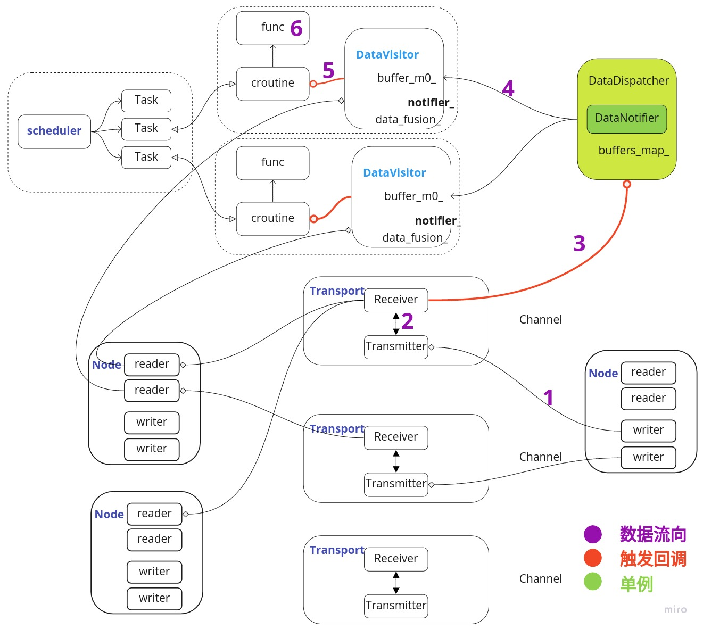
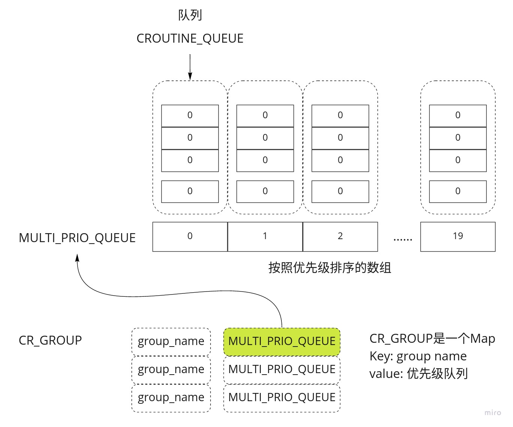
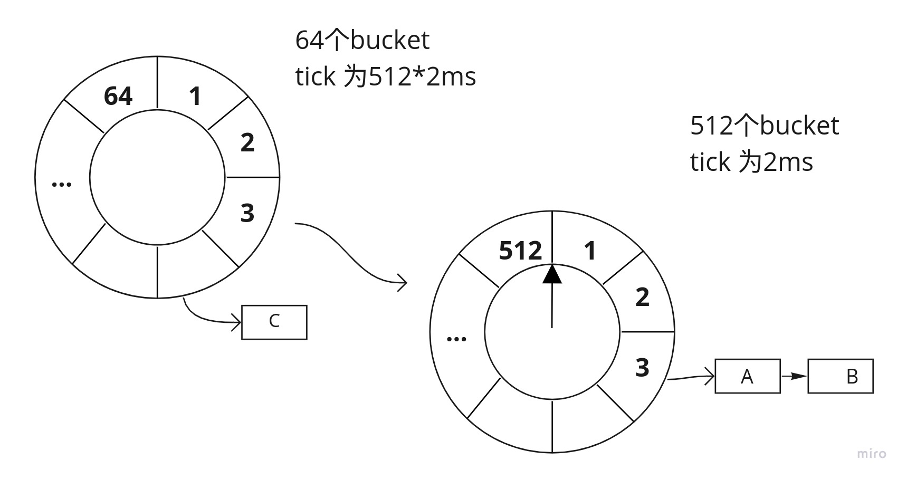

# Dig into Apollo - Cyber 


写在之前，之前的分析都是一些源码级别的分析，发现一开始就深入源码，很容易陷进去，特别是模块非常多的情况，需要看很多遍才能理解清楚。要写出更容易理解的文档，需要的不是事无巨细的分析代码，更主要的是能够把复杂的东西抽象出来，变为简单的东西。一个很简答的例子是画函数调用流程图很简单，但是要把流程图转换成框图却很难。  


## 数据处理流程
我们先看下cyber中整个的数据处理流程，通过理解数据流程中各个模块如何工作，来搞清楚每个模块的作用，然后我们再接着分析具体的模块。    
  

如上图所示，cyber的数据流程可以分为6个过程。  
1. Node节点中的Writer往通道里面写数据。
2. 通道中的Transmitter发布消息，通道中的Receiver订阅消息。
3. Receiver接收到消息之后，触发回调，触发DataDispather进行消息分发。
4. DataDispather接收到消息后，把消息放入CacheBuffer，并且触发Notifier，通知对应的DataVisitor处理消息。
5. DataVisitor把数据从CacheBuffer中读出，并且进行融合，然后通过notifier_唤醒对应的协程。
6. 协程执行对应的注册回调函数，进行数据处理，处理完成之后接着进入睡眠状态。

对数据流程有整体的认识之后，下面我们在分析具体的每个模块，我们还是按照功能划分。  

## 整体介绍
首先我们对cyber中各个模块做一个简单的介绍，之后再接着分析。实际上我们只要搞清楚了下面一些概念之间的关系，就基本上理解清楚了整个Cyber的数据流程。     

#### 1.Component和Node的关系
Component是cyber中封装好的数据处理流程，对用户来说，对应自动驾驶中的Planning Component, Perception Component等，目的是帮助我们更方便的订阅和处理消息。实际上Component模块在加载之后会执行"Initialize()"函数，这是个隐藏的初始化过程，对用户不可见。在"Initialize"中，Component会创建一个Node节点，概念上对应ROS的节点，**每个Component模块只能有一个Node节点**，也就是说每个Component模块有且只能有一个节点，在Node节点中进行消息订阅和发布。  


#### 2.Node和Reader\Writer的关系
在Node节点中可以创建Reader订阅消息，也可以创建Writer发布消息，每个Node节点中可以创建多个Reader和Writer。  


#### 3.Reader和Receiver,Writer和Transmitter,Channel的关系
一个Channel对应一个Topic，概念上对应ROS的消息通道，每个Topic都是唯一的。而Channel中包括一个发送器(Transmitter)和接收器(Receiver)，通过Receiver接收消息，通过Transmitter发送消息。  
一个Reader只能订阅一个通道的消息，如果一个Node需要订阅多个通道的消息，需要创建多个Reader。同理一个Writer也只能发布一个通道的消息，如果需要发布多个消息，需要创建多个Writer。Reader中调用Receiver订阅消息，而Writer通过Transmitter发布消息。 


#### 4.Receiver, DataDispatcher和DataVisitor的关系
每一个Receiver接收到消息之后，都会触发回调，回调中触发DataDispather（消息分发器）发布消息，DataDispather是一个单例，所有的数据分发都在数据分发器中进行，DataDispather会把数据放到对应的缓存中，然后Notify(通知)对应的协程（实际上这里调用的是DataVisitor中注册的Notify）去处理消息。  
DataVisitor（消息访问器）是一个辅助的类，**一个数据处理过程对应一个DataVisitor，通过在DataVisitor中注册Notify（唤醒对应的协程，协程执行绑定的回调函数），并且注册对应的Buffer到DataDispather**，这样在DataDispather的时候会通知对应的DataVisitor去唤醒对应的协程。  
也就是说DataDispather（消息分发器）发布对应的消息到DataVisitor，DataVisitor（消息访问器）唤醒对应的协程，协程中执行绑定的数据处理回调函数。 


#### 5.DataVisitor和Croutine的关系
实际上DataVisitor中的Notify是通过唤醒协程（为了方便理解也可以理解为线程，可以理解为你有一个线程池，通过线程池绑定数据处理函数，数据到来之后就唤醒对应的线程去执行任务），每个协程绑定了一个数据处理函数和一个DataVisitor，数据到达之后，通过DataVisitor中的Notify唤醒对应的协程，执行数据处理回调，执行完成之后协程进入休眠状态。  


#### 6.Scheduler, Task和Croutine
通过上述分析，**数据处理的过程实际上就是通过协程完成的，每一个协程被称为一个Task，所有的Task(任务)都由Scheduler进行调度**。从这里我们可以分析得出实际上Cyber的实时调度由协程去保障，并且可以灵活的通过协程去设置对应的调度策略，当然协程依赖于进程，Apollo在linux中设置进程的优先级为实时轮转，先保障进程的优先级最高，然后内部再通过协程实现对应的调度策略。  
协程和线程的优缺点这里就不展开了，这里有一个疑问是协程不能被终止，除非协程主动退出，这里先留一个伏笔，后面我们再分析协程的调度问题。  


上述就是各个概念之间的关系，上述介绍对理解数据的流程非常有帮助，希望有时间的时候，大家可以画一下对应的数据流程图和关系。  


## Component介绍

我们首先需要清楚一点，component实际上是cyber为了帮助我们特意实现的对象，component加载的时候会自动帮我们创建一个node，通过node来订阅和发布对应的消息，每个component有且只能对应一个node。  
component对用户提供2个接口"Init()"和"Proc()"，用户在Init中进行初始化，在"Proc"中接收Topic执行具体的算法。对用户隐藏的部分包括component的"Initialize()"初始化，以及"Process()"调用执行。     
component还可以动态的加载和卸载，这也可以对应到在dreamviewer上动态的打开关系模块。下面我们先大致介绍下component的工作流程，然后再具体介绍各个模块。  


#### component工作流程
component的工作流程大致如下：  
1. 通过继承"cyber::Component"，用户自定义一个模块，并且实现"Init()"和"Proc()"函数。编译生成".so"文件。
2. 通过classloader加载component模块到内存，创建component对象，调用"Initialize()"初始化。（Initialize中会调用Init）  
3. 创建协程任务，并且注册"Process()"回调，当数据到来的时候，唤醒对象的协程任务执行"Process()"处理数据。（Process会调用Proc）
综上所述，component帮助用户把初始化和数据收发的流程进行了封装，减少了用户的工作量，component封装了整个数据的收发流程，component本身并不是单独的一个线程执行，模块的初始化都在主线程中执行，而具体的任务则是在协程池中执行。  


#### cyber入口
cyber的入口在"cyber/mainboard/mainboard.cc"中，主函数中先进行cyber的初始化，然后启动cyber模块，然后运行，一直等到系统结束。  
```c++
int main(int argc, char** argv) {
  // 1. 解析参数
  ModuleArgument module_args;
  module_args.ParseArgument(argc, argv);

  // 2. 初始化cyber
  apollo::cyber::Init(argv[0]);

  // 3. 启动cyber模块
  ModuleController controller(module_args);
  if (!controller.Init()) {
    controller.Clear();
    AERROR << "module start error.";
    return -1;
  }
  
  // 4. 等待直到程序退出
  apollo::cyber::WaitForShutdown();
  controller.Clear();
  return 0;
}
```


#### component动态加载

cyber主函数在"ModuleController::Init()"进行模块的加载，具体的加载过程在"ModuleController::LoadModule"中。  
```c++
bool ModuleController::LoadModule(const DagConfig& dag_config) {
  const std::string work_root = common::WorkRoot();

  for (auto module_config : dag_config.module_config()) {
    // 1. 加载动态库
    class_loader_manager_.LoadLibrary(load_path);
    
    // 2. 加载消息触发模块
    for (auto& component : module_config.components()) {
      const std::string& class_name = component.class_name();
      // 3. 创建对象
      std::shared_ptr<ComponentBase> base =
          class_loader_manager_.CreateClassObj<ComponentBase>(class_name);
      // 4. 调用对象的Initialize方法
      if (base == nullptr || !base->Initialize(component.config())) {
        return false;
      }
      component_list_.emplace_back(std::move(base));
    }
    
    // 5. 加载定时触发模块
    for (auto& component : module_config.timer_components()) {
      // 6. 创建对象
      const std::string& class_name = component.class_name();
      std::shared_ptr<ComponentBase> base =
          class_loader_manager_.CreateClassObj<ComponentBase>(class_name);
      // 7. 调用对象的Initialize方法
      if (base == nullptr || !base->Initialize(component.config())) {
        return false;
      }
      component_list_.emplace_back(std::move(base));
    }
  }
  return true;
}
```
模块首先通过classloader加载到内存，然后创建对象，并且调用模块的初始化方法。component中每个模块都设计为可以动态加载和卸载，可以实时在线的开启和关闭模块，实现的方式是通过classloader来进行动态的加载动态库。  


#### component初始化
component一共有4个模板类，分别对应接收0-3个消息，（这里有疑问为什么没有4个消息的模板类，是漏掉了吗？）我们这里主要分析2个消息的情况，其它的可以类推。  
```c++
template <typename M0, typename M1>
bool Component<M0, M1, NullType, NullType>::Initialize(
    const ComponentConfig& config) {
  // 1. 创建Node
  node_.reset(new Node(config.name()));
  LoadConfigFiles(config);

  // 2. 调用用户自定义初始化Init()
  if (!Init()) {
    AERROR << "Component Init() failed.";
    return false;
  }

  bool is_reality_mode = GlobalData::Instance()->IsRealityMode();

  ReaderConfig reader_cfg;
  reader_cfg.channel_name = config.readers(1).channel();
  reader_cfg.qos_profile.CopyFrom(config.readers(1).qos_profile());
  reader_cfg.pending_queue_size = config.readers(1).pending_queue_size();
  
  // 3. 创建reader1
  auto reader1 = node_->template CreateReader<M1>(reader_cfg);
  ...
  // 4. 创建reader0
  if (cyber_likely(is_reality_mode)) {
    reader0 = node_->template CreateReader<M0>(reader_cfg);
  } else {
    ...
  }
  
  readers_.push_back(std::move(reader0));
  readers_.push_back(std::move(reader1));


  auto sched = scheduler::Instance();
  // 5. 创建回调，回调执行Proc()
  std::weak_ptr<Component<M0, M1>> self =
      std::dynamic_pointer_cast<Component<M0, M1>>(shared_from_this());
  auto func = [self](const std::shared_ptr<M0>& msg0,
                     const std::shared_ptr<M1>& msg1) {
    auto ptr = self.lock();
    if (ptr) {
      ptr->Process(msg0, msg1);
    } else {
      AERROR << "Component object has been destroyed.";
    }
  };

  std::vector<data::VisitorConfig> config_list;
  for (auto& reader : readers_) {
    config_list.emplace_back(reader->ChannelId(), reader->PendingQueueSize());
  }
  // 6. 创建数据访问器
  auto dv = std::make_shared<data::DataVisitor<M0, M1>>(config_list);
  // 7. 创建协程，协程绑定回调func（执行proc）。数据访问器dv在收到订阅数据之后，唤醒绑定的协程执行任务，任务执行完成之后继续休眠。
  croutine::RoutineFactory factory =
      croutine::CreateRoutineFactory<M0, M1>(func, dv);
  return sched->CreateTask(factory, node_->Name());
}
```
总结以下component的流程。  
1. 创建node节点（1个component只能有1个node节点，之后用户可以用node_在init中自己创建reader或writer）。  
2. 调用用户自定义的初始化函数Init()（子类的Init方法）  
3. 创建reader，订阅几个消息就创建几个reader。  
4. 创建回调函数，实际上是执行用户定义算法Proc()函数
5. 创建数据访问器，数据访问器的用途为接收数据（融合多个通道的数据），唤醒对应的协程执行任务。
6. 创建协程任务绑定回调函数，并且绑定数据访问器到对应的协程任务，用于唤醒对应的任务。  


因为之前对cyber数据的收发流程有了一个简单的介绍，这里我们会分别介绍如何创建协程、如何在scheduler注册任务并且绑定Notify。也就是说，为了方便理解，你可以认为数据通过DataDispatcher已经分发到了对应的DataVisitor中，**接下来我们只分析如何从DataVisitor中取数据，并且触发对应的协程执行回调任务**。  
#### 创建协程
创建协程对应上述代码
```c++
  croutine::RoutineFactory factory =
      croutine::CreateRoutineFactory<M0, M1>(func, dv);
```
接下来我们查看下如何创建协程呢？协程通过工厂模式方法创建，里面包含一个回调函数和一个dv（数据访问器）。  
```c++
template <typename M0, typename M1, typename F>
RoutineFactory CreateRoutineFactory(
    F&& f, const std::shared_ptr<data::DataVisitor<M0, M1>>& dv) {
  RoutineFactory factory;
  // 1. 工厂中设置DataVisitor
  factory.SetDataVisitor(dv);
  factory.create_routine = [=]() {
    return [=]() {
      std::shared_ptr<M0> msg0;
      std::shared_ptr<M1> msg1;
      for (;;) {
        CRoutine::GetCurrentRoutine()->set_state(RoutineState::DATA_WAIT);
        // 2. 从DataVisitor中获取数据
        if (dv->TryFetch(msg0, msg1)) {
          // 3. 执行回调函数
          f(msg0, msg1);
          // 4. 继续休眠
          CRoutine::Yield(RoutineState::READY);
        } else {
          CRoutine::Yield();
        }
      }
    };
  };
  return factory;
}
```
上述过程总结如下：
1. 工厂中设置DataVisitor  
2. 工厂中创建设置协程执行函数，回调包括3个步骤：从DataVisitor中获取数据，执行回调函数，继续休眠。


#### 创建调度任务
创建调度任务是在过程"Component::Initialize"中完成。  
```c++
sched->CreateTask(factory, node_->Name());
```
我们接着分析如何在Scheduler中创建任务。  
```c++
bool Scheduler::CreateTask(std::function<void()>&& func,
                           const std::string& name,
                           std::shared_ptr<DataVisitorBase> visitor) {
  // 1. 根据名称创建任务ID
  auto task_id = GlobalData::RegisterTaskName(name);
  
  auto cr = std::make_shared<CRoutine>(func);
  cr->set_id(task_id);
  cr->set_name(name);
  AINFO << "create croutine: " << name;
  // 2. 分发协程任务
  if (!DispatchTask(cr)) {
    return false;
  }

  // 3. 注册Notify唤醒任务
  if (visitor != nullptr) {
    visitor->RegisterNotifyCallback([this, task_id]() {
      if (cyber_unlikely(stop_.load())) {
        return;
      }
      this->NotifyProcessor(task_id);
    });
  }
  return true;
}
```

#### TimerComponent
实际上Component分为2类：一类是上面介绍的消息驱动的Component，第二类是定时调用的TimerComponent。定时调度模块没有绑定消息收发，需要用户自己创建reader来读取消息，如果需要读取多个消息，可以创建多个reader。  
```c++
bool TimerComponent::Initialize(const TimerComponentConfig& config) {
  // 1. 创建node
  node_.reset(new Node(config.name()));
  LoadConfigFiles(config);
  // 2. 调用用户自定义初始化函数
  if (!Init()) {
    return false;
  }

  std::shared_ptr<TimerComponent> self =
      std::dynamic_pointer_cast<TimerComponent>(shared_from_this());
  // 3. 创建定时器，定时调用"Proc()"函数
  auto func = [self]() { self->Proc(); };
  timer_.reset(new Timer(config.interval(), func, false));
  timer_->Start();
  return true;
}
```
总结一下TimerComponent的执行流程如下。
1. 创建Node
2. 调用用户自定义初始化函数
3. 创建定时器，定时调用"Proc()"函数


上述就是Component模块的调用流程。为了弄清楚消息的调用过程，下面我们分析"DataDispatcher"和"DataVisitor"。 

## DataVisitor和DataDispatcher
DataDispather（消息分发器）发布消息，DataDispather是一个单例，所有的数据分发都在数据分发器中进行，DataDispather会把数据放到对应的缓存中，然后Notify(通知)对应的协程（实际上这里调用的是DataVisitor中注册的Notify）去处理消息。  
DataVisitor（消息访问器）是一个辅助的类，**一个数据处理过程对应一个DataVisitor，通过在DataVisitor中注册Notify（唤醒对应的协程，协程执行绑定的回调函数），并且注册对应的Buffer到DataDispather**，这样在DataDispather的时候会通知对应的DataVisitor去唤醒对应的协程。  
也就是说DataDispather（消息分发器）发布对应的消息到DataVisitor，DataVisitor（消息访问器）唤醒对应的协程，协程中执行绑定的数据处理回调函数。  

#### DataVisitor数据访问器
DataVisitor继承至DataVisitorBase类，先看DataVisitorBase类的实现。  
```c++
class DataVisitorBase {
 public:
  // 1. 初始化的时候创建一个Notifier
  DataVisitorBase() : notifier_(new Notifier()) {}

  // 2. 设置注册回调
  void RegisterNotifyCallback(std::function<void()>&& callback) {
    notifier_->callback = callback;
  }

 protected:
  // 3. 下一次消息的下标
  uint64_t next_msg_index_ = 0;
  // 4. DataNotifier单例
  DataNotifier* data_notifier_ = DataNotifier::Instance();
  std::shared_ptr<Notifier> notifier_;
};
```
可以看到DataVisitorBase创建了一个"Notifier"类，并且提供注册回调的接口。同时还引用了"DataNotifier::Instance()"单例。   

接下来看"DataVisitor"类的实现。  
```c++
template <typename M0, typename M1, typename M2>
class DataVisitor<M0, M1, M2, NullType> : public DataVisitorBase {
 public:
  explicit DataVisitor(const std::vector<VisitorConfig>& configs)
      : buffer_m0_(configs[0].channel_id,
                   new BufferType<M0>(configs[0].queue_size)),
        buffer_m1_(configs[1].channel_id,
                   new BufferType<M1>(configs[1].queue_size)),
        buffer_m2_(configs[2].channel_id,
                   new BufferType<M2>(configs[2].queue_size)) {
    // 1. 在DataDispatcher中增加ChannelBuffer
    DataDispatcher<M0>::Instance()->AddBuffer(buffer_m0_);
    DataDispatcher<M1>::Instance()->AddBuffer(buffer_m1_);
    DataDispatcher<M2>::Instance()->AddBuffer(buffer_m2_);
    // 2. 在DataNotifier::Instance()中增加创建好的Notifier
    data_notifier_->AddNotifier(buffer_m0_.channel_id(), notifier_);
    // 3. 对接收到的消息进行数据融合
    data_fusion_ =
        new fusion::AllLatest<M0, M1, M2>(buffer_m0_, buffer_m1_, buffer_m2_);
  }


  bool TryFetch(std::shared_ptr<M0>& m0, std::shared_ptr<M1>& m1,  // NOLINT
                std::shared_ptr<M2>& m2) {                         // NOLINT
    // 4. 获取融合数据
    if (data_fusion_->Fusion(&next_msg_index_, m0, m1, m2)) {
      next_msg_index_++;
      return true;
    }
    return false;
  }

 private:
  fusion::DataFusion<M0, M1, M2>* data_fusion_ = nullptr;
  ChannelBuffer<M0> buffer_m0_;
  ChannelBuffer<M1> buffer_m1_;
  ChannelBuffer<M2> buffer_m2_;
};
```
总结一下DataVisitor中实现的功能。
1. 在DataDispatcher中添加订阅的ChannelBuffer
2. 在DataNotifier中增加对应通道的Notifier
3. 通过DataVisitor获取数据并进行融合

**这里注意**  
1. 如果DataVisitor只访问一个消息，则不会对消息进行融合，如果DataVisitor访问2个以上的数据，那么需要进行融合，并且注册融合回调。之后CacheBuffer中会调用融合回调进行数据处理，而不会把数据放入CacheBuffer中。  
```c++
// 1. 只有一个消息的时候直接从Buffer中获取消息
  bool TryFetch(std::shared_ptr<M0>& m0) {  // NOLINT
    if (buffer_.Fetch(&next_msg_index_, m0)) {
      next_msg_index_++;
      return true;
    }
    return false;
  }

// 2. 当有2个消息的时候，从融合buffer中读取消息
  bool TryFetch(std::shared_ptr<M0>& m0, std::shared_ptr<M1>& m1) {  // NOLINT
    if (data_fusion_->Fusion(&next_msg_index_, m0, m1)) {
      next_msg_index_++;
      return true;
    }
    return false;
  }
```  
2. 实际上如果有多个消息的时候，会以第1个消息为基准，然后把其它消息的最新消息一起放入融合好的buffer_fusion_。  

```c++
  AllLatest(const ChannelBuffer<M0>& buffer_0,
            const ChannelBuffer<M1>& buffer_1)
      : buffer_m0_(buffer_0),
        buffer_m1_(buffer_1),
        buffer_fusion_(buffer_m0_.channel_id(),
                       new CacheBuffer<std::shared_ptr<FusionDataType>>(
                           buffer_0.Buffer()->Capacity() - uint64_t(1))) {
    // 1. 注意这里只注册了buffer_m0_的回调，其它的消息还是把消息放入CacheBuffer。  
    // 2. 而buffer_m0_直接调用回调函数，把消息放入融合的CacheBuffer。  
    buffer_m0_.Buffer()->SetFusionCallback(
        [this](const std::shared_ptr<M0>& m0) {
          std::shared_ptr<M1> m1;
          if (!buffer_m1_.Latest(m1)) {
            return;
          }

          auto data = std::make_shared<FusionDataType>(m0, m1);
          std::lock_guard<std::mutex> lg(buffer_fusion_.Buffer()->Mutex());
          buffer_fusion_.Buffer()->Fill(data);
        });
  }
```
3. DataFusion类是一个虚类，定义了数据融合的接口"Fusion()"，Apollo里只提供了一种数据融合的方式，即以第一个消息的时间为基准，取其它最新的消息，当然也可以在这里实现其它的数据融合方式。  


 
#### DataDispatcher数据分发器
接下来我们看DataDispatcher的实现。  
```c++
template <typename T>
class DataDispatcher {
 public:
  using BufferVector =
      std::vector<std::weak_ptr<CacheBuffer<std::shared_ptr<T>>>>;
  ~DataDispatcher() {}
  // 1. 添加ChannelBuffer到buffers_map_
  void AddBuffer(const ChannelBuffer<T>& channel_buffer);

  // 2. 分发通道中的消息
  bool Dispatch(const uint64_t channel_id, const std::shared_ptr<T>& msg);

 private:
  // 3. DataNotifier单例
  DataNotifier* notifier_ = DataNotifier::Instance();
  std::mutex buffers_map_mutex_;
  // 4. 哈希表，key为通道id，value为订阅通道消息的CacheBuffer数组。
  AtomicHashMap<uint64_t, BufferVector> buffers_map_;
  // 5. 单例
  DECLARE_SINGLETON(DataDispatcher)
};
```
总结一下DataDispatcher的实现。
1. 添加ChannelBuffer到buffers_map_，key为通道id（topic），value为订阅通道消息的CacheBuffer数组。
2. 分发通道中的消息。根据通道id，把消息放入对应的CacheBuffer。然后通过DataNotifier::Instance()通知对应的通道。

**如果一个通道(topic)有3个CacheBuffer订阅，那么每次都会往这3个CacheBuffer中写入当前消息的指针。因为消息是共享的，消息访问的时候需要加锁。**    

那么DataNotifier如何通知对应的Channel的呢？理解清楚了DataNotifier的数据结构，那么也就理解了DataNotifier的原理，DataNotifier保存了
```
class DataNotifier {
 public:
  using NotifyVector = std::vector<std::shared_ptr<Notifier>>;
  ~DataNotifier() {}

  void AddNotifier(uint64_t channel_id,
                   const std::shared_ptr<Notifier>& notifier);

  bool Notify(const uint64_t channel_id);

 private:
  std::mutex notifies_map_mutex_;
  // 1. 哈希表，key为通道id，value为Notify数组
  AtomicHashMap<uint64_t, NotifyVector> notifies_map_;

  DECLARE_SINGLETON(DataNotifier)
};
```
DataNotifier中包含一个哈希表，表的key为通道id，表的值为Notify数组，每个DataVisitorBase在初始化的时候会创建一个Notify。  


接着我们看下CacheBuffer的实现，CacheBuffer实际上实现了一个缓存队列，主要关注下Fill函数。  
```c++
  void Fill(const T& value) {
    if (fusion_callback_) {
      // 1. 融合回调
      fusion_callback_(value);
    } else {
      // 2. 如果Buffer满，实现循环队列
      if (Full()) {
        buffer_[GetIndex(head_)] = value;
        ++head_;
        ++tail_;
      } else {
        buffer_[GetIndex(tail_ + 1)] = value;
        ++tail_;
      }
    }
  }
```

ChannelBuffer是CacheBuffer的封装，主要看下获取值。  
```
template <typename T>
bool ChannelBuffer<T>::Fetch(uint64_t* index,
                             std::shared_ptr<T>& m) {  // NOLINT
  std::lock_guard<std::mutex> lock(buffer_->Mutex());
  if (buffer_->Empty()) {
    return false;
  }

  if (*index == 0) {
    *index = buffer_->Tail();
  // 1. 为什么是判断最新的加1，而不是大于？？？
  } else if (*index == buffer_->Tail() + 1) {
    return false;
  } else if (*index < buffer_->Head()) {
    auto interval = buffer_->Tail() - *index;
    AWARN << "channel[" << GlobalData::GetChannelById(channel_id_) << "] "
          << "read buffer overflow, drop_message[" << interval << "] pre_index["
          << *index << "] current_index[" << buffer_->Tail() << "] ";
    *index = buffer_->Tail();
  }
  m = buffer_->at(*index);
  return true;
}
```
疑问：这里获取的id是消息的累计数量，也就是说从开始到结束发送了多少的消息。如果消息大于最新的id，而不是等于最大值+1，则会返回错误的值？？？  


#### data目录总结
通过上述的分析，实际上数据的访问都是通过"DataVisitor"来实现，数据的分发通过"DataDispatcher"来实现。reader中也是通过DataVisitor来访问数据，在reader中订阅对应的DataDispatcher。也就是说如果你要订阅一个通道，首先是在reader中注册消息的topic，绑定DataDispatcher，之后对应通道的消息到来之后，触发DataDispatcher分发消息，而DataDispatcher通过DataVisitor中的Notify唤醒协程，从DataVisitor中获取消息，并执行协程中绑定的回调函数，以上就是整个消息的收发过程。  

疑问： Reader中还拷贝了一份数据到Blocker中，实际上数据的处理过程并不需要缓存数据，参考"Planning"模块中的实现都是在回调函数中把数据拷贝到指针中。看注释是说Blocker是用来仿真的？？？后面需要确实下。以下是Planning模块中回调函数中拷贝数据的实现。  
```c++
  traffic_light_reader_ = node_->CreateReader<TrafficLightDetection>(
      FLAGS_traffic_light_detection_topic,
      [this](const std::shared_ptr<TrafficLightDetection>& traffic_light) {
        ADEBUG << "Received traffic light data: run traffic light callback.";
        std::lock_guard<std::mutex> lock(mutex_);
        // 1. 拷贝消息到指针
        traffic_light_.CopyFrom(*traffic_light);
      });
```  

这里需要注意系统在component中自动帮我们创建了一个DataVisitor，订阅component中的消息，融合获取最新的消息之后，执行Proc回调。需要注意component的第一个消息一定是模块的基准消息来源，也就是模块中最主要的参考消息，不能随便调换顺序。  


## Node介绍
Node目录中包含了Node对象、Reader对象和Writer对象。Node对象主要对应Ros中的Node节点，在Node节点中可以创建Reader和Writer来订阅和发布消息，需要管理对应的通道注册。  

#### Node对象


#### Reader对象


#### Writer对象


## CRoutine协程

协程是用户态的线程，由于进程切换需要用户态到内核态的切换，而协程不需要切换到内核态，因此协程的切换开销比线程低。实际上线程切换的过程如下：  
1. 保存当前线程的现场到堆栈，寄存器，栈指针
2. 用户态切换到内核态
3. 切换到另外一个线程，跳转到栈指针，恢复现场

一个线程的几种状态: running、sleeping。那么协程需要几种状态呢？  
```
enum class RoutineState { READY, FINISHED, SLEEP, IO_WAIT, DATA_WAIT };
```
可以看到协程的状态有5种：准备好、结束、睡觉、等待IO、等待数据。  

接着看下CRoutine的实现。  
```c++
class CRoutine {
 public:
  explicit CRoutine(const RoutineFunc &func);
  virtual ~CRoutine();

  // static interfaces
  static void Yield();
  static void Yield(const RoutineState &state);
  static void SetMainContext(const std::shared_ptr<RoutineContext> &context);
  static CRoutine *GetCurrentRoutine();
  static char **GetMainStack();

  // public interfaces
  bool Acquire();
  void Release();

  // It is caller's responsibility to check if state_ is valid before calling
  // SetUpdateFlag().
  void SetUpdateFlag();

  // acquire && release should be called before Resume
  // when work-steal like mechanism used
  RoutineState Resume();
  RoutineState UpdateState();
  RoutineContext *GetContext();
  char **GetStack();

  void Run();
  void Stop();
  void Wake();
  void HangUp();
  void Sleep(const Duration &sleep_duration);

  // getter and setter
  RoutineState state() const;
  void set_state(const RoutineState &state);

  uint64_t id() const;
  void set_id(uint64_t id);

  const std::string &name() const;
  void set_name(const std::string &name);

  int processor_id() const;
  void set_processor_id(int processor_id);

  uint32_t priority() const;
  void set_priority(uint32_t priority);

  std::chrono::steady_clock::time_point wake_time() const;

  void set_group_name(const std::string &group_name) {
    group_name_ = group_name;
  }

  const std::string &group_name() { return group_name_; }

 private:
  CRoutine(CRoutine &) = delete;
  CRoutine &operator=(CRoutine &) = delete;

  std::string name_;
  std::chrono::steady_clock::time_point wake_time_ =
      std::chrono::steady_clock::now();

  RoutineFunc func_;
  RoutineState state_;

  std::shared_ptr<RoutineContext> context_;

  std::atomic_flag lock_ = ATOMIC_FLAG_INIT;
  std::atomic_flag updated_ = ATOMIC_FLAG_INIT;

  bool force_stop_ = false;

  int processor_id_ = -1;
  uint32_t priority_ = 0;
  uint64_t id_ = 0;

  std::string group_name_;

  static thread_local CRoutine *current_routine_;
  static thread_local char *main_stack_;
};
```
对上述方法做一些归类。


下面总结一下CRoutine的切换流程。


## Scheduler调度
所谓的调度，一定是系统资源和运行任务的矛盾，如果系统资源足够多，那么就不需要调度了，也没有调度的必要。调度的作用就是在资源有限的情况下，合理利用系统资源，使系统的效率最高。  

####  Scheduler* Instance()
在"scheduler_factory.cc"中实现了"Scheduler* Instance()"方法，该方法根据"conf"目录中的配置创建不同的调度策略。Cyber中有2种调度策略"SchedulerClassic"和"SchedulerChoreography"。要理解上述2种模型，可以参考go语言中的GPM模型。    
1. SchedulerClassic 采用了协程池的概念，协程没有绑定到具体的Processor，所有的协程放在全局的优先级队列中，每次从最高优先级的任务开始执行。  
2. SchedulerChoreography 采用了本地队列和全局队列相结合的方式，通过"ChoreographyContext"运行本地队列的线程，通过"ClassicContext"来运行全局队列。  
疑问： 这里的调度对象为原子指针"std::atomic<Scheduler*> instance"，为什么需要设置内存模型，并且加锁呢？  


#### 基本概念

#### 1.GPM模型
[GPM模型](https://learnku.com/articles/41728)是go语言中的概念，G代表协程，P代表执行器，M代表线程。P代表协程执行的环境，一个P绑定一个线程M，协程G根据不同的上下文环境在P中执行，上述的设计解耦了协程和线程，线程和协程都只知道P中，在go语言中还有一个调度器，把具体的协程分配到不同的P中，这样就可以在用户态实现协程的调度，同时执行多个任务。  
在go语言早期，只有一个全局的协程队列，每个P都会从全局队列中取任务，然后执行。因为多个P都会去全局队列中取任务，因此会带来并发访问，需要在全局队列中加锁。全局队列调度模型如图。  
   

上述方法虽然实现了多个任务的调度，但是带来的问题是多个P都会去竞争全局锁，导致效率低下，之后go语言对调度模型做了改善，改善之后每个P都会拥有一个本地队列，P优先从本地队列中取任务执行，如果P中没有任务了，那么P会从全局或者相邻的任务中偷取一半的任务执行，这样带来的好处是不需要全局锁了，每个P都优先执行本地队列。另外调度器还会监视P中的协程，如果协程过长时间阻塞，则会把协程移动到全局队列，以示惩罚。本地队列加全局队列如图。  
    

理解了GPM模型，下面我们接着看Cyber中的调度器，SchedulerClassic代表着全局队列模型，SchedulerChoreography则代表着本地队列加全局队列模型。SchedulerChoreography模型和go语言的模型稍微有点区别，全局队列和本地队列是隔离的，也就是说本地队列不会去全局队列中取任务。  


####　2.Processor执行器
Processor执行器是协程的载体，对协程来说Processor就是逻辑的CPU。Processor中有协程执行的上下文信息，还有绑定的线程信息。先看下BindContext的实现。  
```c++
void Processor::BindContext(const std::shared_ptr<ProcessorContext>& context) {
  // 1. 协程执行的上下文信息，会随着协程切换而切换
  context_ = context;
  // 2. 绑定Processor到具体的线程
  std::call_once(thread_flag_,
                 [this]() { thread_ = std::thread(&Processor::Run, this); });
}
```
也就是说协程运行在Processor之上，切换协程的时候传入对应的上下文到Processor，然后Processor开始执行协程任务。下面看Processor是如何执行的。  
```c++
void Processor::Run() {
  // 1. 获取线程的PID，系统内唯一
  tid_.store(static_cast<int>(syscall(SYS_gettid)));
  
  snap_shot_->processor_id.store(tid_);

  while (cyber_likely(running_.load())) {
    if (cyber_likely(context_ != nullptr)) {
      // 2. 获取优先级最高并且准备就绪的协程
      auto croutine = context_->NextRoutine();
      if (croutine) {
        snap_shot_->execute_start_time.store(cyber::Time::Now().ToNanosecond());
        snap_shot_->routine_name = croutine->name();
        // 3. 执行协程任务，完成后释放协程
        croutine->Resume();
        croutine->Release();
      } else {
        snap_shot_->execute_start_time.store(0);
        // 4. 如果协程组中没有空闲的协程，则等待
        context_->Wait();
      }
    } else {
      // 5. 如果上下文为空，则线程阻塞10毫秒
      std::unique_lock<std::mutex> lk(mtx_ctx_);
      cv_ctx_.wait_for(lk, std::chrono::milliseconds(10));
    }
  }
}
```
**疑问**： 
1. 因为Processor每次都会从高优先级的队列开始取任务，假设Processor的数量不够，可能会出现低优先级的协程永远得不到调度的情况。  
2. 协程的调度没有抢占，也就是说一个协程在执行的过程中，除非主动让出，否则会一直占用Processor，如果Processor在执行低优先级的任务，来了一个高优先级的任务并不能抢占执行。调度器的抢占还是交给线程模型去实现了，cyber中通过调节cgroup来调节，保证优先级高的任务优先执行。   

一共有2种ProcessorContext上下文"ClassicContext"和"ChoreographyContext"上下文，分别对应不同的调度策略。后面分析Scheduler对象的时候，我们会接着分析。  


#### 3. conf配置文件
Scheduler调度的配置文件在"conf"目录中，配置文件中可以设置线程线程的CPU亲和性以及调度测量，也可以设置cgroup，还可以设置协程的优先级。下面以"example_sched_classic.conf"文件来举例子。  
```
scheduler_conf {
    // 1. 设置调度器策略
    policy: "classic"
    // 2. 设置cpu set
    process_level_cpuset: "0-7,16-23" # all threads in the process are on the cpuset
    // 3. 设置线程的cpuset，调度策略和优先级
    threads: [
        {
            name: "async_log"
            cpuset: "1"
            policy: "SCHED_OTHER"   # policy: SCHED_OTHER,SCHED_RR,SCHED_FIFO
            prio: 0
        }, {
            name: "shm"
            cpuset: "2"
            policy: "SCHED_FIFO"
            prio: 10
        }
    ]
    classic_conf {
        // 4. 设置分组，线程组的cpuset，cpu亲和性，调度测量和优先级。设置调度器创建"processor"对象的个数，以及协程的优先级。  
        groups: [
            {
                name: "group1"
                processor_num: 16
                affinity: "range"
                cpuset: "0-7,16-23"
                processor_policy: "SCHED_OTHER"  # policy: SCHED_OTHER,SCHED_RR,SCHED_FIFO
                processor_prio: 0
                tasks: [
                    {
                        name: "E"
                        prio: 0
                    }
                ]
            },{
                name: "group2"
                processor_num: 16
                affinity: "1to1"
                cpuset: "8-15,24-31"
                processor_policy: "SCHED_OTHER"
                processor_prio: 0
                tasks: [
                    {
                        name: "A"
                        prio: 0
                    },{
                        name: "B"
                        prio: 1
                    },{
                        name: "C"
                        prio: 2
                    },{
                        name: "D"
                        prio: 3
                    }
                ]
            }
        ]
    }
}
```

下面我们开始看调度器，上述已经简单的介绍了2种调度器，SchedulerClassic是基于全局优先队列的调度器。

#### SchedulerClassic对象
我们知道协程实际上建立在线程之上，线程分时执行多个协程，看上去多个协程就是一起工作的。假如让你设计一个协程池，首先需要设置协程池中协程的个数，当协程超过协程池个数的时候需要把协程放入一个阻塞队列中，如果队列满了，还有协程到来，那么丢弃到来的协程，并且报错。（上述设计借鉴了线程池的思路）  


#### 创建Processor  
调度器中首先会创建Processor，并且绑定到线程。调度器根据"conf"目录中的cgroup配置初始化线程，根据"processor_num"的个数创建多个Processor，并且绑定到线程。  
```c++
void SchedulerClassic::CreateProcessor() {
  //  读取调度配置文件，参照conf目录
  for (auto& group : classic_conf_.groups()) {
    // 1. 分组名称 
    auto& group_name = group.name();
    // 2. 分组执行器(线程)数量 等于协程池大小
    auto proc_num = group.processor_num();
    if (task_pool_size_ == 0) {
      task_pool_size_ = proc_num;
    }
    // 3. 分组CPU亲和性
    auto& affinity = group.affinity();
    // 4. 分组线程调度策略
    auto& processor_policy = group.processor_policy();
    // 5. 分组优先级
    auto processor_prio = group.processor_prio();
    // 7. 分组cpu set
    std::vector<int> cpuset;
    ParseCpuset(group.cpuset(), &cpuset);

    for (uint32_t i = 0; i < proc_num; i++) {
      auto ctx = std::make_shared<ClassicContext>(group_name);
      pctxs_.emplace_back(ctx);

      auto proc = std::make_shared<Processor>();
      // 8. 绑定上下文
      proc->BindContext(ctx);
      // 9. 设置线程的cpuset和cpu亲和性
      SetSchedAffinity(proc->Thread(), cpuset, affinity, i);
      // 10. 设置线程调度策略和优先级 (proc->Tid()为线程pid)
      SetSchedPolicy(proc->Thread(), processor_policy, processor_prio,
                     proc->Tid());
      processors_.emplace_back(proc);
    }
  }
}
```

SchedulerClassic是Scheduler的子类，Scheduler中实现了"CreateTask"和"NotifyTask"接口，用于创建任务和唤醒任务。对用户来说只需要关心任务，Scheduler为我们屏蔽了Processor对象的操作。对应的子类中实现了"DispatchTask"，"RemoveTask"和"NotifyProcessor"的操作。  
我们先看Scheduler如何创建任务。  
```
bool Scheduler::CreateTask(std::function<void()>&& func,
                           const std::string& name,
                           std::shared_ptr<DataVisitorBase> visitor) {

  auto task_id = GlobalData::RegisterTaskName(name);
  // 1. 创建协程，绑定func函数
  auto cr = std::make_shared<CRoutine>(func);
  cr->set_id(task_id);
  cr->set_name(name);
  AINFO << "create croutine: " << name;
  
  // 2. 分发任务
  if (!DispatchTask(cr)) {
    return false;
  }

  // 3. 注册回调，visitor参数为可选的。
  if (visitor != nullptr) {
    visitor->RegisterNotifyCallback([this, task_id]() {
      if (cyber_unlikely(stop_.load())) {
        return;
      }
      this->NotifyProcessor(task_id);
    });
  }
  return true;
}
```
总结：  
1. 创建任务的时候只有对应数据访问的DataVisitorBase注册了回调，其它的任务要自己触发回调。  
2. DispatchTask中调用子类中的不同策略进行任务分发。  

接着我们看SchedulerClassic的DispatchTask调度策略。  
```c++
bool SchedulerClassic::DispatchTask(const std::shared_ptr<CRoutine>& cr) {
  // 1. 根据协程id，获取协程的锁
  ...

  // 2. 将协程放入协程map
  {
    WriteLockGuard<AtomicRWLock> lk(id_cr_lock_);
    if (id_cr_.find(cr->id()) != id_cr_.end()) {
      return false;
    }
    id_cr_[cr->id()] = cr;
  }

  // 3. 设置协程的优先级和group
  if (cr_confs_.find(cr->name()) != cr_confs_.end()) {
    ClassicTask task = cr_confs_[cr->name()];
    cr->set_priority(task.prio());
    cr->set_group_name(task.group_name());
  } else {
    // croutine that not exist in conf
    cr->set_group_name(classic_conf_.groups(0).name());
  }

  // 4. 将协程放入对应的优先级队列
  // Enqueue task.
  {
    WriteLockGuard<AtomicRWLock> lk(
        ClassicContext::rq_locks_[cr->group_name()].at(cr->priority()));
    ClassicContext::cr_group_[cr->group_name()]
        .at(cr->priority())
        .emplace_back(cr);
  }

  // 5. 唤醒协程组
  ClassicContext::Notify(cr->group_name());
  return true;
}
```

这里NotifyProcessor实际上就是唤醒对应Processor的上下文执行环境。  
```c++
bool SchedulerClassic::NotifyProcessor(uint64_t crid) {
  if (cyber_unlikely(stop_)) {
    return true;
  }

  {
    ReadLockGuard<AtomicRWLock> lk(id_cr_lock_);
    if (id_cr_.find(crid) != id_cr_.end()) {
      auto cr = id_cr_[crid];
      if (cr->state() == RoutineState::DATA_WAIT ||
          cr->state() == RoutineState::IO_WAIT) {
        cr->SetUpdateFlag();
      }

      ClassicContext::Notify(cr->group_name());
      return true;
    }
  }
  return false;
}
```
疑问:  
1. 如果协程在等待IO，系统知道协程在等待io，但还是触发对应的协程组去工作。并没有让协程继续阻塞？？？  

再看如何从"ClassicContext"获取Processor执行的协程。下图是全局协程队列的数据结构，为一个2级数组，第一级数组为优先级数组，第二级数组为一个队列。  
     

```c++
std::shared_ptr<CRoutine> ClassicContext::NextRoutine() {
  if (cyber_unlikely(stop_.load())) {
    return nullptr;
  }

  // 1. 从优先级最高的队列开始遍历
  for (int i = MAX_PRIO - 1; i >= 0; --i) {
    // 2. 获取当前优先级队列的锁
    ReadLockGuard<AtomicRWLock> lk(lq_->at(i));
    for (auto& cr : multi_pri_rq_->at(i)) {
      if (!cr->Acquire()) {
        continue;
      }
      // 3. 返回状态就绪的协程
      if (cr->UpdateState() == RoutineState::READY) {
        return cr;
      }

      cr->Release();
    }
  }

  return nullptr;
}
```

我们知道线程阻塞的条件有4种：  
1. 通过调用sleep(millseconds)使任务进入休眠状态
2. 通过调用wait（）使线程挂起
3. 等待某个输入、输出流
4. 等待锁

而Processor绑定的线程阻塞是通过上下文的等待实现的。在ClassicContext中等待条件（1s的超时时间），等待的时候设置notify_grp_减1。
```
void ClassicContext::Wait() {
  // 1. 获取锁
  std::unique_lock<std::mutex> lk(mtx_wrapper_->Mutex());
  // 2. 等待条件大于0
  cw_->Cv().wait_for(lk, std::chrono::milliseconds(1000),
                     [&]() { return notify_grp_[current_grp] > 0; });
  // 3. 对应协程组的唤醒条件减1
  if (notify_grp_[current_grp] > 0) {
    notify_grp_[current_grp]--;
  }
}
```

Processor的唤醒也是通过上下文实现的。  
```
void ClassicContext::Notify(const std::string& group_name) {
  // 1. 加锁
  (&mtx_wq_[group_name])->Mutex().lock();
  // 2. 协程唤醒条件加1
  notify_grp_[group_name]++;
  (&mtx_wq_[group_name])->Mutex().unlock();
  // 3. 唤醒线程
  cv_wq_[group_name].Cv().notify_one();
}
```

关于SchedulerClassic我们就先介绍到这里，下面我们开始介绍另外一种调度器SchedulerChoreography。  

#### SchedulerClassic调度器
SchedulerChoreography创建Processor，会分2部分创建，一部分是有本地队列的Processor，一部分是协程池的Processor。  
```
void SchedulerChoreography::CreateProcessor() {
  for (uint32_t i = 0; i < proc_num_; i++) {
    auto proc = std::make_shared<Processor>();
    // 1. 绑定ChoreographyContext
    auto ctx = std::make_shared<ChoreographyContext>();

    proc->BindContext(ctx);
    SetSchedAffinity(proc->Thread(), choreography_cpuset_,
                     choreography_affinity_, i);
    SetSchedPolicy(proc->Thread(), choreography_processor_policy_,
                   choreography_processor_prio_, proc->Tid());
    pctxs_.emplace_back(ctx);
    processors_.emplace_back(proc);
  }

  for (uint32_t i = 0; i < task_pool_size_; i++) {
    auto proc = std::make_shared<Processor>();
    // 2. 绑定ClassicContext
    auto ctx = std::make_shared<ClassicContext>();

    proc->BindContext(ctx);
    SetSchedAffinity(proc->Thread(), pool_cpuset_, pool_affinity_, i);
    SetSchedPolicy(proc->Thread(), pool_processor_policy_, pool_processor_prio_,
                   proc->Tid());
    pctxs_.emplace_back(ctx);
    processors_.emplace_back(proc);
  }
}
```
在看SchedulerChoreography如何分发任务。  
```c++
bool SchedulerChoreography::DispatchTask(const std::shared_ptr<CRoutine>& cr) {
  // 1. 根据协程id，获取协程的锁
  ...

  // 2. 设置优先级和协程绑定的Processor Id
  if (cr_confs_.find(cr->name()) != cr_confs_.end()) {
    ChoreographyTask taskconf = cr_confs_[cr->name()];
    cr->set_priority(taskconf.prio());

    if (taskconf.has_processor()) {
      cr->set_processor_id(taskconf.processor());
    }
  }

  ...

  uint32_t pid = cr->processor_id();
  // 3. 如果Processor Id小于proc_num_，默认Processor Id为-1
  if (pid < proc_num_) {
    // 4. 协程放入上下文本地队列中
    static_cast<ChoreographyContext*>(pctxs_[pid].get())->Enqueue(cr);
  } else {

    cr->set_group_name(DEFAULT_GROUP_NAME);

    // 5. 协程放入ClassicContext协程池队列中
    {
      WriteLockGuard<AtomicRWLock> lk(
          ClassicContext::rq_locks_[DEFAULT_GROUP_NAME].at(cr->priority()));
      ClassicContext::cr_group_[DEFAULT_GROUP_NAME]
          .at(cr->priority())
          .emplace_back(cr);
    }
  }
  return true;
}
```
疑问：  
1. cr->processor_id()的默认值为"-1"，而vector访问越界的时候不会报错，本来应该放入全局队列中的？？？  


#### ChoreographyContext上下文
ChoreographyContext中的调度就非常简单了。  
```
std::shared_ptr<CRoutine> ChoreographyContext::NextRoutine() {
  // 1. 从本地队列中取出协程
  ReadLockGuard<AtomicRWLock> lock(rq_lk_);
  for (auto it : cr_queue_) {
    auto cr = it.second;
    if (!cr->Acquire()) {
      continue;
    }

    if (cr->UpdateState() == RoutineState::READY) {
      return cr;
    }
    cr->Release();
  }
  return nullptr;
}
```

ChoreographyContext中"Wait"和"Notify"方法与ClassicContext类似，这里就不展开了。  


#### 总结
1. SchedulerClassic 采用了协程池的概念，协程没有绑定到具体的Processor，所有的协程放在全局的优先级队列中，每次从最高优先级的任务开始执行。  
2. SchedulerChoreography 采用了本地队列和全局队列相结合的方式，通过"ChoreographyContext"运行本地队列的线程，通过"ClassicContext"来运行全局队列。 
3. Processor对协程来说是一个逻辑上的cpu，ProcessorContext实现Processor的运行上下文，通过ProcessorContext来获取协程，休眠或者唤醒，Scheduler调度器实现了协程调度算法。


下面介绍下cyber的异步调用接口"cyber::Async"，启动异步执行任务。  
## 异步调用
在"task.h"中定义了异步调用的方法包括"Async","Yield","SleepFor","USleep"方法。下面我们逐个看下上述方法的实现。  

#### Async方法
```c++
template <typename F, typename... Args>
static auto Async(F&& f, Args&&... args)
    -> std::future<typename std::result_of<F(Args...)>::type> {
  return GlobalData::Instance()->IsRealityMode()
             ? TaskManager::Instance()->Enqueue(std::forward<F>(f),
                                                std::forward<Args>(args)...)
             : std::async(
                   std::launch::async,
                   std::bind(std::forward<F>(f), std::forward<Args>(args)...));
}
```
如果为真实模式，则采用"TaskManager"的方法生成协程任务，如果是仿真模式则创建线程。  

TaskManager实际上实现了一个任务池，最大执行的任务数为scheduler模块中设置的TaskPoolSize大小。超出的任务会放在大小为1000的有界队列中，如果超出1000，任务会被丢弃。下面我们看TaskManager的具体实现。  
```
TaskManager::TaskManager()
// 1. 设置有界队列，长度为1000
    : task_queue_size_(1000),
      task_queue_(new base::BoundedQueue<std::function<void()>>()) {
  if (!task_queue_->Init(task_queue_size_, new base::BlockWaitStrategy())) {
    AERROR << "Task queue init failed";
    throw std::runtime_error("Task queue init failed");
  }
  // 2. 协程任务，每次从队列中取任务执行，如果没有任务则让出协程，等待数据
  auto func = [this]() {
    while (!stop_) {
      std::function<void()> task;
      if (!task_queue_->Dequeue(&task)) {
        auto routine = croutine::CRoutine::GetCurrentRoutine();
        routine->HangUp();
        continue;
      }
      task();
    }
  };

  num_threads_ = scheduler::Instance()->TaskPoolSize();
  auto factory = croutine::CreateRoutineFactory(std::move(func));
  tasks_.reserve(num_threads_);
  // 3. 创建TaskPoolSize个任务并且放入调度器
  for (uint32_t i = 0; i < num_threads_; i++) {
    auto task_name = task_prefix + std::to_string(i);
    tasks_.push_back(common::GlobalData::RegisterTaskName(task_name));
    if (!scheduler::Instance()->CreateTask(factory, task_name)) {
      AERROR << "CreateTask failed:" << task_name;
    }
  }
}
```
1. 协程承载运行具体的任务，也就是说如果任务队列中有任务，则调用协程去执行，如果队列中没有任务，则让出协程，并且设置协程为等待数据的状态，那么让出协程之后唤醒是谁去触发的呢？  
每次在任务队列中添加任务的时候，会唤醒协程执行任务。  
2. task_queue_会被多个协程访问，并发数据访问这里没有加锁，需要看下这个队列是如何实现的？？？  
3. 上述的任务可以在"conf"文件中设置"/internal/task + index"的优先级来实现。

接着看下Enqueue的实现，加入任务到任务队列。  
```c++
  template <typename F, typename... Args>
  auto Enqueue(F&& func, Args&&... args)
    // 1. 返回值为future类型
      -> std::future<typename std::result_of<F(Args...)>::type> {
    using return_type = typename std::result_of<F(Args...)>::type;
    auto task = std::make_shared<std::packaged_task<return_type()>>(
        std::bind(std::forward<F>(func), std::forward<Args>(args)...));
    if (!stop_.load()) {
      // 2. 将函数加入任务队列，注意这里的任务不是调度单元里的任务，可以理解为一个函数
      task_queue_->Enqueue([task]() { (*task)(); });
      // 3. 这里的任务是调度任务，唤醒每个协程执行任务。
      for (auto& task : tasks_) {
        scheduler::Instance()->NotifyTask(task);
      }
    }
    std::future<return_type> res(task->get_future());
    return res;
  }
```
每次在任务队列中添加任务的时候，唤醒任务协程中所有的协程。  


#### Yield和Sleep方法
Yield方法和Async类似，如果为协程则让出当前协程，如果为线程则让出线程。SleepFor和USleep方法类似，这里就不展开了。
```c++
static inline void Yield() {
  if (croutine::CRoutine::GetCurrentRoutine()) {
    croutine::CRoutine::Yield();
  } else {
    std::this_thread::yield();
  }
}
```


## SysMo系统监控
SysMo模块的用途主要是监控系统协程的运行状况。

#### Start
在start中单独启动一个线程去进行系统监控，这里没有设置线程的优先级，因此不能在"conf"文件中设置优先级？？？    
```c++
void SysMo::Start() {
  auto sysmo_start = GetEnv("sysmo_start");
  if (sysmo_start != "" && std::stoi(sysmo_start)) {
    start_ = true;
    sysmo_ = std::thread(&SysMo::Checker, this);
  }
}
```

#### Checker
每隔100ms调用一次Checker，获取调度信息。  
```c++
void SysMo::Checker() {
  while (cyber_unlikely(!shut_down_.load())) {
    scheduler::Instance()->CheckSchedStatus();
    std::unique_lock<std::mutex> lk(lk_);
    cv_.wait_for(lk, std::chrono::milliseconds(sysmo_interval_ms_));
  }
}
```
打印的是协程的调度快照。  
```c++
void Scheduler::CheckSchedStatus() {
  std::string snap_info;
  auto now = Time::Now().ToNanosecond();
  for (auto processor : processors_) {
    auto snap = processor->ProcSnapshot();
    if (snap->execute_start_time.load()) {
      auto execute_time = (now - snap->execute_start_time.load()) / 1000000;
      snap_info.append(std::to_string(snap->processor_id.load()))
          .append(":")
          .append(snap->routine_name)
          .append(":")
          .append(std::to_string(execute_time));
    } else {
      snap_info.append(std::to_string(snap->processor_id.load()))
          .append(":idle");
    }
    snap_info.append(", ");
  }
  snap_info.append("timestamp: ").append(std::to_string(now));
  AINFO << snap_info;
  snap_info.clear();
}
```


## Timer定时器
定时器提供在指定的时间触发执行的功能。定时器的应用非常普遍，比如定时触发秒杀活动、定时清理日志、定时发送心跳信息等。实现定时器的方法多种多样，古代有采用水漏或者沙漏的方式，近代有采用机械的方式（各种各样的时钟），数字脉冲，元素衰减等方式。  
在计算机领域有2种形式，**一种是硬件定时器，一种是软件定时器**。硬件定时器的原理是计算时钟脉冲，当规定的时钟脉冲之后由硬件触发中断程序执行，硬件定时器一般是芯片自带的，硬件定时器时间比较精准但是数量有限，因此人们又发明了软件定时器。软件定时器由软件统计计算机时钟个数，然后触发对应的任务执行，由于是纯软件实现，理论上可以创建很多个，下面我们主要看下软件定时器的实现。  

## 定时器的实现

#### 双向链表
首先我们想到的是把定时任务放入一个队列中，每隔固定的时间（一个tick）去检查队列中是否有超时的任务，如果有，则触发执行该任务。这样做的好处是实现简单，但是每次都需要轮询整个队列来找到谁需要被触发，当队列的长度很大时，每个固定时间都需要去轮询一次队列，时间开销比较大。当我们需要删除一个任务的时候，也需要轮询一遍队列找到需要删除的任务，实际上我们可以优化一下用双向链表去实现队列，这样删除的任务的时间复杂度就是O(1)了。总结一下就是采用双向链表实现队列，插入的时间复杂度是O(1)，删除的时间复杂度也是O(1)，但是查询的时间复杂度是O(n)。  
    

#### 最小堆
最小堆的实现方式是为了解决上述查找的时候需要遍历整个链表的问题，我们知道最小堆中堆顶的元素就是最小的元素，每次我们只需要检查堆顶的元素是否超时，超时则弹出执行，然后再检查新的堆顶元素是否超时，这样查找可执行任务的时间复杂度约等于O(1)，最小堆虽然提高了查找的时间，但是插入和删除任务的时间复杂度为O(log2n)。下面我们看一个例子。  
堆中节点的值存放的是任务到期的时间，每隔1分钟判断下是否有任务需要执行，比如任务A是19:01分触发，周期为5分钟，任务B是19:02分触发，周期为10分钟，那么第一次最小堆弹出19:01，执行之后，在堆中重新插入19:06分的任务A，这时候任务B到了堆顶，1分钟之后检测需要执行任务B，执行完成后，在堆中重新插入19:12分的任务B。然后循环执行上述过程。每执行一次任务都需要重新插入任务到堆中，当任务频繁执行的时候，插入任务的开销也不容忽略。  
  

#### 时间轮
最后，我们介绍一种插入、删除和触发执行都是O(1)的方法，由计算机科学家"George Varghese"等提出，在NetBSD(一种操作系统)上实现并替代了早期内核中的callout定时器实现。最原始的时间轮如下图。
  
一共有8个bucket，每个bucket代表tick的时间，类似于时钟，每个1秒钟走一格，我们可以定义tick的时间为1秒钟，那么bucket[1]就代表第1秒，而bucket[8]就代表第8秒，然后循环进行上述步骤。一个bucket中可能有多个任务，每个任务采用链表的方式连接起来。下面通过一个例子来说明如何添加、删除和查找任务。  
假设时间轮中有8个bucket，每个bucket占用一个tick时间，每个tick为1秒。当前有2个定时任务A、B，分别需要3秒、11秒执行一次。目前指针指在0的位置，3秒钟之后指针将指向bucket[3]的位置，因此我们把任务A放入bucket[3]中，接下来我们再看如何放置任务B，任务B是11秒之后执行，也就是说时间轮转1圈之后，再过3秒种，任务B才执行，那么如何标记任务的圈数呢？这里引入了round的概念，round为1就表示需要1圈，如果round为2则需要2圈，同理推广到其它圈数。我们把B任务也放入bucket[3]，但是设置它的round为1。
我们先看下任务A和任务B的执行过程，3秒钟之后时间轮转到bucket[3]，这时候检查bucket[3]中的任务，只执行round为0的任务，这里执行任务A，然后把bucket[3]中所有任务的round减1，这时候任务B的round数为0了，等到时间轮转一圈之后，就会执行任务B了。  
这里还有一个疑问就是任务A执行完成之后，下一次触发如何执行，其实在bucket[3]执行完成之后，会把任务A从bucket[3]中删除，然后从新计算3+3，放入bucket[6]中，等到bucket[6]执行完成之后，然后再放入（6+3）对8取余，放入bucket[1]中。也就是说每次任务执行完成之后需要重新计算任务在哪个bucket，然后放入对应的bucket中。  
  
可以看到时间轮算法的插入复杂度是O(1)，删除的复杂度也是O(1)，查找执行的复杂度也是O(1)，因此时间轮实现的定时器非常高效。  

## Cyber定时器实现

#### 用户接口
Timer对象是开放给用户的接口，主要实现了定时器的配置"TimerOption"，启动定时器和关闭定时器3个接口。我们首先看下定时器的配置。
```c++
  TimerOption(uint32_t period, std::function<void()> callback, bool oneshot)
      : period(period), callback(callback), oneshot(oneshot) {}
```
包括：定时器周期、回调函数、一次触发还是周期触发（默认为周期触发）。  

Timer对象主要的实现都在"Start()"中。  
```c++
void Timer::Start() {

  // 1. 首先判断定时器是否已经启动
  if (!started_.exchange(true)) {
    // 2. 初始化任务
    if (InitTimerTask()) {
      // 3. 在时间轮中增加任务
      timing_wheel_->AddTask(task_);
      AINFO << "start timer [" << task_->timer_id_ << "]";
    }
  }
}
``` 
Start中的步骤很简单:  
1. 判断定时器是否已经启动
2. 如果定时器没有启动，则初始化定时任务
3. 在时间轮中增加任务。

那么初始化任务中做了哪些事情呢？  
```c++
bool Timer::InitTimerTask() {

  // 1. 初始化定时任务
  task_.reset(new TimerTask(timer_id_));
  task_->interval_ms = timer_opt_.period;
  task_->next_fire_duration_ms = task_->interval_ms;
  // 2. 是否单次触发
  if (timer_opt_.oneshot) {
    std::weak_ptr<TimerTask> task_weak_ptr = task_;
    // 3. 注册任务回调
    task_->callback = [callback = this->timer_opt_.callback, task_weak_ptr]() {
      auto task = task_weak_ptr.lock();
      if (task) {
        std::lock_guard<std::mutex> lg(task->mutex);
        callback();
      }
    };
  } else {
    std::weak_ptr<TimerTask> task_weak_ptr = task_;
    // 注册任务回调
    task_->callback = [callback = this->timer_opt_.callback, task_weak_ptr]() {

      std::lock_guard<std::mutex> lg(task->mutex);
      auto start = Time::MonoTime().ToNanosecond();
      callback();
      auto end = Time::MonoTime().ToNanosecond();
      uint64_t execute_time_ns = end - start;

      if (task->last_execute_time_ns == 0) {
        task->last_execute_time_ns = start;
      } else {
        // start - task->last_execute_time_ns 为2次执行真实间隔时间，task->interval_ms是设定的间隔时间
        // 注意误差会修复补偿，因此这里用的是累计，2次误差会抵消，保持绝对误差为0
        task->accumulated_error_ns +=
            start - task->last_execute_time_ns - task->interval_ms * 1000000;
      }

      task->last_execute_time_ns = start;
      // 如果执行时间大于任务周期时间，则下一个tick马上执行
      if (execute_time_ms >= task->interval_ms) {
        task->next_fire_duration_ms = TIMER_RESOLUTION_MS;
      } else {
        int64_t accumulated_error_ms = ::llround(
            static_cast<double>(task->accumulated_error_ns) / 1e6);
        if (static_cast<int64_t>(task->interval_ms - execute_time_ms -
                                 TIMER_RESOLUTION_MS) >= accumulated_error_ms) {
          // 这里会补偿误差
          task->next_fire_duration_ms =
              task->interval_ms - execute_time_ms - accumulated_error_ms;
        } else {
          task->next_fire_duration_ms = TIMER_RESOLUTION_MS;
        }
 
      }
      TimingWheel::Instance()->AddTask(task);
    };
  }
  return true;
}
```
下面对Timer中初始化任务的过程做一些解释。  
1. 在Timer对象中创建Task任务并注册回调"task_->callback"，任务回调中首先会调用用户传入的"callback()"函数，然后把新的任务放入下一个时间轮bucket中，对应到代码就是"TimingWheel::Instance()->AddTask(task)"。  
2. task->next_fire_duration_ms是任务下一次执行的间隔，这个间隔是以task执行完成之后为起始时间的，因为每次插入新任务到时间轮都是在用户"callback"函数执行之后进行的，因此这里的时间起点也是以这个时间为准。
3. task->accumulated_error_ns是累计时间误差，注意这个误差是累计的，而且每次插入任务的时候都会修复这个误差，因此这个误差不会一直增大，也就是说假设你第一次执行的比较早，那么累计误差为负值，下次执行的时间间隔就会变长，如果第一次执行的时间比较晚，那么累计误差为正值，下次执行的时间间隔就会缩短。通过动态的调节，保持绝对的时间执行间隔一致。  
  


#### TimingWheel时间轮
接下来看时间轮TimingWheel的实现，TimingWheel时间轮的配置如下：
```
512个bucket
64个round    
tick 为2ms
``` 

TimingWheel是通过AddTask调用执行的，下面是具体过程。
```c++
void TimingWheel::AddTask(const std::shared_ptr<TimerTask>& task,
                          const uint64_t current_work_wheel_index) {
  // 1.不是运行状态则启动时间轮
  if (!running_) {
    // 2.启动Tick线程，并且加入scheduler调度。
    Start();
  }
  
  // 3. 计算一下轮bucket编号
  auto work_wheel_index = current_work_wheel_index +
                          task->next_fire_duration_ms / TIMER_RESOLUTION_MS;
  
  // 4. 如果超过最大的bucket数
  if (work_wheel_index >= WORK_WHEEL_SIZE) {
    auto real_work_wheel_index = GetWorkWheelIndex(work_wheel_index);
    task->remainder_interval_ms = real_work_wheel_index;
    auto assistant_ticks = work_wheel_index / WORK_WHEEL_SIZE;
    // 5.疑问，如果转了一圈之后，为什么直接加入剩余的bucket？？？
    if (assistant_ticks == 1 &&
        real_work_wheel_index != current_work_wheel_index_) {
      work_wheel_[real_work_wheel_index].AddTask(task);
      ADEBUG << "add task to work wheel. index :" << real_work_wheel_index;
    } else {
      auto assistant_wheel_index = 0;
      {
        // 6.如果超出，则放入上一级时间轮中
        std::lock_guard<std::mutex> lock(current_assistant_wheel_index_mutex_);
        assistant_wheel_index = GetAssistantWheelIndex(
            current_assistant_wheel_index_ + assistant_ticks);
        assistant_wheel_[assistant_wheel_index].AddTask(task);
      }
      ADEBUG << "add task to assistant wheel. index : "
             << assistant_wheel_index;
    }
  } else {
    // 7. 如果没有超过最大bucket数，则增加到对应的bucket中
    work_wheel_[work_wheel_index].AddTask(task);
    ADEBUG << "add task [" << task->timer_id_
           << "] to work wheel. index :" << work_wheel_index;
  }
}
```
1. 从上述过程可以看出Cyber的时间轮单独采用一个线程调度执行"std::thread([this]() { this->TickFunc(); })"，定时任务则放入协程池中去执行。也就是说主线程单独执行时间计数，而具体的定时任务开多个协程去执行，可以并发执行多个定时任务。定时任务中最好不要引入阻塞的操作，或者执行时间过长。   
2. Cyber定时器中引入了2级时间轮的方法（消息队列kafka中也是类似实现），类似时钟的小时指针和分钟指针，当一级时间轮触发完成之后，再移动到二级时间轮中执行。第二级时间轮不能超过一圈，因此定时器的最大定时时间为64*512*2ms，最大不超过约65s。 
     
 
#### Tick
接下来我们看下时间轮中的Tick是如何工作的。在上述"AddTask"中会调用"Start"函数启动一个线程，线程执行"TickFunc"。  
```c++
void TimingWheel::TickFunc() {
  Rate rate(TIMER_RESOLUTION_MS * 1000000);  // ms to ns
  // 1. 循环调用
  while (running_) {
    // 2. 执行bucket中的回调，并且删除当前bucket中的任务(回调中会增加新的任务到bucket)
    Tick();
    
    tick_count_++;
    // 3. 休眠一个Tick
    rate.Sleep();
    {
      std::lock_guard<std::mutex> lock(current_work_wheel_index_mutex_);
      // 4.获取当前bucket id，每次加1
      current_work_wheel_index_ =
          GetWorkWheelIndex(current_work_wheel_index_ + 1);
    }
    // 5.下一级时间轮已经转了一圈，上一级时间轮加1
    if (current_work_wheel_index_ == 0) {
      {
        // 6.上一级时间轮bucket id加1
        std::lock_guard<std::mutex> lock(current_assistant_wheel_index_mutex_);
        current_assistant_wheel_index_ =
            GetAssistantWheelIndex(current_assistant_wheel_index_ + 1);
      }
      // 7. 
      Cascade(current_assistant_wheel_index_);
    }
  }
}
```
这里需要注意假设二级时间轮中有一个任务的时间周期就为512，那么在当前bucket回调中又会在当前bucket中增加一个任务，那么这个任务会执行2次，如何解决这个问题呢？ Cyber中采用把这个任务放入上一级时间轮中，然后在触发一个周期之后，放到下一级的时间轮中触发。  


## 总结
经过上述分析，介绍了Cyber中定时器的实现原理，这里还有2个疑问。
1. 一是定时器是否为单线程，任务都是在单线程中的多个协程中执行？？？  
答：定时器的计数单独在一个线程中执行，具体的定时任务在协程池中执行，也就是说多个定时任务可以并发执行。  

2. 当"TimingWheel::AddTask"中"work_wheel_index >= WORK_WHEEL_SIZE"并且"assistant_ticks == 1"时，假设原始的current_work_wheel_index_mutex_ = 200，消息触发周期为600个tick，那么按照上述计算方法得到的work_wheel_index = 800，real_work_wheel_index = 288，assistant_ticks = 1，那么"work_wheel_[real_work_wheel_index].AddTask(task)"会往288增加任务，实际上这个任务在88个tick之后就触发了？？？


## data_fusion_
data_fusion_总是以第一个消息为基准，查找融合最新的消息。


## Transport
Transport 把消息通过 DataDispatcher 把消息放进buffer 并且触发 DataNotifier::Notify

notify之后会触发 协程执行 而协程会调用DataVisitor::TryFetch 去取数据

取到数据之后，调用process函数执行。

## ListenerHandler 和 RtpsDispatcher
是否为通知signal接收发送消息，对应一张线性表？？？

RtpsDispatcher 用来分发消息，同时触发ListenerHandler？？？


## Croutine调度
什么时候采用协程，用协程做了哪些工作？？？


#### scheduler, task和croutine
如果有一个新的任务需要处理，则调度器会创建一个任务，而任务又由协程去处理。
创建任务的时候DataVisitorBase在调度器中注册回调，这个回调触发调度器根据任务id进行NotifyProcessor

一个任务就是一个协程，协程负责调用reader enqueue读取消息，平时处于yeild状态，等到DataVisitor触发回调之后开始工作。


