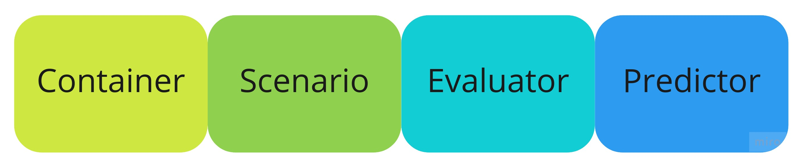
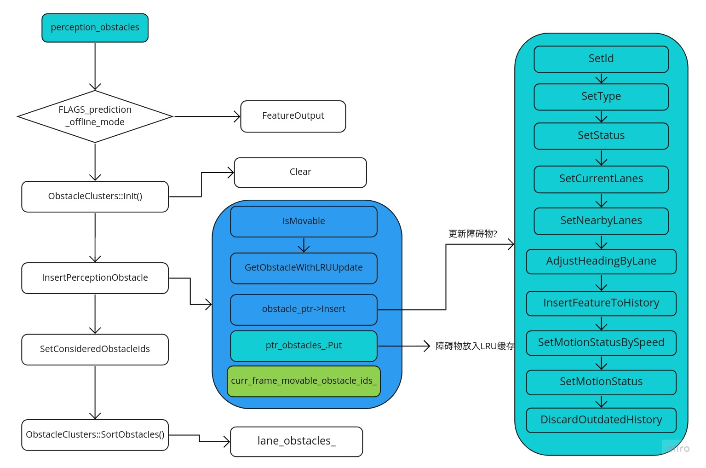

# Prediction

> 悟已往之不谏,知来者之可追


## 介绍
首先建议先阅读官方文档(readme.md)，里面说明了数据流向，也就是说预测模块是直接接收的感知模块给出的障碍物信息，这和CV领域的传统预测任务有区别，CV领域的预测任务不需要先识别物体，只需要根据物体的特征，对比前后2帧，然后得出物体的位置，也就说甚至不需要物体识别，业界之所以不这么做的原因是因为检测物体太耗时了。
当然也有先检测物体再做跟踪的，也就是说目前apollo中的物体检测实际上是采用的第二种方法，这也可以理解，反正感知模块一定会工作，而且一定要检测物体，所以何不把这个信息直接拿过来用呢？这和人类似，逐帧跟踪指定特征的对象，就是物体的轨迹，然后再根据现有的轨迹预测物体讲来的轨迹。
预测的轨迹和障碍物信息发送给规划(planning)模块使用。


## 目录结构
预测模块的目录结构如下：
```
.
├── BUILD
├── common                    // common目录，公用类
├── conf                      // 启动配置
├── container                 // 1. 消息容器
├── dag                       // 启动文件dag
├── data                      // 模型文件路径
├── evaluator                 // 3. 评估者
├── images                    // 文档（图片）
├── launch                    // 启动，加载模块
├── network
├── pipeline                  // 工具
├── prediction_component.cc       // 预测模块主入口
├── prediction_component.h
├── prediction_component_test.cc
├── predictor                // 4. 预测器
├── proto                   // protobuf消息格式
├── README_cn.md            // 文档（中文介绍，建议直接看英文）
├── README.md              // 文档（英文介绍）
├── scenario               // 2. 场景
├── submodules             // 子模块???
├── testdata               // 测试数据
└── util                   // 工具类
```
可以看到预测模块主要是分为2大块功能，一是实时的预测执行过程，一是工具类(离线验证？)：
* **在线预测流程** - container -> scenario -> evaluator -> predictor
* **离线流程** - pipeline (util)提取bag包中的数据给离线测试用？


## 预测模块(PredictionComponent类)
预测模块和其它模块一样，都是在cyber中注册，具体的实现在"prediction_component.h"和"prediction_component.cc"中，我们知道cyber模块有2种消息触发模式，一种是定时器触发，一种是消息触发，而预测为消息触发模式。
预测模块的**输入消息**为：
1. **perception::PerceptionObstacles** - 感知模块输出的障碍物信息
2. **planning::ADCTrajectory** - 规划模块输出的行驶路径
3. **localization::LocalizationEstimate** - 车辆当前的位置

**输出消息**:
1. **prediction::PredictionObstacles** - 预测模块输出的障碍物信息

预测模块和所有其它模块一样，都实现了"cyber::Component"基类中的"Init()"和"Proc()"方法，分别进行初始化和消息触发调用，调用由框架自动执行，关于cyber如何调用和执行每个模块，可以参考cyber模块的介绍，下面我们主要介绍这2个方法。


#### 初始化(Init())
预测模块的初始化在"PredictionComponent::Init()"中进行，主要是注册消息读取和发送控制器，用来读取和发送消息，**需要注意的是初始化过程中也对"MessageProcess"类进行了初始化，而"MessageProcess"实现了预测模块的整个消息处理流程**。
```
bool PredictionComponent::Init() {
  component_start_time_ = Clock::NowInSeconds();

  // 预测模块消息处理流程初始化
  if (!MessageProcess::Init()) {
    return false;
  }

  // 规划模块消息读取者
  planning_reader_ = node_->CreateReader<ADCTrajectory>(
      FLAGS_planning_trajectory_topic, nullptr);

  // 定位模块消息读取者
  localization_reader_ =
      node_->CreateReader<localization::LocalizationEstimate>(
          FLAGS_localization_topic, nullptr);
  // 故事读取???
  storytelling_reader_ = node_->CreateReader<storytelling::Stories>(
      FLAGS_storytelling_topic, nullptr);
  // 预测消息发送者
  prediction_writer_ =
      node_->CreateWriter<PredictionObstacles>(FLAGS_prediction_topic);
  // 中间消息的发送者，这一块的目的是什么？？？
  container_writer_ =
      node_->CreateWriter<SubmoduleOutput>(FLAGS_container_topic_name);

  adc_container_writer_ = node_->CreateWriter<ADCTrajectoryContainer>(
      FLAGS_adccontainer_topic_name);

  perception_obstacles_writer_ = node_->CreateWriter<PerceptionObstacles>(
      FLAGS_perception_obstacles_topic_name);

  return true;
}
```

下面我们接着看消息回调执行函数


#### 回调执行(Proc)
回调执行函数会执行以下过程:
```
bool PredictionComponent::Proc(
    const std::shared_ptr<PerceptionObstacles>& perception_obstacles) {
  // 1. 如果使用lego，则执行子过程
  if (FLAGS_use_lego) {
    return ContainerSubmoduleProcess(perception_obstacles);
  }
  // 2. 否则就执行端到端的过程
  return PredictionEndToEndProc(perception_obstacles);
}
```

下面我们分别看下这2个过程有什么差异？我们先看


#### ContainerSubmoduleProcess
子过程的函数如下：
```c++
bool PredictionComponent::ContainerSubmoduleProcess(
    const std::shared_ptr<PerceptionObstacles>& perception_obstacles) {
  constexpr static size_t kHistorySize = 10;
  const auto frame_start_time = absl::Now();
  // Read localization info. and call OnLocalization to update
  // the PoseContainer.
  // 读取定位信息，并且更新位置容器
  localization_reader_->Observe();
  auto ptr_localization_msg = localization_reader_->GetLatestObserved();
  if (ptr_localization_msg == nullptr) {
    AERROR << "Prediction: cannot receive any localization message.";
    return false;
  }
  MessageProcess::OnLocalization(*ptr_localization_msg);

  // Read planning info. of last frame and call OnPlanning to update
  // the ADCTrajectoryContainer
  // 读取规划路径，并且更新路径容器
  planning_reader_->Observe();
  auto ptr_trajectory_msg = planning_reader_->GetLatestObserved();
  if (ptr_trajectory_msg != nullptr) {
    MessageProcess::OnPlanning(*ptr_trajectory_msg);
  }

  // Read storytelling message and call OnStorytelling to update the
  // StoryTellingContainer
  // 读取故事消息，并且更新故事容器？？？
  storytelling_reader_->Observe();
  auto ptr_storytelling_msg = storytelling_reader_->GetLatestObserved();
  if (ptr_storytelling_msg != nullptr) {
    MessageProcess::OnStoryTelling(*ptr_storytelling_msg);
  }

  MessageProcess::ContainerProcess(*perception_obstacles);
  // 障碍物容器指针
  auto obstacles_container_ptr =
      ContainerManager::Instance()->GetContainer<ObstaclesContainer>(
          AdapterConfig::PERCEPTION_OBSTACLES);
  CHECK_NOTNULL(obstacles_container_ptr);
  // 路径规划容器指针
  auto adc_trajectory_container_ptr =
      ContainerManager::Instance()->GetContainer<ADCTrajectoryContainer>(
          AdapterConfig::PLANNING_TRAJECTORY);
  CHECK_NOTNULL(adc_trajectory_container_ptr);
  // 输出障碍物信息
  SubmoduleOutput submodule_output =
      obstacles_container_ptr->GetSubmoduleOutput(kHistorySize,
                                                  frame_start_time);
  // 发布消息
  container_writer_->Write(submodule_output);
  adc_container_writer_->Write(*adc_trajectory_container_ptr);
  perception_obstacles_writer_->Write(*perception_obstacles);
  return true;
}
```
看起来上述函数只是计算中间过程，并且发布消息到订阅节点。具体的用途需要结合业务来分析（具体的业务场景是什么？？？）。


#### PredictionEndToEndProc
端到端的过程函数如下：
```
bool PredictionComponent::PredictionEndToEndProc(
    const std::shared_ptr<PerceptionObstacles>& perception_obstacles) {

  // Update relative map if needed
  // 如果是导航模式，需要判断地图是否准备好
  if (FLAGS_use_navigation_mode && !PredictionMap::Ready()) {
    AERROR << "Relative map is empty.";
    return false;
  }

  // Read localization info. and call OnLocalization to update
  // the PoseContainer.
  // 读取定位消息，并且处理消息
  localization_reader_->Observe();
  auto ptr_localization_msg = localization_reader_->GetLatestObserved();
  MessageProcess::OnLocalization(*ptr_localization_msg);

  // Read storytelling message and call OnStorytelling to update the
  // StoryTellingContainer
  // 读取并且处理故事消息？？？
  storytelling_reader_->Observe();
  auto ptr_storytelling_msg = storytelling_reader_->GetLatestObserved();
  if (ptr_storytelling_msg != nullptr) {
    MessageProcess::OnStoryTelling(*ptr_storytelling_msg);
  }

  // Read planning info. of last frame and call OnPlanning to update
  // the ADCTrajectoryContainer
  // 读取并且处理规划消息
  planning_reader_->Observe();
  auto ptr_trajectory_msg = planning_reader_->GetLatestObserved();
  if (ptr_trajectory_msg != nullptr) {
    MessageProcess::OnPlanning(*ptr_trajectory_msg);
  }


  // Get all perception_obstacles of this frame and call OnPerception to
  // process them all.
  // 处理障碍物消息
  auto perception_msg = *perception_obstacles;
  PredictionObstacles prediction_obstacles;
  MessageProcess::OnPerception(perception_msg, &prediction_obstacles);


  // 填充发布预测的障碍物轨迹消息
  // Postprocess prediction obstacles message
  prediction_obstacles.set_start_timestamp(frame_start_time_);
  ...

  common::util::FillHeader(node_->Name(), &prediction_obstacles);
  prediction_writer_->Write(prediction_obstacles);
  return true;
}
```


## 消息处理(MessageProcess)
可以看到上述过程都是在MessageProcess中处理完成的，那么我们先看下MessageProcess的执行过程。


#### 初始化(Init)
消息处理的初始化首先在"PredictionComponent::Init()"中调用，下面我们看下实现了哪些功能：
```c++
bool MessageProcess::Init() {
  // 1. 初始化容器
  InitContainers();
  // 2. 初始化评估器
  InitEvaluators();
  // 3. 初始化预测器
  InitPredictors();

  // 如果为导航模式，则判断地图是否加载
  if (!FLAGS_use_navigation_mode && !PredictionMap::Ready()) {
    AERROR << "Map cannot be loaded.";
    return false;
  }

  return true;
}
```
上述子过程的初始化就是从配置文件读取配置，并且初始化对应的类，结构相对比较简单，这里就不一一介绍了。


#### 消息处理
定位，规划和故事的消息处理相对比较简单，主要是向对应的容器中插入数据（每个容器都实现了Insert()方法），下面着重介绍感知模块消息的处理过程，该过程也输出了最后的结果。
```c++
void MessageProcess::OnPerception(
    const perception::PerceptionObstacles& perception_obstacles,
    PredictionObstacles* const prediction_obstacles) {
  // 1. 分析场景和处理容器中的数据
  ContainerProcess(perception_obstacles);

  // 获取障碍物容器
  auto ptr_obstacles_container =
      ContainerManager::Instance()->GetContainer<ObstaclesContainer>(
          AdapterConfig::PERCEPTION_OBSTACLES);
  // 获取规划曲线容器
  auto ptr_ego_trajectory_container =
      ContainerManager::Instance()->GetContainer<ADCTrajectoryContainer>(
          AdapterConfig::PLANNING_TRAJECTORY);

  // Insert features to FeatureOutput for offline_mode
  // 离线模式，保存障碍物曲线？？？
  if (FLAGS_prediction_offline_mode == PredictionConstants::kDumpFeatureProto) {
    for (const int id :
         ptr_obstacles_container->curr_frame_movable_obstacle_ids()) {
      Obstacle* obstacle_ptr = ptr_obstacles_container->GetObstacle(id);
      if (obstacle_ptr == nullptr) {
        AERROR << "Null obstacle found.";
        continue;
      }
      if (!obstacle_ptr->latest_feature().IsInitialized()) {
        AERROR << "Obstacle [" << id << "] has no latest feature.";
        continue;
      }
      // TODO(all): the adc trajectory should be part of features for learning
      //            algorithms rather than part of the feature.proto
      /*
      *obstacle_ptr->mutable_latest_feature()->mutable_adc_trajectory_point() =
          ptr_ego_trajectory_container->adc_trajectory().trajectory_point();
      */
      FeatureOutput::InsertFeatureProto(obstacle_ptr->latest_feature());
      ADEBUG << "Insert feature into feature output";
    }
    // Not doing evaluation on offline mode
    return;
  }

  // Make evaluations
  // 2. 进行评估
  EvaluatorManager::Instance()->Run(ptr_obstacles_container);
  if (FLAGS_prediction_offline_mode ==
          PredictionConstants::kDumpDataForLearning ||
      FLAGS_prediction_offline_mode == PredictionConstants::kDumpFrameEnv) {
    return;
  }

  // Make predictions
  // 3. 进行预测
  PredictorManager::Instance()->Run(perception_obstacles,
                                    ptr_ego_trajectory_container,
                                    ptr_obstacles_container);

  // Get predicted obstacles
  // 4. 输出预测结果
  *prediction_obstacles = PredictorManager::Instance()->prediction_obstacles();
}
```
上面的消息处理过程实际上是整个预测的过程，分为以下几个步骤：



下面主要分析各个模块的输入是什么，输出是什么？ 以及它们的作用？


## 容器(container)
容器的作用主要是存储对应类型的消息，用来给评估器(evaluator)使用。

#### 容器基类(Container)
首先介绍容器基类"Container"类，主要申明了"Insert"方法：
```
class Container {
 public:
  Container() = default;

  virtual ~Container() = default;

  // 子类重写Insert方法
  virtual void Insert(const ::google::protobuf::Message& message) = 0;
};
```

#### 容器管理(ContainerManager)
上述基类有4个扩展类：PoseContainer，ObstaclesContainer，ADCTrajectoryContainer和StoryTellingContainer，分别存储不同的消息类型，而这些容器的管理和注册在ContainerManager中，下面我们看下ContainerManager类的具体实现。
```c++
class ContainerManager {
 public:
  // 初始化
  void Init(const common::adapter::AdapterManagerConfig &config);

  // 获取容器模板
  template <typename T>
  T *GetContainer(const common::adapter::AdapterConfig::MessageType &type) {
    auto key_type = static_cast<int>(type);
    if (containers_.find(key_type) != containers_.end()) {
      return static_cast<T *>(containers_[key_type].get());
    }
    return nullptr;
  }
  // gtest 可以访问被测试类的私有成员
  FRIEND_TEST(FeatureExtractorTest, junction);
  FRIEND_TEST(ScenarioManagerTest, run);

 private:
  // 注册容器
  void RegisterContainer(
      const common::adapter::AdapterConfig::MessageType &type);

  // 创建容器
  std::unique_ptr<Container> CreateContainer(
      const common::adapter::AdapterConfig::MessageType &type);

  // 注册所有的容器
  void RegisterContainers();

 private:
  // 容器map，保存所有已经创建的容器
  std::unordered_map<int, std::unique_ptr<Container>> containers_;

  // 配置文件
  common::adapter::AdapterManagerConfig config_;
  // 单例
  DECLARE_SINGLETON(ContainerManager)
};
```
ContainerManager类的执行过程如下：

可以看到容器管理器在Init中根据配置文件创建并且注册对应类型的容器，并且放到"containers_"中，而"containers_"为map结构，其中key为容器的类型，而值为对应的容器。注册之后通过"GetContainer"获取对应类型的容器。
总结起来就是"ContainerManager"负责从配置文件注册并且管理对应的容器。

#### 姿态容器(PoseContainer)
姿态容器主要是根据"localization::LocalizationEstimate"消息转换为障碍物(perception::PerceptionObstacle)信息，这其实是把本车转换为障碍物。
```c++
class PoseContainer : public Container {
 public:
  PoseContainer() = default;

  virtual ~PoseContainer() = default;

  // 插入消息
  void Insert(const ::google::protobuf::Message& message) override;

  // 获取障碍物信息(这里就是本车)
  const perception::PerceptionObstacle* ToPerceptionObstacle();

  double GetTimestamp();

 private:
  // 根据本车位置转换为障碍物信息
  void Update(const localization::LocalizationEstimate& localization);

 public:
  // 类型赋值为车
  static const perception::PerceptionObstacle::Type type_ =
      perception::PerceptionObstacle::VEHICLE;

 private:
  // 障碍物指针
  std::unique_ptr<perception::PerceptionObstacle> obstacle_ptr_;
};
```
姿态容器(PoseContainer)中主要注意"PoseContainer::Update"方法的实现，即把当前车辆转换为障碍物信息，由于该函数实现比较简单，这里就不展开了。

#### 规划轨迹容器(ADCTrajectoryContainer)
ADCTrajectoryContainer类的具体实现如下：
```c++
class ADCTrajectoryContainer : public Container {
 public:

  ADCTrajectoryContainer();
  virtual ~ADCTrajectoryContainer() = default;

  // 插入消息
  void Insert(const ::google::protobuf::Message& message) override;

  // 是否受到保护???
  bool IsProtected() const;

  // 确认点是否在路口之中
  bool IsPointInJunction(const common::PathPoint& point) const;

  // 当前的道路序列是否和规划的轨迹有重叠???
  bool HasOverlap(const LaneSequence& lane_sequence) const;

  // 设置位置
  void SetPosition(const common::math::Vec2d& position);

  // 获取规划轨迹中的路口
  std::shared_ptr<const hdmap::JunctionInfo> ADCJunction() const;

  // 获取到路口的距离
  double ADCDistanceToJunction() const;

  // 获取规划轨迹
  const planning::ADCTrajectory& adc_trajectory() const;

  // 道路是否在参考线中
  bool IsLaneIdInReferenceLine(const std::string& lane_id) const;

  bool IsLaneIdInTargetReferenceLine(const std::string& lane_id) const;
  // 获取道路序列
  const std::vector<std::string>& GetADCLaneIDSequence() const;

  const std::vector<std::string>& GetADCTargetLaneIDSequence() const;
  // 设置路口???
  void SetJunction(const std::string& junction_id, const double distance);

 private:
  // 设置路口的形状
  void SetJunctionPolygon();
  // 设置道路序列
  void SetLaneSequence();

  void SetTargetLaneSequence();
  // 道路id转换为字符串
  std::string ToString(const std::unordered_set<std::string>& lane_ids);

  std::string ToString(const std::vector<std::string>& lane_ids);

 private:
  planning::ADCTrajectory adc_trajectory_;          // 规划轨迹
  common::math::Polygon2d adc_junction_polygon_;    // 轨迹的路口形状
  std::shared_ptr<const hdmap::JunctionInfo> adc_junction_info_ptr_;
  double s_dist_to_junction_;
  std::unordered_set<std::string> adc_lane_ids_;
  std::vector<std::string> adc_lane_seq_;           // 轨迹道路序列
  std::unordered_set<std::string> adc_target_lane_ids_;
  std::vector<std::string> adc_target_lane_seq_;
};
```
还是一样查看对应的"Insert"函数中实现了哪些功能？
```c++
void ADCTrajectoryContainer::Insert(
    const ::google::protobuf::Message& message) {
  adc_lane_ids_.clear();
  adc_lane_seq_.clear();
  adc_target_lane_ids_.clear();
  adc_target_lane_seq_.clear();
  adc_junction_polygon_ = std::move(Polygon2d());
  // 获取规划轨迹
  adc_trajectory_.CopyFrom(dynamic_cast<const ADCTrajectory&>(message));

  // 设置道路序列
  SetLaneSequence();

  // 设置目标道路序列
  SetTargetLaneSequence();
}
```
可以看到"Insert"函数主要实现了规划轨迹的赋值操作，也就是保存规划轨迹的信息，**而其它函数的功能，主要用来场景(scenario)识别中**，我们在看到具体的场景识别的时候再展开分析。

##### 故事容器(StoryTellingContainer)
StoryTellingContainer类和其它上述容器的实现类似:
```c++
class StoryTellingContainer : public Container {
 public:
  StoryTellingContainer() = default;
  virtual ~StoryTellingContainer() = default;

  // 插入storytelling::Stories信息
  void Insert(const ::google::protobuf::Message& message) override;

  // 获取路口信息
  std::shared_ptr<const hdmap::JunctionInfo> ADCJunction() const;

  // 获取路口Id
  const std::string& ADCJunctionId() const;

  // 计算到路口的距离
  double ADCDistanceToJunction() const;

 private:
  apollo::storytelling::CloseToJunction close_to_junction_;
};
```
StoryTellingContainer类实际上是接收"storytelling"模块的消息，来获取当前车和路口的距离。

#### 障碍物容器(ObstaclesContainer)
我们最后介绍障碍物容器，实际上障碍物分为2块，一种是障碍物(Obstacle)，一种是障碍物簇(ObstacleClusters)，下面我们分别开始介绍：
```c++
class ObstaclesContainer : public Container {
 public:
  ObstaclesContainer();
  explicit ObstaclesContainer(const SubmoduleOutput& submodule_output);
  virtual ~ObstaclesContainer() = default;

  // 插入障碍物(PerceptionObstacles)信息
  void Insert(const ::google::protobuf::Message& message) override;

  // 插入障碍物信息和时间戳
  void InsertPerceptionObstacle(
      const perception::PerceptionObstacle& perception_obstacle,
      const double timestamp);

  // 根据特征创建并且插入对应的障碍物
  void InsertFeatureProto(const Feature& feature);

  // 创建道路图结构
  void BuildLaneGraph();

  // 创建路口的特征
  void BuildJunctionFeature();

  // 根据id获取障碍物
  Obstacle* GetObstacle(const int id);

  // 清空障碍物容器???
  void Clear();

  void CleanUp();

  size_t NumOfObstacles() { return ptr_obstacles_.size(); }
  // 根据id获取障碍物
  const apollo::perception::PerceptionObstacle& GetPerceptionObstacle(
      const int id);

  // 当前帧的移动障碍物id
  const std::vector<int>& curr_frame_movable_obstacle_ids();

  // 当前帧不能移动的障碍物id
  const std::vector<int>& curr_frame_unmovable_obstacle_ids();

  // 当前帧中不能忽略的障碍物信息
  const std::vector<int>& curr_frame_considered_obstacle_ids();

  // 设置不能忽略的障碍物id
  void SetConsideredObstacleIds();

  // 当前帧中的障碍物id
  std::vector<int> curr_frame_obstacle_ids();

  double timestamp() const;

  // 获取子模块输出
  SubmoduleOutput GetSubmoduleOutput(
      const size_t history_size, const absl::Time& frame_start_time);

 private:
  // 根据最近最少使用的原则获取障碍物
  Obstacle* GetObstacleWithLRUUpdate(const int obstacle_id);
  // 是否移动
  bool IsMovable(const perception::PerceptionObstacle& perception_obstacle);

 private:
  double timestamp_ = -1.0;
  common::util::LRUCache<int, std::unique_ptr<Obstacle>> ptr_obstacles_;
  std::vector<int> curr_frame_movable_obstacle_ids_;
  std::vector<int> curr_frame_unmovable_obstacle_ids_;
  std::vector<int> curr_frame_considered_obstacle_ids_;
};
```
可以看到障碍物容器主要是根据不同的障碍物测量保存障碍物信息，下面我们看下相应的流程图：

可以看到上述过程中的主要功能实现都在"Obstacle"类中，下面我们主要分析下"Obstacle"类中的几个函数。

我们接着看"Obstacle"类的消息插入函数：
```c++
bool Obstacle::Insert(const PerceptionObstacle& perception_obstacle,
                      const double timestamp,
                      const int prediction_obstacle_id) {
  // 是否是过时的消息
  if (ReceivedOlderMessage(timestamp)) {
    return false;
  }

  // 把障碍物的信息赋值给feature，包括Id,Type,Status
  Feature feature;
  if (!SetId(perception_obstacle, &feature, prediction_obstacle_id)) {
    return false;
  }

  SetType(perception_obstacle, &feature);

  SetStatus(perception_obstacle, timestamp, &feature);

  // Set obstacle lane features
  // 设置障碍物lane特征
  if (type_ != PerceptionObstacle::PEDESTRIAN) {
    SetCurrentLanes(&feature);
    SetNearbyLanes(&feature);
  }

  // 根据lane调整车辆的方向
  if (FLAGS_adjust_vehicle_heading_by_lane &&
      type_ == PerceptionObstacle::VEHICLE) {
    AdjustHeadingByLane(&feature);
  }

  // 将障碍物特征保存到历史(feature_history_)
  InsertFeatureToHistory(feature);

  // 设置障碍物运动状态(set_is_still)
  if (FLAGS_use_navigation_mode) {
    SetMotionStatusBySpeed();
  } else {
    SetMotionStatus();
  }

  // 删除过去的历史特征(feature_history_)
  DiscardOutdatedHistory();
  return true;
}
```
其中还用到了卡尔曼(KalmanFilter)滤波？？？


我们接着看BuildLaneGraph函数：
```c++
void Obstacle::BuildLaneGraph() {

  Feature* feature = mutable_latest_feature();
  // No need to BuildLaneGraph for those non-moving obstacles.
  if (feature->is_still() && id_ != FLAGS_ego_vehicle_id) {
    ADEBUG << "Not build lane graph for still obstacle";
    return;
  }
  if (feature->lane().lane_graph().lane_sequence_size() > 0) {
    ADEBUG << "Not build lane graph for an old obstacle";
    return;
  }
  double speed = feature->speed();
  double t_max = FLAGS_prediction_trajectory_time_length;
  auto estimated_move_distance = speed * t_max;

  double road_graph_search_distance = std::fmax(
      estimated_move_distance, FLAGS_min_prediction_trajectory_spatial_length);

  bool is_in_junction = HasJunctionFeatureWithExits();
  std::unordered_set<std::string> exit_lane_id_set;
  if (is_in_junction) {
    for (const auto& exit : feature->junction_feature().junction_exit()) {
      exit_lane_id_set.insert(exit.exit_lane_id());
    }
  }

  // BuildLaneGraph for current lanes:
  // Go through all the LaneSegments in current_lane,
  // construct up to max_num_current_lane of them.
  int seq_id = 0;
  int curr_lane_count = 0;
  for (auto& lane : feature->lane().current_lane_feature()) {
    std::shared_ptr<const LaneInfo> lane_info =
        PredictionMap::LaneById(lane.lane_id());
    LaneGraph lane_graph = ObstacleClusters::GetLaneGraph(
        lane.lane_s(), road_graph_search_distance, true, lane_info);
    if (lane_graph.lane_sequence_size() > 0) {
      ++curr_lane_count;
    }
    for (const auto& lane_seq : lane_graph.lane_sequence()) {
      if (is_in_junction && !HasJunctionExitLane(lane_seq, exit_lane_id_set)) {
        continue;
      }
      LaneSequence* lane_seq_ptr =
          feature->mutable_lane()->mutable_lane_graph()->add_lane_sequence();
      lane_seq_ptr->CopyFrom(lane_seq);
      lane_seq_ptr->set_lane_sequence_id(seq_id++);
      lane_seq_ptr->set_lane_s(lane.lane_s());
      lane_seq_ptr->set_lane_l(lane.lane_l());
      lane_seq_ptr->set_vehicle_on_lane(true);
      lane_seq_ptr->set_lane_type(lane.lane_type());
      SetLaneSequenceStopSign(lane_seq_ptr);
      ADEBUG << "Obstacle [" << id_ << "] set a lane sequence ["
             << lane_seq.ShortDebugString() << "].";
    }
    if (curr_lane_count >= FLAGS_max_num_current_lane) {
      break;
    }
  }

  // BuildLaneGraph for neighbor lanes.
  int nearby_lane_count = 0;
  for (auto& lane : feature->lane().nearby_lane_feature()) {
    std::shared_ptr<const LaneInfo> lane_info =
        PredictionMap::LaneById(lane.lane_id());
    LaneGraph lane_graph = ObstacleClusters::GetLaneGraph(
        lane.lane_s(), road_graph_search_distance, false, lane_info);
    if (lane_graph.lane_sequence_size() > 0) {
      ++nearby_lane_count;
    }
    for (const auto& lane_seq : lane_graph.lane_sequence()) {
      if (is_in_junction && !HasJunctionExitLane(lane_seq, exit_lane_id_set)) {
        continue;
      }
      LaneSequence* lane_seq_ptr =
          feature->mutable_lane()->mutable_lane_graph()->add_lane_sequence();
      lane_seq_ptr->CopyFrom(lane_seq);
      lane_seq_ptr->set_lane_sequence_id(seq_id++);
      lane_seq_ptr->set_lane_s(lane.lane_s());
      lane_seq_ptr->set_lane_l(lane.lane_l());
      lane_seq_ptr->set_vehicle_on_lane(false);
      lane_seq_ptr->set_lane_type(lane.lane_type());
      SetLaneSequenceStopSign(lane_seq_ptr);
      ADEBUG << "Obstacle [" << id_ << "] set a lane sequence ["
             << lane_seq.ShortDebugString() << "].";
    }
    if (nearby_lane_count >= FLAGS_max_num_nearby_lane) {
      break;
    }
  }

  if (feature->has_lane() && feature->lane().has_lane_graph()) {
    SetLanePoints(feature);
    SetLaneSequencePath(feature->mutable_lane()->mutable_lane_graph());
  }
  ADEBUG << "Obstacle [" << id_ << "] set lane graph features.";
}
```

#### 道路图(RoadGraph)
道路图的实现在"road_graph.h"和"road_graph.cc"中，构建道路图在"BuildLaneGraph"方法中，而主要的实现则在"ConstructLaneSequence"中：
```c++
void RoadGraph::ConstructLaneSequence(
    const bool search_forward_direction, const double accumulated_s,
    const double curr_lane_seg_s, std::shared_ptr<const LaneInfo> lane_info_ptr,
    const int graph_search_horizon, const bool consider_lane_split,
    std::list<LaneSegment>* const lane_segments,
    LaneGraph* const lane_graph_ptr) const {
  // Sanity checks.
  if (lane_info_ptr == nullptr) {
    AERROR << "Invalid lane.";
    return;
  }
  if (graph_search_horizon < 0) {
    AERROR << "The lane search has already reached the limits";
    AERROR << "Possible map error found!";
    return;
  }

  // Create a new lane_segment based on the current lane_info_ptr.
  double curr_s =
      curr_lane_seg_s >= 0.0 ? curr_lane_seg_s : lane_info_ptr->total_length();
  LaneSegment lane_segment;
  lane_segment.set_adc_s(curr_s);
  lane_segment.set_lane_id(lane_info_ptr->id().id());
  lane_segment.set_lane_turn_type(
      PredictionMap::LaneTurnType(lane_info_ptr->id().id()));
  lane_segment.set_total_length(lane_info_ptr->total_length());
  if (search_forward_direction) {
    lane_segment.set_start_s(curr_s);
    lane_segment.set_end_s(std::fmin(curr_s + length_ - accumulated_s,
                                     lane_info_ptr->total_length()));
  } else {
    lane_segment.set_start_s(
        std::fmax(0.0, curr_s - (length_ - accumulated_s)));
    lane_segment.set_end_s(curr_s);
  }
  if (search_forward_direction) {
    lane_segments->push_back(std::move(lane_segment));
  } else {
    lane_segments->push_front(std::move(lane_segment));
  }

  // End condition: if search reached the maximum search distance,
  // or if there is no more successor lane_segment.
  if (search_forward_direction) {
    if (lane_segment.end_s() < lane_info_ptr->total_length() ||
        lane_info_ptr->lane().successor_id().empty()) {
      LaneSequence* sequence = lane_graph_ptr->add_lane_sequence();
      for (const auto& it : *lane_segments) {
        *(sequence->add_lane_segment()) = it;
      }
      lane_segments->pop_back();
      return;
    }
  } else {
    if (lane_segment.start_s() > 0.0 ||
        lane_info_ptr->lane().predecessor_id().empty()) {
      LaneSequence* sequence = lane_graph_ptr->add_lane_sequence();
      for (const auto& it : *lane_segments) {
        *(sequence->add_lane_segment()) = it;
      }
      lane_segments->pop_front();
      return;
    }
  }

  // Otherwise, continue searching for subsequent lane_segments.
  double new_accumulated_s = 0.0;
  double new_lane_seg_s = 0.0;
  std::vector<std::shared_ptr<const hdmap::LaneInfo>> candidate_lanes;
  std::set<std::string> set_lane_ids;
  if (search_forward_direction) {
    new_accumulated_s = accumulated_s + lane_info_ptr->total_length() - curr_s;
    // Reundancy removal.
    for (const auto& successor_lane_id : lane_info_ptr->lane().successor_id()) {
      set_lane_ids.insert(successor_lane_id.id());
    }
    for (const auto& unique_id : set_lane_ids) {
      candidate_lanes.push_back(PredictionMap::LaneById(unique_id));
    }
    // Sort the successor lane_segments from left to right.
    std::sort(candidate_lanes.begin(), candidate_lanes.end(), IsAtLeft);
    // Based on other conditions, select what successor lanes should be used.
    if (!consider_lane_split) {
      candidate_lanes = {
          PredictionMap::LaneWithSmallestAverageCurvature(candidate_lanes)};
    }
  } else {
    new_accumulated_s = accumulated_s + curr_s;
    new_lane_seg_s = -0.1;
    // Redundancy removal.
    for (const auto& predecessor_lane_id :
         lane_info_ptr->lane().predecessor_id()) {
      set_lane_ids.insert(predecessor_lane_id.id());
    }
    for (const auto& unique_id : set_lane_ids) {
      candidate_lanes.push_back(PredictionMap::LaneById(unique_id));
    }
  }
  bool consider_further_lane_split =
      !search_forward_direction ||
      (FLAGS_prediction_offline_mode ==
       PredictionConstants::kDumpFeatureProto) ||
      (FLAGS_prediction_offline_mode ==
       PredictionConstants::kDumpDataForLearning) ||
      (consider_lane_split && candidate_lanes.size() == 1);
  // Recursively expand lane-sequence.
  for (const auto& candidate_lane : candidate_lanes) {
    ConstructLaneSequence(search_forward_direction, new_accumulated_s,
                          new_lane_seg_s, candidate_lane,
                          graph_search_horizon - 1, consider_further_lane_split,
                          lane_segments, lane_graph_ptr);
  }
  if (search_forward_direction) {
    lane_segments->pop_back();
  } else {
    lane_segments->pop_front();
  }
}
```
上述道路图的作用是什么？？？如何构造道路图？？？


## 场景(scenario)
根据本车的位置，和高精度地图，解析当前车辆所在的场景。

#### 场景管理器(ScenarioManager)
场景管理器只有2个函数，一个是Run，一个是输出当前场景scenario。下面我们分析如何获取当前场景：
```
void ScenarioManager::Run() {
  // 获取环境特征
  auto environment_features = FeatureExtractor::ExtractEnvironmentFeatures();
  // 通过环境特征分析场景
  auto ptr_scenario_features = ScenarioAnalyzer::Analyze(environment_features);
  // 给当前场景赋值
  current_scenario_ = ptr_scenario_features->scenario();

  // TODO(all) other functionalities including lane, junction filters
}
```


## 评估者(evaluator)
"Evaluator"类为基类，其它类继承至该类，而"EvaluatorManager"类做为管理类，负责管理三种评估者，分别为：自行车，行人，汽车。

#### 评估者基类(Evaluator)
在"Evaluator"基类中申明方法"Evaluate"，其它子类重新构造实现了上述方法。另外基类中还实现了2个辅助函数：
1. 提供世界坐标到物体坐标转换
```
  std::pair<double, double> WorldCoordToObjCoord(
      std::pair<double, double> input_world_coord,
      std::pair<double, double> obj_world_coord, double obj_world_angle)
```
2. 提供向量转矩阵？？？
```
  Eigen::MatrixXf VectorToMatrixXf(const std::vector<double>& nums,
                                   const int start_index, const int end_index)

  Eigen::MatrixXf VectorToMatrixXf(const std::vector<double>& nums,
                                   const int start_index, const int end_index,
                                   const int output_num_row,
                                   const int output_num_col)
```

#### 评估者管理器(EvaluatorManager)
评估者管理器主要是对评估器进行管理和注册。
```
class EvaluatorManager {
 public:

  virtual ~EvaluatorManager() = default;

  void Init(const PredictionConf& config);

  Evaluator* GetEvaluator(const ObstacleConf::EvaluatorType& type);

  void Run(ObstaclesContainer* obstacles_container);

  void EvaluateObstacle(Obstacle* obstacle,
                        ObstaclesContainer* obstacles_container,
                        std::vector<Obstacle*> dynamic_env);

  void EvaluateObstacle(Obstacle* obstacle,
                        ObstaclesContainer* obstacles_container);

 private:
  void BuildObstacleIdHistoryMap(ObstaclesContainer* obstacles_container);

  void DumpCurrentFrameEnv(ObstaclesContainer* obstacles_container);

  void RegisterEvaluator(const ObstacleConf::EvaluatorType& type);

  std::unique_ptr<Evaluator> CreateEvaluator(
      const ObstacleConf::EvaluatorType& type);

  void RegisterEvaluators();

 private:
  std::map<ObstacleConf::EvaluatorType, std::unique_ptr<Evaluator>> evaluators_;
  ...

  std::unordered_map<int, ObstacleHistory> obstacle_id_history_map_;

  DECLARE_SINGLETON(EvaluatorManager)
};
```


下面我们分别查看3种不同的评估者： 自行车评估者，行人评估者和车辆评估者。
#### 自行车评估者(CyclistKeepLaneEvaluator)
自行车评估者主要是评估自行车保持当前车道的概率。评估主要是函数"Evaluate"中进行的，**函数的参数"obstacles_container"没有使用，使用的只是"obstacle_ptr"障碍物指针**。评估的过程主要是根据生成的"LaneGraph"计算自行车在lane中出现的概率。
```c++
bool CyclistKeepLaneEvaluator::Evaluate(
    Obstacle* obstacle_ptr, ObstaclesContainer* obstacles_container) {
  // 设置评估者类型
  obstacle_ptr->SetEvaluatorType(evaluator_type_);
  // 特征是否初始化，该方法为protobuf自带方法，确认required字段是否都已经赋值，看起来这里没必要判断？？？
  // https://github.com/protocolbuffers/protobuf/issues/2900
  int id = obstacle_ptr->id();
  if (!obstacle_ptr->latest_feature().IsInitialized()) {
    return false;
  }

  Feature* latest_feature_ptr = obstacle_ptr->mutable_latest_feature();
  // 检查特征是否包含lane graph
  if (!latest_feature_ptr->has_lane() ||
      !latest_feature_ptr->lane().has_lane_graph() ||
      !latest_feature_ptr->lane().has_lane_feature()) {
    return false;
  }

  LaneGraph* lane_graph_ptr =
      latest_feature_ptr->mutable_lane()->mutable_lane_graph();
  // 检查lane graph的道路序列是否为空
  if (lane_graph_ptr->lane_sequence().empty()) {
    return false;
  }

  std::string curr_lane_id =
      latest_feature_ptr->lane().lane_feature().lane_id();
  // 计算每个lane序列的概率
  for (auto& lane_sequence : *lane_graph_ptr->mutable_lane_sequence()) {
    const double probability = ComputeProbability(curr_lane_id, lane_sequence);
    lane_sequence.set_probability(probability);
  }
  return true;
}
```
下面我们看下概率计算是如何进行的？计算的过程也很简单，就是判断lane序列的第一条lane是否和当前lane相同，相同则返回1，不相同则返回0。
```
double CyclistKeepLaneEvaluator::ComputeProbability(
    const std::string& curr_lane_id, const LaneSequence& lane_sequence) {
  if (lane_sequence.lane_segment().empty()) {
    AWARN << "Empty lane sequence.";
    return 0.0;
  }
  // 如果序列的第一条车道和当前车道id一致，那么则返回1，否则返回0
  std::string lane_seq_first_id = lane_sequence.lane_segment(0).lane_id();
  if (curr_lane_id == lane_seq_first_id) {
    return 1.0;
  }
  return 0.0;
}
```

#### 行人互动评估者(PedestrianInteractionEvaluator)
行人互动评估主要是估计行人的概率，采用了深度学习的LSTM模型，关于行人预测可以参考论文"Social LSTM:Human Trajectory Prediction in Crowded Spaces"，这里我们对代码进行分析。
1. 首先初始化加载深度学习模型。
```c++
void PedestrianInteractionEvaluator::LoadModel() {
  // 设置线程数为1
  torch::set_num_threads(1);
  if (FLAGS_use_cuda && torch::cuda::is_available()) {
    ADEBUG << "CUDA is available";
    // 设置CUDA设备
    device_ = torch::Device(torch::kCUDA);
  }
  // 加载训练好的LTSM模型文件
  torch_position_embedding_ = torch::jit::load(
      FLAGS_torch_pedestrian_interaction_position_embedding_file, device_);
  torch_social_embedding_ = torch::jit::load(
      FLAGS_torch_pedestrian_interaction_social_embedding_file, device_);
  torch_single_lstm_ = torch::jit::load(
      FLAGS_torch_pedestrian_interaction_single_lstm_file, device_);
  torch_prediction_layer_ = torch::jit::load(
      FLAGS_torch_pedestrian_interaction_prediction_layer_file, device_);
}
```
2. 评估行人行为，函数比较长，输入为障碍物，输出为行人轨迹"latest_feature_ptr->add_predicted_trajectory"，关于Feature的描述在"feature.proto"中。其中函数参数"obstacles_container"没有使用（原因为继承至基类的方法，重写的时候保存了参数），下面我们开始分析具体的代码：
```c++
bool PedestrianInteractionEvaluator::Evaluate(
    Obstacle* obstacle_ptr, ObstaclesContainer* obstacles_container) {
  // Sanity checks.
  CHECK_NOTNULL(obstacle_ptr);

  obstacle_ptr->SetEvaluatorType(evaluator_type_);

  int id = obstacle_ptr->id();
  if (!obstacle_ptr->latest_feature().IsInitialized()) {
    AERROR << "Obstacle [" << id << "] has no latest feature.";
    return false;
  }
  Feature* latest_feature_ptr = obstacle_ptr->mutable_latest_feature();
  CHECK_NOTNULL(latest_feature_ptr);

  // Extract features, and:
  //  - if in offline mode, save it locally for training.
  //  - if in online mode, pass it through trained model to evaluate.
  std::vector<double> feature_values;
  // 这里只是把最新的行人时间戳和位置提取出来了，并且线性存储在数组中(把数据展开)，
  // 也就是说数组的第一个元素是时间戳，第二为ID，第三和第四为位置。
  ExtractFeatures(obstacle_ptr, &feature_values);
  if (FLAGS_prediction_offline_mode ==
      PredictionConstants::kDumpDataForLearning) {
    FeatureOutput::InsertDataForLearning(*latest_feature_ptr, feature_values,
                                         "pedestrian", nullptr);
    ADEBUG << "Saving extracted features for learning locally.";
    return true;
  }

  static constexpr double kShortTermPredictionTimeResolution = 0.4;
  static constexpr int kShortTermPredictionPointNum = 5;
  static constexpr int kHiddenStateUpdateCycle = 4;

  // Step 1 Get social embedding
  torch::Tensor social_pooling = GetSocialPooling();
  std::vector<torch::jit::IValue> social_embedding_inputs;
  social_embedding_inputs.push_back(std::move(social_pooling.to(device_)));
  torch::Tensor social_embedding =
      torch_social_embedding_.forward(social_embedding_inputs)
          .toTensor()
          .to(torch::kCPU);

  // Step 2 Get position embedding
  double pos_x = feature_values[2];
  double pos_y = feature_values[3];
  double rel_x = 0.0;
  double rel_y = 0.0;
  if (obstacle_ptr->history_size() > kHiddenStateUpdateCycle - 1) {
    rel_x = obstacle_ptr->latest_feature().position().x() -
            obstacle_ptr->feature(3).position().x();
    rel_y = obstacle_ptr->latest_feature().position().y() -
            obstacle_ptr->feature(3).position().y();
  }

  torch::Tensor torch_position = torch::zeros({1, 2});
  torch_position[0][0] = rel_x;
  torch_position[0][1] = rel_y;
  std::vector<torch::jit::IValue> position_embedding_inputs;
  position_embedding_inputs.push_back(std::move(torch_position.to(device_)));
  torch::Tensor position_embedding =
      torch_position_embedding_.forward(position_embedding_inputs)
          .toTensor()
          .to(torch::kCPU);

  // Step 3 Conduct single LSTM and update hidden states
  torch::Tensor lstm_input =
      torch::zeros({1, 2 * (kEmbeddingSize + kHiddenSize)});
  for (int i = 0; i < kEmbeddingSize; ++i) {
    lstm_input[0][i] = position_embedding[0][i];
  }

  if (obstacle_id_lstm_state_map_.find(id) ==
      obstacle_id_lstm_state_map_.end()) {
    obstacle_id_lstm_state_map_[id].ht = torch::zeros({1, 1, kHiddenSize});
    obstacle_id_lstm_state_map_[id].ct = torch::zeros({1, 1, kHiddenSize});
    obstacle_id_lstm_state_map_[id].timestamp = obstacle_ptr->timestamp();
    obstacle_id_lstm_state_map_[id].frame_count = 0;
  }
  torch::Tensor curr_ht = obstacle_id_lstm_state_map_[id].ht;
  torch::Tensor curr_ct = obstacle_id_lstm_state_map_[id].ct;
  int curr_frame_count = obstacle_id_lstm_state_map_[id].frame_count;

  if (curr_frame_count == kHiddenStateUpdateCycle - 1) {
    for (int i = 0; i < kHiddenSize; ++i) {
      lstm_input[0][kEmbeddingSize + i] = curr_ht[0][0][i];
      lstm_input[0][kEmbeddingSize + kHiddenSize + i] = curr_ct[0][0][i];
    }

    std::vector<torch::jit::IValue> lstm_inputs;
    lstm_inputs.push_back(std::move(lstm_input.to(device_)));
    auto lstm_out_tuple = torch_single_lstm_.forward(lstm_inputs).toTuple();
    auto ht = lstm_out_tuple->elements()[0].toTensor();
    auto ct = lstm_out_tuple->elements()[1].toTensor();
    obstacle_id_lstm_state_map_[id].ht = ht.clone();
    obstacle_id_lstm_state_map_[id].ct = ct.clone();
  }
  obstacle_id_lstm_state_map_[id].frame_count =
      (curr_frame_count + 1) % kHiddenStateUpdateCycle;

  // Step 4 for-loop get a trajectory
  // Set the starting trajectory point
  Trajectory* trajectory = latest_feature_ptr->add_predicted_trajectory();
  trajectory->set_probability(1.0);
  TrajectoryPoint* start_point = trajectory->add_trajectory_point();
  start_point->mutable_path_point()->set_x(pos_x);
  start_point->mutable_path_point()->set_y(pos_y);
  start_point->mutable_path_point()->set_theta(latest_feature_ptr->theta());
  start_point->set_v(latest_feature_ptr->speed());
  start_point->set_relative_time(0.0);

  for (int i = 1; i <= kShortTermPredictionPointNum; ++i) {
    double prev_x = trajectory->trajectory_point(i - 1).path_point().x();
    double prev_y = trajectory->trajectory_point(i - 1).path_point().y();
    CHECK(obstacle_id_lstm_state_map_.find(id) !=
          obstacle_id_lstm_state_map_.end());
    torch::Tensor torch_position = torch::zeros({1, 2});
    double curr_rel_x = rel_x;
    double curr_rel_y = rel_y;
    if (i > 1) {
      curr_rel_x =
          prev_x - trajectory->trajectory_point(i - 2).path_point().x();
      curr_rel_y =
          prev_y - trajectory->trajectory_point(i - 2).path_point().y();
    }
    torch_position[0][0] = curr_rel_x;
    torch_position[0][1] = curr_rel_y;
    std::vector<torch::jit::IValue> position_embedding_inputs;
    position_embedding_inputs.push_back(std::move(torch_position.to(device_)));
    torch::Tensor position_embedding =
        torch_position_embedding_.forward(position_embedding_inputs)
            .toTensor()
            .to(torch::kCPU);
    torch::Tensor lstm_input =
        torch::zeros({1, kEmbeddingSize + 2 * kHiddenSize});
    for (int i = 0; i < kEmbeddingSize; ++i) {
      lstm_input[0][i] = position_embedding[0][i];
    }

    auto ht = obstacle_id_lstm_state_map_[id].ht.clone();
    auto ct = obstacle_id_lstm_state_map_[id].ct.clone();

    for (int i = 0; i < kHiddenSize; ++i) {
      lstm_input[0][kEmbeddingSize + i] = ht[0][0][i];
      lstm_input[0][kEmbeddingSize + kHiddenSize + i] = ct[0][0][i];
    }
    std::vector<torch::jit::IValue> lstm_inputs;
    lstm_inputs.push_back(std::move(lstm_input.to(device_)));
    auto lstm_out_tuple = torch_single_lstm_.forward(lstm_inputs).toTuple();
    ht = lstm_out_tuple->elements()[0].toTensor();
    ct = lstm_out_tuple->elements()[1].toTensor();
    std::vector<torch::jit::IValue> prediction_inputs;
    prediction_inputs.push_back(ht[0]);
    auto pred_out_tensor = torch_prediction_layer_.forward(prediction_inputs)
                               .toTensor()
                               .to(torch::kCPU);
    auto pred_out = pred_out_tensor.accessor<float, 2>();
    TrajectoryPoint* point = trajectory->add_trajectory_point();
    double curr_x = prev_x + static_cast<double>(pred_out[0][0]);
    double curr_y = prev_y + static_cast<double>(pred_out[0][1]);
    point->mutable_path_point()->set_x(curr_x);
    point->mutable_path_point()->set_y(curr_y);
    point->set_v(latest_feature_ptr->speed());
    point->mutable_path_point()->set_theta(
        latest_feature_ptr->velocity_heading());
    point->set_relative_time(kShortTermPredictionTimeResolution *
                             static_cast<double>(i));
  }

  return true;
}
```

车辆评估者涉及的评估者模型比较多，下面我们逐个介绍。
#### CostEvaluator
评估车辆的横向偏移概率，通过计算当前车的宽度和车道的横向差值，然后通过"Sigmoid"函数映射到0-1的概率空间。
#### CruiseMLPEvaluator
MLP为"多层神经网络"，相比上述过程，新增加了lane相关的特征。
#### JunctionMapEvaluator
加入了语义地图，模型未知？？？
#### JunctionMLPEvaluator
路口多层神经网络，没有利用地图
#### LaneAggregatingEvaluator
道路合并评估器
#### LaneScanningEvaluator
道路扫描？？？
#### MLPEvaluator
多层神经网络评估器？？？
#### SemanticLSTMEvaluator
语义LSTM评估器

评估器主要是用深度学习的方法进行预测对应的概率，而且依赖事先建好的图，所以弄清楚上述2个过程很关键。


## 预测器(predictor)
"Predictor"类为基类，其它类继承至该类，而"PredictorManager"类作为管理类。最后通过预测器预测障碍物的轨迹。

#### 预测器基类(Predictor)
预测者基类主要申明了"Predict"方法，在子预测器中重构。输入是评估器给出的概率(trajectory)，输出则是预测的轨迹。

#### 预测管理器(PredictorManager)
预测管理器主要是对预测器进行创建，管理和注册。主要的实现在"PredictObstacle"中：


下面我们分别介绍几种预测器。
#### EmptyPredictor
对静止的物体进行预测，没有任何轨迹输出。
#### ExtrapolationPredictor
外推法预测器，
#### FreeMovePredictor
自由移动？？？
#### InteractionPredictor

#### JunctionPredictor

#### LaneSequencePredictor
生成曲线在"DrawLaneSequenceTrajectoryPoints"中实现。

#### MoveSequencePredictor
#### SequencePredictor
#### SingleLanePredictor

上述所有评估器的过程都类似，都是找到lane之后对lane做一个平滑的曲线？？？最后都调用了"PredictionMap::SmoothPointFromLane"。


## Reference
* [Apollo 5.0 障碍物行为预测技术](https://www.cnblogs.com/liuzubing/p/11388485.html)
* [Apollo自动驾驶入门课程第⑥讲—预测](https://cloud.tencent.com/developer/news/310036)
