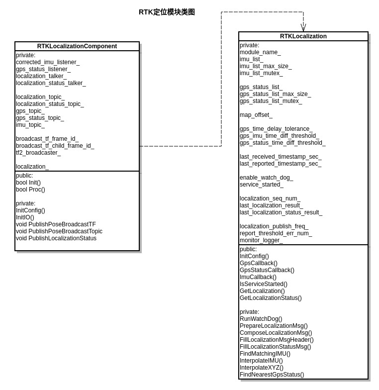
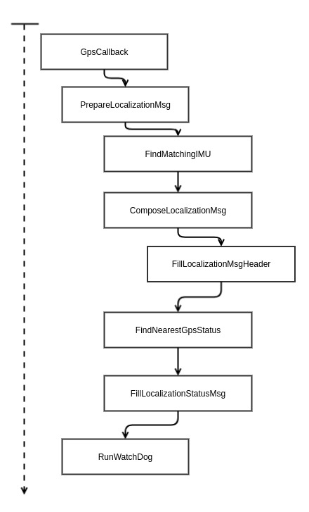

# Dig into Apollo - Localization   

## Table of Contents
- [Localization模块简介](#introduction)
- [代码目录](#content)
- [RTK定位流程](#rtk)
- [Reference](#reference)


<a name="introduction" />

## Localization模块简介
localization模块主要实现了以下2个功能：
1. 输出车辆的位置信息（planning模块使用）
2. 输出车辆的姿态，速度信息（control模块使用）  

其中apollo代码中分别实现了3种定位方法：
1. GNSS + IMU定位
2. NDT定位（点云定位）
3. MSF（上面2种方式的融合定位）

> MSF方法并没有开发源码，是以动态库的方式提供的。实现的思路可以参考论文"Robust and Precise Vehicle Localization Based on Multi-Sensor Fusion in Diverse City Scenes"


<a name="content" />

## 代码目录
下面是localization的目录结构，看之前最好看下该模块的readme文件:  
```
├── common          // 声明配置(flags)，从conf目录中读取相应的值
├── conf            // 配置文件存放目录
├── dag             // cyber DAG流
├── launch          // cyber的配置文件，依赖DAG图（这2个和cyber有关的后面再分析）
├── msf             // 融合定位（gnss,点云,IMU融合定位）
│   ├── common
│   │   ├── io
│   │   ├── test_data
│   │   └── util
│   ├── local_integ
│   ├── local_map
│   │   ├── base_map
│   │   ├── lossless_map
│   │   ├── lossy_map
│   │   ├── ndt_map
│   │   └── test_data
│   ├── local_tool
│   │   ├── data_extraction
│   │   ├── local_visualization
│   │   └── map_creation
│   └── params
│       ├── gnss_params
│       ├── vehicle_params
│       └── velodyne_params
├── ndt                         // ndt定位
│   ├── map_creation
│   ├── ndt_locator
│   └── test_data
│       ├── ndt_map
│       └── pcds
├── proto                   // 消息格式
├── rtk                     // rtk定位
└── testdata                // imu和gps的测试数据
```
可以看到，主要是rtk，ndt，msf这3个目录分别代表了不同的定位方法，而proto是消息的格式定义，common和conf主要是存放一些配置和消息TOPIC。下面我们逐个分析各个模块。  


<a name="rtk" />

## RTK定位流程
可以看到rtk模块相对比较简单，目录结构如下：
```
├── BUILD                               // bazel编译文件
├── rtk_localization.cc                 // rtk定位功能实现模块
├── rtk_localization_component.cc       // rtk消息发布模块
├── rtk_localization_component.h
├── rtk_localization.h
└── rtk_localization_test.cc            // 测试
```
在http://rtk_localization_component.cc中可以看到
```c++
RTKLocalizationComponent::RTKLocalizationComponent()
    : localization_(new RTKLocalization()) {}
```
即class RTKLocalization()实际上是RTKLocalizationComponent()中的一个属性localization_，我们可以发现apollo模块的架构大部分都是这样，一个模块负责发布接收消息，一个模块负责实现具体的功能，后面的模块在前面的模块中注册为一个属性。

具体的类图如下：  
    
其中RTKLocalization首先读取驱动模块发布的gnss消息，然后再调用GpsCallback输出位置。

1. 通过回调读取gnss驱动发布的消息

在gnss driver中DataParser类通过PublishCorrimu发布IMU的消息，而RTKLocalizationComponent::InitIO中绑定了回调
```c++
corrected_imu_listener_ = node_->CreateReader<localization::CorrectedImu>(
      imu_topic_, std::bind(&RTKLocalization::ImuCallback, localization_.get(),
                            std::placeholders::_1));
```
当读取imu_topic_的消息时候，调用ImuCallback回调，把数据放到imu_list_中。

2. 通过GpsCallback返回位置信息，下面是GpsCallback的函数调用顺序  
  
上面就是RTK模块的工作流程。  


<a name="reference" />

## Reference
[Robust and Precise Vehicle Localization Based on Multi-Sensor Fusion in Diverse City Scenes](https://ieeexplore.ieee.org/document/8461224)  


