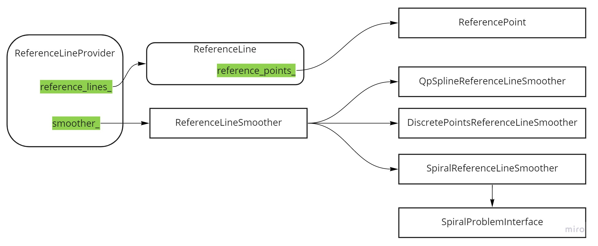

# Dig into Apollo - Reference line 

> 尽吾志也而不能至者，可以无悔矣


## Table of Contents
- [介绍](#introduction)
- [参考线](#rf_line)
- [平滑器](#rf_smoother)  
- [参考线提供者](#rf_provider)


<a name="introduction" />

## 参考线介绍(Reference line)  

参考线是根据routing规划的路线，生成一系列参考轨迹，提供给规划算法做为参考，从而生成最终的规划轨迹。
为什么要提供参考呢？因为道路是结构化道路，在没有参考的情况下，需要通过搜索算法来查找路线，这种场景在机器人路径规划中比较普遍，机器人在一个开放空间只要没有障碍物它就可以行走，而车不一样，车是在道路上行驶的，在提供参考的情况下，节省了查找的时间和复杂度，降低了算法的难度，这也就是参考线的意义。  

1. ReferenceLine和ReferenceLineInfo的关系
ReferenceLine提供的是轨迹信息，而ReferenceLineInfo在ReferenceLine的基础上新添加了决策信息。  


<a name="rf_line" />

## 参考线(ReferenceLineInfo)
参考线信息，在参考线的基础添加了决策信息，ST图等。


#### 参考线中的点(ReferencePoint)  
参考线中的点继承至`hdmap::MapPathPoint`，而`hdmap::MapPathPoint`又继承至`common::math::Vec2d`，也就是说参考线中的点实际上包含了路径点的信息，它有原来路径点中的朝向和坐标信息，同时还新增加了曲率信息，通过下图我们可以清楚的看出上述关系。  
  


#### 参考线(ReferenceLine)  
理解了参考线中的点之后，我们再看参考线的数据结构。  
```c++
  std::vector<SpeedLimit> speed_limit_;  // 速度限制
  std::vector<ReferencePoint> reference_points_;  // 参考线的点
  hdmap::Path map_path_;  // 路径
  uint32_t priority_ = 0;  // 优先级
```
其中速度限制主要标明参考线中哪些段有速度限制，因为是一个数组，因此一个参考线中可以有多段不同的限速。优先级则表示了当前参考线的优先级，用于后面有多个参考线的时候进行挑选。  
参考线中的点也是一个数组，也就是说参考线是由参考点组成的，而`map_path_`则是最不好理解的，实际上`map_path_`就是地图中参考线，把参考线中的点转换到地图中，因此`map_path_`中的点和参考点数组的大小是一致的。  

除此之外，参考线还提供了一些方法，通过这些方法我们可以拼接参考线，也可以判断参考线所在位置的路的宽度，以及是否在路上等信息。我们先分析这些方法的功能实现，然后再介绍哪些场景需要用到这些功能。  


#### 构造函数
我们可以看到有2种方式来生成ReferenceLine，可以通过一组参考点来生成，也可以通过地图路径来生成，这2者实际上是等价的，下面我们开始分析。
1. 通过一组参考点生成，`reference_points_`直接拷贝赋值了，然后再用`reference_points`生成`hdmap::MapPathPoint`，最后保存到`map_path_`。
```c++
ReferenceLine::ReferenceLine(
    const std::vector<ReferencePoint>& reference_points)
    : reference_points_(reference_points),
      map_path_(std::move(std::vector<hdmap::MapPathPoint>(
          reference_points.begin(), reference_points.end()))) {
    ...
}
```

2. 通过地图路径生成参考线。遍历路径中的点，然后取`lane_waypoints`中的第一个点，保存到参考点的数组中。
```c++
ReferenceLine::ReferenceLine(const MapPath& hdmap_path)
    : map_path_(hdmap_path) {
  for (const auto& point : hdmap_path.path_points()) {
    const auto& lane_waypoint = point.lane_waypoints()[0];
    reference_points_.emplace_back(
        hdmap::MapPathPoint(point, point.heading(), lane_waypoint), 0.0, 0.0);
  }
}
```

#### 缝合参考线(Stitch)
缝合参考线是把2段参考线连接起来，代码中也给出了下面2种情况。并且每次拼接的时候，会尽可能多的采用自身的参考线。  
```c++
   * Example 1
   * this:   |--------A-----x-----B------|
   * other:                 |-----C------x--------D-------|
   * Result: |------A-----x-----B------x--------D-------|
   * In the above example, A-B is current reference line, and C-D is the other
   * reference line. If part B and part C matches, we update current reference
   * line to A-B-D.
   *
   * Example 2
   * this:                  |-----A------x--------B-------|
   * other:  |--------C-----x-----D------|
   * Result: |--------C-----x-----A------x--------B-------|
   * In the above example, A-B is current reference line, and C-D is the other
   * reference line. If part A and part D matches, we update current reference
   * line to C-A-B.
   *
   * @return false if these two reference line cannot be stitched
   */
  bool Stitch(const ReferenceLine& other);
```
接下来我们分析下代码。
```c++
bool ReferenceLine::Stitch(const ReferenceLine& other) {
  // 1. 找到起点的交点
  auto first_point = reference_points_.front();
  common::SLPoint first_sl;
  if (!other.XYToSL(first_point, &first_sl)) {
    AWARN << "Failed to project the first point to the other reference line.";
    return false;
  }
  bool first_join = first_sl.s() > 0 && first_sl.s() < other.Length();
  // 2. 找到终点的交点
  auto last_point = reference_points_.back();
  common::SLPoint last_sl;
  if (!other.XYToSL(last_point, &last_sl)) {
    AWARN << "Failed to project the last point to the other reference line.";
    return false;
  }
  bool last_join = last_sl.s() > 0 && last_sl.s() < other.Length();
  // 3. 如果起点和终点都没有交点，则退出
  if (!first_join && !last_join) {
    AERROR << "These reference lines are not connected.";
    return false;
  }

  // 累积s值
  const auto& accumulated_s = other.map_path().accumulated_s();
  // 参考点
  const auto& other_points = other.reference_points();
  auto lower = accumulated_s.begin();
  static constexpr double kStitchingError = 1e-1;

  if (first_join) {
    // 4. 如果横向偏移大于0.1m，则退出
    if (first_sl.l() > kStitchingError) {
      AERROR << "lateral stitching error on first join of reference line too "
                "big, stitching fails";
      return false;
    }
    lower = std::lower_bound(accumulated_s.begin(), accumulated_s.end(),
                             first_sl.s());
    // 4.1 因为this的起点在other之后，插入other的起点到this的起点
    size_t start_i = std::distance(accumulated_s.begin(), lower);
    reference_points_.insert(reference_points_.begin(), other_points.begin(),
                             other_points.begin() + start_i);
  }
  if (last_join) {
    // 5.1 如果横向偏移大于0.1m，则退出
    if (last_sl.l() > kStitchingError) {
      AERROR << "lateral stitching error on first join of reference line too "
                "big, stitching fails";
      return false;
    }
    // 5.2 因为this的终点小于other的终点，把other终点拼接到参考线的终点
    auto upper = std::upper_bound(lower, accumulated_s.end(), last_sl.s());
    auto end_i = std::distance(accumulated_s.begin(), upper);
    reference_points_.insert(reference_points_.end(),
                             other_points.begin() + end_i, other_points.end());
  }
  map_path_ = MapPath(std::move(std::vector<hdmap::MapPathPoint>(
      reference_points_.begin(), reference_points_.end())));
  return true;
}
```

#### 分割参考线(Segment)
分割参考线的方法是根据起点s，向前和向后的查看距离把参考线进行分割。 有2个方法，我们只看其中一个就可以了。  
```c++
bool ReferenceLine::Segment(const double s, const double look_backward,
                            const double look_forward) {
  const auto& accumulated_s = map_path_.accumulated_s();


  // 1. 查找向后的索引(look_backward)
  auto start_index =
      std::distance(accumulated_s.begin(),
                    std::lower_bound(accumulated_s.begin(), accumulated_s.end(),
                                     s - look_backward));
  // 2. 查找向前的索引(look_forward)
  auto end_index =
      std::distance(accumulated_s.begin(),
                    std::upper_bound(accumulated_s.begin(), accumulated_s.end(),
                                     s + look_forward));
  // 3. 如果只有一个点
  if (end_index - start_index < 2) {
    AERROR << "Too few reference points after shrinking.";
    return false;
  }
  
  // 4. 更新当前的参考线，并且返回成功
  reference_points_ =
      std::vector<ReferencePoint>(reference_points_.begin() + start_index,
                                  reference_points_.begin() + end_index);
  map_path_ = MapPath(std::vector<hdmap::MapPathPoint>(
      reference_points_.begin(), reference_points_.end()));
  return true;
}
```

#### 其它方法介绍
这里把其它一些方法的功能进行介绍，具体的代码就不展开分析了。
```c++
  // 根据s值获取参考点（会根据s进行插值）
  ReferencePoint GetReferencePoint(const double s) const;  
  // 根据x,y找到最近的点，并且进行插值
  ReferencePoint GetReferencePoint(const double x, const double y) const;  

  // PathPoint转换为FrenetFramePoint
  common::FrenetFramePoint GetFrenetPoint(
      const common::PathPoint& path_point) const;
  
  // 
  std::pair<std::array<double, 3>, std::array<double, 3>> ToFrenetFrame(
      const common::TrajectoryPoint& traj_point) const;

  // 查找起点和终点分别为start_s和end_s的参考点
  std::vector<ReferencePoint> GetReferencePoints(double start_s,
                                               double end_s) const;
  // 获取离s最近的索引
  size_t GetNearestReferenceIndex(const double s) const;  

  // 离s最近的ReferencePoint
  ReferencePoint GetNearestReferencePoint(const common::math::Vec2d& xy) const;
  ReferencePoint GetNearestReferencePoint(const double s) const;    

  // 根据起点s和终点s获取LaneSegment
  std::vector<hdmap::LaneSegment> GetLaneSegments(const double start_s,
                                                  const double end_s) const;
  // 获取box在参考线上的投影框
  bool GetApproximateSLBoundary(const common::math::Box2d& box,
                                const double start_s, const double end_s,
                                SLBoundary* const sl_boundary) const;
  bool GetSLBoundary(const common::math::Box2d& box,
                     SLBoundary* const sl_boundary) const;
  bool GetSLBoundary(const hdmap::Polygon& polygon,
                     SLBoundary* const sl_boundary) const;
  // SL坐标到XY坐标相互转换
  bool SLToXY(const common::SLPoint& sl_point,
              common::math::Vec2d* const xy_point) const;
  bool XYToSL(const common::math::Vec2d& xy_point,
              common::SLPoint* const sl_point) const;
  // 获取s距离处路的宽度
  bool GetLaneWidth(const double s, double* const lane_left_width,
                    double* const lane_right_width) const;
  // 获取s距离处的偏移
  bool GetOffsetToMap(const double s, double* l_offset) const;
  // 获取s距离处路的宽度
  bool GetRoadWidth(const double s, double* const road_left_width,
                    double* const road_right_width) const;
  // 获取s距离处路的类型
  hdmap::Road::Type GetRoadType(const double s) const;
  // 获取s距离处道路
  void GetLaneFromS(const double s,
                    std::vector<hdmap::LaneInfoConstPtr>* lanes) const;
  // 获取乘车宽度
  double GetDrivingWidth(const SLBoundary& sl_boundary) const;
  // 是否在路上
  bool IsOnLane(const common::SLPoint& sl_point) const;
  bool IsOnLane(const common::math::Vec2d& vec2d_point) const;
  template <class XYPoint>
  bool IsOnLane(const XYPoint& xy) const {
    return IsOnLane(common::math::Vec2d(xy.x(), xy.y()));
  }
  bool IsOnLane(const SLBoundary& sl_boundary) const;   

  bool IsOnRoad(const common::SLPoint& sl_point) const;
  bool IsOnRoad(const common::math::Vec2d& vec2d_point) const;
  bool IsOnRoad(const SLBoundary& sl_boundary) const;
  // 是否堵路了
  bool IsBlockRoad(const common::math::Box2d& box2d, double gap) const;
  // 是否有重叠
  bool HasOverlap(const common::math::Box2d& box) const;
  // 查找s处的速度限制
  double GetSpeedLimitFromS(const double s) const;
  // 添加start_s到end_s处的速度限制，并且进行排序
  void AddSpeedLimit(double start_s, double end_s, double speed_limit);                   
```


<a name="rf_smoother" />

## 平滑器(ReferenceLineSmoother)  
平滑器的主要作用是对参考线做平滑，一共有3种类型的平滑器。  
* DiscretePointsReferenceLineSmoother
* QpSplineReferenceLineSmoother
* SpiralReferenceLineSmoother

它们都继承至`ReferenceLineSmoother`，需要提供设置锚点`SetAnchorPoints`和`Smooth`2个接口。  
```c++
struct AnchorPoint {
  common::PathPoint path_point;
  double lateral_bound = 0.0;
  double longitudinal_bound = 0.0;
  // enforce smoother to strictly follow this reference point
  bool enforced = false;
};

class ReferenceLineSmoother {
 public:
  explicit ReferenceLineSmoother(const ReferenceLineSmootherConfig& config)
      : config_(config) {}

  // 虚函数，设置锚点
  virtual void SetAnchorPoints(
      const std::vector<AnchorPoint>& achor_points) = 0;

  // 虚函数，平滑参考线
  virtual bool Smooth(const ReferenceLine&, ReferenceLine* const) = 0;

  virtual ~ReferenceLineSmoother() = default;
 protected:
  ReferenceLineSmootherConfig config_;
};
```

#### DiscretePointsReferenceLineSmoother
todo

#### QpSplineReferenceLineSmoother
todo

#### SpiralReferenceLineSmoother
todo


<a name="rf_provider" />

## 参考线提供者(ReferenceLineProvider)  
planning模块中分为2个任务，一个线程单独的执行ReferenceLineProvider，另外一个线程根据生成好的参考线进行路径规划。而参考线提供者根据车辆的位置，pnc地图来生成参考线，并且进行平滑之后输出给planning模块做后续的路径规划。

我们带着以下几个问题来阅读代码。  
1. 整个流程的过程是怎样的？
2. 如何生成的参考线，输入是什么？输出是什么？
3. 参考线用图来形象的表示？

#### 构造函数
从参考线提供者的构造函数中就可以看出，**它的输入是车辆状态和地图，输出是参考线**。  
```c++
ReferenceLineProvider::ReferenceLineProvider(
    const common::VehicleStateProvider *vehicle_state_provider,
    const hdmap::HDMap *base_map,
    const std::shared_ptr<relative_map::MapMsg> &relative_map)
  // 1. 初始化车辆状态提供者
    : vehicle_state_provider_(vehicle_state_provider) {
  // 2. 如果是导航模式则启动相对地图，如果不是则启动pnc_map
  if (!FLAGS_use_navigation_mode) {
    pnc_map_ = std::make_unique<hdmap::PncMap>(base_map);
    relative_map_ = nullptr;
  } else {
    pnc_map_ = nullptr;
    relative_map_ = relative_map;
  }
  // 3. 初始化平滑器
  ACHECK(cyber::common::GetProtoFromFile(FLAGS_smoother_config_filename,
                                         &smoother_config_))
      << "Failed to load smoother config file "
      << FLAGS_smoother_config_filename;
  if (smoother_config_.has_qp_spline()) {
    smoother_.reset(new QpSplineReferenceLineSmoother(smoother_config_));
  } else if (smoother_config_.has_spiral()) {
    smoother_.reset(new SpiralReferenceLineSmoother(smoother_config_));
  } else if (smoother_config_.has_discrete_points()) {
    smoother_.reset(new DiscretePointsReferenceLineSmoother(smoother_config_));
  } else {
    ACHECK(false) << "unknown smoother config "
                  << smoother_config_.DebugString();
  }
  is_initialized_ = true;
}
```

#### 开始线程
ReferenceLineProvider通过`Start()`方法开始启动新的线程并且执行，通过`Stop()`方法停止。  
```c++
bool ReferenceLineProvider::Start() {
  if (FLAGS_use_navigation_mode) {
    return true;
  }
  if (!is_initialized_) {
    AERROR << "ReferenceLineProvider has NOT been initiated.";
    return false;
  }
  // 1. 启动异步任务运行GenerateThread
  if (FLAGS_enable_reference_line_provider_thread) {
    task_future_ = cyber::Async(&ReferenceLineProvider::GenerateThread, this);
  }
  return true;
}
```

然后通过以下2个方法，刷新routing请求和车辆状态。也就是说参考线通过实时的routing请求和车辆状态来生成参考线。  
```c++
  bool UpdateRoutingResponse(const routing::RoutingResponse& routing);

  void UpdateVehicleState(const common::VehicleState& vehicle_state);
```

通过`GetReferenceLines`来获取参考线。实际上并发模式和不是并发模式执行的函数都是一样，只不过并发模式下另外的线程已经计算好了，因此可以直接赋值。
```c++
bool ReferenceLineProvider::GetReferenceLines(
    std::list<ReferenceLine> *reference_lines,
    std::list<hdmap::RouteSegments> *segments) {
  ...
  // 1. 如果有单独的线程，则直接赋值 
  if (FLAGS_enable_reference_line_provider_thread) {
    std::lock_guard<std::mutex> lock(reference_lines_mutex_);
    if (!reference_lines_.empty()) {
      reference_lines->assign(reference_lines_.begin(), reference_lines_.end());
      segments->assign(route_segments_.begin(), route_segments_.end());
      return true;
    }
  } else {
    double start_time = Clock::NowInSeconds();
    // 2. 否则，创建并且更新参考线
    if (CreateReferenceLine(reference_lines, segments)) {
      UpdateReferenceLine(*reference_lines, *segments);
      double end_time = Clock::NowInSeconds();
      last_calculation_time_ = end_time - start_time;
      return true;
    }
  }

  AWARN << "Reference line is NOT ready.";
  if (reference_line_history_.empty()) {
    AERROR << "Failed to use reference line latest history";
    return false;
  }
  // 3. 如果失败，则采用上一次的规划轨迹
  reference_lines->assign(reference_line_history_.back().begin(),
                          reference_line_history_.back().end());
  segments->assign(route_segments_history_.back().begin(),
                   route_segments_history_.back().end());
  AWARN << "Use reference line from history!";
  return true;
}
```
从上面代码可以得出，参考线的生成主要集中在2个函数中`CreateReferenceLine`和`UpdateReferenceLine`。


#### CreateReferenceLine
创建参考线
```c++
bool ReferenceLineProvider::CreateReferenceLine(
    std::list<ReferenceLine> *reference_lines,
    std::list<hdmap::RouteSegments> *segments) {

  // 1. 获取车辆状态
  common::VehicleState vehicle_state;
  {
    std::lock_guard<std::mutex> lock(vehicle_state_mutex_);
    vehicle_state = vehicle_state_;
  }
  // 2. 获取routing
  routing::RoutingResponse routing;
  {
    std::lock_guard<std::mutex> lock(routing_mutex_);
    routing = routing_;
  }
  bool is_new_routing = false;
  {
    // 2.1 如果是新routing，那么更新routing
    std::lock_guard<std::mutex> lock(pnc_map_mutex_);
    if (pnc_map_->IsNewRouting(routing)) {
      is_new_routing = true;
      if (!pnc_map_->UpdateRoutingResponse(routing)) {
        AERROR << "Failed to update routing in pnc map";
        return false;
      }
    }
  }

  // 3. 创建routing segment
  if (!CreateRouteSegments(vehicle_state, segments)) {
    AERROR << "Failed to create reference line from routing";
    return false;
  }
  if (is_new_routing || !FLAGS_enable_reference_line_stitching) {
    for (auto iter = segments->begin(); iter != segments->end();) {
      reference_lines->emplace_back();
      // 4.1.1 平滑routing segment
      if (!SmoothRouteSegment(*iter, &reference_lines->back())) {
        AERROR << "Failed to create reference line from route segments";
        reference_lines->pop_back();
        iter = segments->erase(iter);
      } else {
        common::SLPoint sl;
        if (!reference_lines->back().XYToSL(vehicle_state, &sl)) {
          AWARN << "Failed to project point: {" << vehicle_state.x() << ","
                << vehicle_state.y() << "} to stitched reference line";
        }
        // 4.1.2 收缩参考线
        Shrink(sl, &reference_lines->back(), &(*iter));
        ++iter;
      }
    }
    return true;
  } else {  // stitching reference line
    // 4.2 根据routing segment扩展参考线
    for (auto iter = segments->begin(); iter != segments->end();) {
      reference_lines->emplace_back();
      if (!ExtendReferenceLine(vehicle_state, &(*iter),
                               &reference_lines->back())) {
        AERROR << "Failed to extend reference line";
        reference_lines->pop_back();
        iter = segments->erase(iter);
      } else {
        ++iter;
      }
    }
  }
  return true;
}
```
创建参考线的过程如下，首先获取routing的消息，然后生成routingsegment，之后结合车辆状态，扩展和分割参考线。
  


#### UpdatedReferenceLine
只是更新标签
```c++
void ReferenceLineProvider::UpdateReferenceLine(
    const std::list<ReferenceLine> &reference_lines,
    const std::list<hdmap::RouteSegments> &route_segments) {
  // 1. 如果参考线大小和roue路线段不相等，则返回
  if (reference_lines.size() != route_segments.size()) {
    AERROR << "The calculated reference line size(" << reference_lines.size()
           << ") and route_segments size(" << route_segments.size()
           << ") are different";
    return;
  }
  std::lock_guard<std::mutex> lock(reference_lines_mutex_);
  // 2.1 如果新旧参考线大小不等，则拷贝
  if (reference_lines_.size() != reference_lines.size()) {
    reference_lines_ = reference_lines;
    route_segments_ = route_segments;
  } else {
    // 2.2 如果相等，则依次拷贝
    auto segment_iter = route_segments.begin();
    auto internal_iter = reference_lines_.begin();
    auto internal_segment_iter = route_segments_.begin();
    for (auto iter = reference_lines.begin();
         iter != reference_lines.end() &&
         segment_iter != route_segments.end() &&
         internal_iter != reference_lines_.end() &&
         internal_segment_iter != route_segments_.end();
         ++iter, ++segment_iter, ++internal_iter, ++internal_segment_iter) {
      if (iter->reference_points().empty()) {
        *internal_iter = *iter;
        *internal_segment_iter = *segment_iter;
        continue;
      }
      if (common::util::SamePointXY(
              iter->reference_points().front(),
              internal_iter->reference_points().front()) &&
          common::util::SamePointXY(iter->reference_points().back(),
                                    internal_iter->reference_points().back()) &&
          std::fabs(iter->Length() - internal_iter->Length()) <
              common::math::kMathEpsilon) {
        continue;
      }
      *internal_iter = *iter;
      *internal_segment_iter = *segment_iter;
    }
  }
  // 3. 存储并且更新最近3次的参考线和routing历史信息
  reference_line_history_.push(reference_lines_);
  route_segments_history_.push(route_segments_);
  static constexpr int kMaxHistoryNum = 3;
  if (reference_line_history_.size() > kMaxHistoryNum) {
    reference_line_history_.pop();
    route_segments_history_.pop();
  }
}
```
