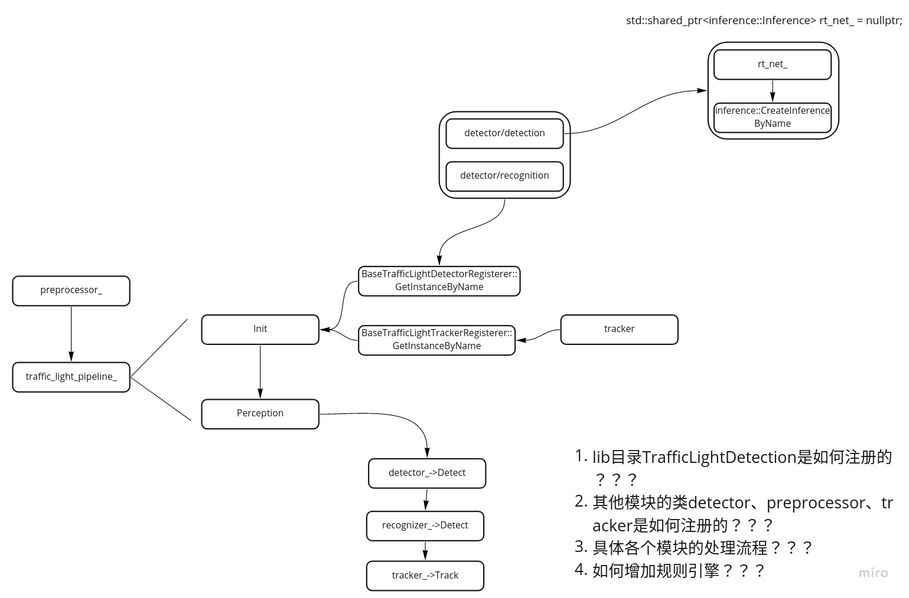

# Dig into Apollo - Perception 

> 温故而知新，可以为师矣


## Table of Contents
- [CNN](cnn)
    - [什么是CNN？](cnn#what_is_cnn)
    - [CNN的原理](cnn#cnn_principle)
        - [卷积层(Convolutional Layer)](cnn#convolutional)
        - [池化层(Max Pooling Layer)](cnn#max_pool)
        - [全连接层(Fully Connected Layer)](cnn#fully_connect)
    - [如何构建CNN](cnn#how_to)
    - [基本概念](cnn#base_concept)
    - [引用](cnn#reference)
- [Caffe2](caffe2)
    - [Caffe2环境准备](caffe2#env)
    - [安装显卡驱动](caffe2#drivers)
    - [安装CUDA](caffe2#cuda)
        - [选择CUDA版本](caffe2#cuda_version)
        - [安装CUDA](caffe2#cuda_install)
        - [设置环境变量](caffe2#cuda_env)
        - [检验安装](caffe2#cuda_check)
    - [安装cuDNN](caffe2#cudnn)
    - [安装Caffe2](caffe2#caffe2)
    - [参考](caffe2#reference)

<a name="introduction" />

## Perception模块简介

我们先看下perception的目录结构：  
```
.
├── base         // 基础类
├── BUILD        // 编译testdata，用于测试
├── camera       // 摄像头  --- 子模块流程
├── common       // 公共目录
├── data
├── fusion       // 融合
├── inference    // 深度学习推理相关
├── lib          // lib库
├── lidar        // 雷达    --- 子模块流程
├── map          // 地图
├── onboard      // 各个子模块的入口     --- 子模块入口
├── production   // Cyber加载模块入口    --- Cyber加载入口
├── proto        // 数据格式，protobuf
├── radar        // 毫米波  --- 子模块流程
├── README.md
└── testdata    // 上述几个模块的测试数据，包括训练好的模型
```
下面介绍几个重要的目录结构: 
* production/onboard目录 - **感知模块的入口在production目录，通过lanuch加载对应的dag，启动感知模块**。可以看到感知启动了多个子模块，来处理不同的传感器信息（Lidar,Radar,Camera）。各个子模块的入口在onboard目录中，各个子模块会订阅不同的传感器Topic，然后进行统一的流水线(Pipeline)作业。每个子模块的流水线作业分别在不同的文件夹中(camera, lidar, radar)。这就是感知模块总体的目录结构。
* inference目录 - 深度学习推理相关的库，**主要实现了加载创建caffe深度学习模型，TensorRT深度学习优化器等**。
* lib目录 - 提供注册类和线程池，（提供的线程池也就是说module可以再次启动线程？？？module）

整个模块的流程如图：  
  


## production


## onboard


## radar
我们先从一个简单的模块开始看起，首先看下radar目录：  
```
.
├── app          // 每个模块都有一个app目录
├── common       // 公共目录
└── lib          // 库
```


radar模块被"RadarDetectionComponent"引用，perception的入口在onboard中。我们最后分析下"RadarDetectionComponent"模块。  


## tools
obstacle_detection 根据kitti的例子，对camera做完整流程的识别，如果需要入门，可以把这个例子先跑通，同时也可以拿这个例子进行性能调优。  

lane_detection 车道线识别的例子


## Reference
[A Beginner's Guide to Convolutional Neural Networks](https://skymind.ai/wiki/convolutional-network)  
[cnn](https://cs231n.github.io/convolutional-networks/)  
[traffic light dataset](https://hci.iwr.uni-heidelberg.de/node/6132/download/3d66608cfb112934ef40175e9a20c81f)  
[pytorch-tutorial](https://github.com/yunjey/pytorch-tutorial)  
[全连接层的作用是什么？](https://www.zhihu.com/question/41037974)  
[索伯算子](https://zh.wikipedia.org/wiki/%E7%B4%A2%E8%B2%9D%E7%88%BE%E7%AE%97%E5%AD%90)  
[卷积](https://zh.wikipedia.org/wiki/%E5%8D%B7%E7%A7%AF)  

> tensorRT
[TensorRT(1)-介绍-使用-安装](https://arleyzhang.github.io/articles/7f4b25ce/)  
[高性能深度学习支持引擎实战——TensorRT](https://zhuanlan.zhihu.com/p/35657027)  

