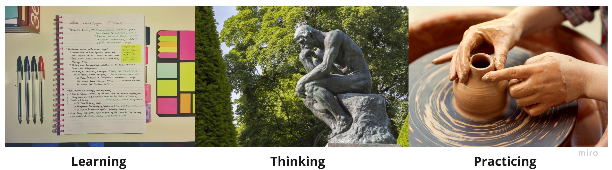

# Dig into Apollo 
  

The original intention of creating this project was to leave some notes in the learning process of autonomous driving.I found a lot of great resources and personal blogs, and sometimes I really want to compliment that only online self-study can be so good! Therefore, I urge myself to make better notes.  

Hereby I would like to thank @[Baidu Apollo](https://github.com/ApolloAuto/apollo) @[3Blue1Brown](https://space.bilibili.com/88461692/) @[Hongyi Li](https://www.bilibili.com/video/av23593949/) @[iMorpheusAI](https://i.youku.com/i/UNTMxNDU3NjEwMA==?spm=a2hzp.8244740.0.0) @[Mr Paul](https://paul.pub/about/). Welcome to contribute to the project, if you find the project helpful, welcome star:heart:!

创建这个项目的初衷是为了在自动驾驶的学习过程中留下一些笔记，参考了不少网络上的资料和个人博客，有的时候真想拍案惊呼，为什么仅仅依靠自学就能够做到如此优秀！也因此敦促自己贡献更加优秀的笔记。  

在这里特此感谢@[百度Apollo项目](https://github.com/ApolloAuto/apollo) @[3Blue1Brown](https://space.bilibili.com/88461692/) @[台大李宏毅](https://www.bilibili.com/video/av23593949/) @[iMorpheusAI](https://i.youku.com/i/UNTMxNDU3NjEwMA==?spm=a2hzp.8244740.0.0) @[阿Paul哥](https://paul.pub/about/)，欢迎对项目的贡献，如果觉得项目对你有帮助，欢迎star:heart:！ 

#### :performing_arts: 公告
1. 由于目前国内访问github太慢，网上有通过设置host来加快访问github的攻略，为了方便大家下载代码，现在把代码同步托管到码云上。主线代码可能随时都在更新，因此我会定期同步代码，如果需要稳定版本最好下载tag版本"v5.5.0"。  

    - **Apollo镜像: [apollo](https://gitee.com/daohu527/apollo)**  
    - **Dig-into-Apollo镜像: [Dig-into-Apollo](https://gitee.com/daohu527/Dig-into-Apollo)**

2. 为了方便更好的交流和学习自动驾驶相关技术，新建立了微信公众号和交流群，欢迎大家交流分享！  

    - **微信公众号** : 分子运动，或者搜索"fzyd006"  

## :ledger: 目录
- [apollo简介](introduction)
    - [简介](introduction#introduction)
    - [目录结构](introduction#content)
    - [编译](introduction#compile)
- [Map](map)
    - [Map模块简介](map#introduction)
    - [Map目录结构](map#content)
    - [地图数据结构](map#map_data_struct)
        - [地图信息头](map#header)
        - [人行横道](map#crosswalk)
        - [路口](map#junction)
        - [车道](map#lane)
        - [停止信号](map#stop_sign)
        - [交通信号标志](map#signal)
        - [让行](map#yield)
        - [重叠区域](map#overlap)
        - [禁止停车](map#cleararea)
        - [道路信息](map#road)
        - [停车区域](map#parking)
        - [行人道路](map#sidewalk)
    - [opendriver地图解析](map#parse)
    - [高精度地图API](map#api)
    - [如何制作高精度地图](map#how)
        - [采集](map#collect)
        - [加工](map#process)
        - [转换](map#transform)
    - [Reference](#reference)
- [Localization](localization)
    - [Localization模块简介](localization#introduction)
    - [代码目录](localization#content)
    - [RTK定位流程](localization#rtk)
    - [Reference](localizationreference)
- [Perception](perception)
    - [CNN](perception/cnn)
        - [什么是CNN？](perception/cnn#what_is_cnn)
        - [CNN的原理](perception/cnn#cnn_principle)
            - [卷积层(Convolutional Layer)](perception/cnn#convolutional)
            - [池化层(Max Pooling Layer)](perception/cnn#max_pool)
            - [全连接层(Fully Connected Layer)](perception/cnn#fully_connect)
        - [如何构建CNN](perception/cnn#how_to)
        - [基本概念](perception/cnn#base_concept)
        - [引用](perception/cnn#reference)
    - [Caffe2](perception/caffe2)
        - [Caffe2环境准备](perception/caffe2#env)
        - [安装显卡驱动](perception/caffe2#drivers)
        - [安装CUDA](perception/caffe2#cuda)
            - [选择CUDA版本](perception/caffe2#cuda_version)
            - [安装CUDA](perception/caffe2#cuda_install)
            - [设置环境变量](perception/caffe2#cuda_env)
            - [检验安装](perception/caffe2#cuda_check)
        - [安装cuDNN](perception/caffe2#cudnn)
        - [安装Caffe2](perception/caffe2#caffe2)
        - [参考](perception/caffe2#reference)
    - [Perception模块简介](perception#introduction)
        - [production目录](perception#production)
        - [onboard目录](perception#onboard)
        - [radar子模块](perception#radar#radar_module)
        - [camera子模块](perception#camera#camera_module)
        - [lidar子模块](perception#lidar#lidar_module)
        - [fusion子模块](perception#fusion#fusion_module)
        - [inference推理子模块](perception#inference#inference_module)
        - [Reference](perception#reference)    
- [Prediction](prediction)
    - [介绍](prediction#introduction)
    - [目录结构](prediction#directory)
    - [预测模块(PredictionComponent类)](prediction#preciction_component)
      - [初始化(Init())](prediction#preciction_init)
      - [回调执行(Proc)](prediction#preciction_proc)
      - [ContainerSubmoduleProcess](prediction#preciction_submodule)
      - [PredictionEndToEndProc](prediction#preciction_endtoend)
    - [消息处理(MessageProcess)](prediction#message_process)
      - [初始化(Init)](prediction#message_init)
      - [消息处理](prediction#onperception)
    - [容器(container)](prediction#container)
    - [场景(scenario)](prediction#scenario)
    - [评估者(evaluator)](prediction#evaluator)
    - [预测器(predictor)](prediction#predictor)
    - [Reference](prediction#reference)  
- [Routing](routing)
    - [Routing模块简介](routing#introduction)
    - [基础知识](routing#base)
      - [Demo](routing#demo)
      - [地图](routing#map)
      - [最短距离](routing#shortest_path)
    - [Routing模块分析](routing#routing)
      - [创建Routing地图](routing#create_routing_map)
      - [Routing主流程](routing#routing_main)
    - [调试工具](routing#tools)
    - [问题](routing#question)
    - [OSM数据查找](routing#osm_find)
    - [Reference](routing#reference)
- [Planning](planning)
    - [Planning模块简介](planning#introduction)
      - [Planning输入输出](planning#planning_io)
      - [Planning整个流程](planning#planning_flow)
    - [Planning模块入口](planning#planning_entry)
      - [模块注册](planning#planning_register)
      - [模块初始化](planning#planning_init)
      - [模块运行](planning#planning_proc)
    - [OnLanePlanning](planning#onLanePlanning)
      - [初始化](planning#onLanePlanning_init)
      - [事件触发](planning#onLanePlanning_trigger)
    - [Planner](planning#planner)
      - [Planner注册场景](planning#planner_register)
      - [运行场景](planning#planner_plan)
    - [Scenario](planning#scenario)
      - [场景转换](planning#scenario_update)
      - [场景运行](planning#scenario_process)
    - [Task](planning#task)
      - [DP & QP](planning#dp_qp)
    - [Reference](planning#reference)
- [Control](control)
    - [Control模块简介](control#introduction)
    - [Control模块主流程](control#main)
        - [控制器注册](control#register)
        - [Pad消息](control#pad)
        - [estop_标志位](control#estop)
    - [控制器](control#controller)
    - [LonController控制器](control#lon_controller)
        - [校准表](control#calibration_table)
        - [PID参数调节](control#pid)
    - [LatController控制器](control#lat_controller)
    - [MPCController控制器](control#mpc_controller)
    - [StanleyLatController控制器](control#stanleylat_controller)
    - [Reference](control#reference) 
- [Canbus](canbus)
    - [Canbus模块介绍](canbus#introduction)
    - [Canbus模块主流程](canbus#main)
        - [车辆工厂模式(VehicleFactory)](canbus#vehicle_factory)
        - [车辆控制器(LincolnController)](canbus#lincoln_controller)
    - [Canbus(驱动程序)](canbus#canbus_driver)
        - [消息管理器(MessageManager)](canbus#message_manager)
        - [消息接收(CanReceiver)](canbus#can_receiver)
        - [消息发送(CanSender)](canbus#can_sender)
        - [canbus客户端(CanClient)](canbus#can_client)
    - [Reference](canbus#reference)
- [Simulation](simulation)
    - [为什么需要仿真](simulation#why_simulation)
    - [如何仿真](simulation#how_simulation)
        - [仿真软件](simulation#simulator)
        - [工作方式](simulation#simulator_work)
        - [工作原理](simulation#simulator_principle)
    - [如何使用](simulation#how_to)
        - [桥接器](simulation#adapter)
        - [制作地图](simulation#make_map)
        - [测试场景](simulation#test_case)
        - [功能多样化](simulation#features)
    - [如何构建自动驾驶仿真系统？](simulation#how_build)
    - [地图](simulation#simulation_map)
    - [真实场景地图生成](simulation#map_generate)
        - [地图模型制作](simulation#model_build)
        - [高精度地图制作](simulation#hdmap_build)
    - [虚拟场景地图生成](simulation#virtual_map_build)
    - [车](simulation#car)
    - [行为](simulation#behavior)
        - [NPC](simulation#npc)
        - [天气](simulation#weather)
        - [红绿灯](simulation#traffic_light)
    - [API](simulation#api)
    - [部署](simulation#deploy)
    - [总结](simulation#summary)
    - [参考](simulation#reference)
- [Cyber](cyber)
    - [Cyber源码分析](cyber/source)
    - [Cyber设计思想](cyber/design)
- [V2X](v2x)  
    - [v2x目录结构](#introduction)  
    - [v2x_proxy](#v2x_proxy)
      - [app](#app)
      - [TrafficLightTimer](#trafficlight_timer)
      - [OnV2xCarStatusTimer](#onv2xcar_timer)
    - [OBU接口(ObuInterFaceGrpcImpl)](#obu_interface)
      - [远程调用服务(grpc_interface)](#grpc_interface)
    - [系统接口(OsInterFace)](#os_interface)
      - [SendMsgToOs](#send_msg_to_os)
      - [GetMsgFromOs](#get_msg_from_os)    
- [Transform](transform)
    - [Transform模块简介](transform#introduction)
    - [Transform(静态变换)](transform#static_transform)
    - [transform_broadcaster（广播）](transform#no_static_transform)
    - [Buffer（接收缓存）](transform#buffer)
        - [缓存接口](transform#buffer_interface)
        - [缓存实现](transform#buffer_class)
    - [总结](transform#summary)
    - [Reference](transform#reference)   
- [Docker](docker)  
    - [docker编译](#docker_build)
    - [docker脚本](#docker_script)
    - [设置主机](#setup_host)   
- [Build](build)
    - [编译](build#build)
    - [常见问题](build#question)
- [Performance](performance)
    - [线程调度](performance#schedule)
    - [Cgroups](performance#cgroups)
    - [CPU亲和性](performance#cpu)
    - [中断绑定](performance#interrupt)
    - [linux性能优化](performance#linux)
      - [Perf安装](performance#perf)
      - [火焰图](performance#flame_graph)
    - [Reference](performance#reference)
- [Drivers](drivers)
- [Dreamview](dreamview)
- [Toolbox](toolbox)

> 各个模块的介绍都在对应的子目录中，主流程放在readme.md中，一些细节的函数和疑问放在todo.md中，需要了解主流程直接看readme.md，如果要深挖整个代码可以参考todo.md。

##  :unlock: 计划
* 2020/7/30之前完成
    - [ ] perception模块的流程分析
* 2020/8/30之前完成
    - [ ] cyber的transport底层实现    
* 次要任务
    - [ ] routing模块可视化工具介绍  
    - [ ] planning模块各个控制器的具体实现  

## :pushpin: 参考
[apollo](https://github.com/ApolloAuto/apollo)  
[awesome-self-driving-car](https://github.com/daohu527/awesome-self-driving-car)    
