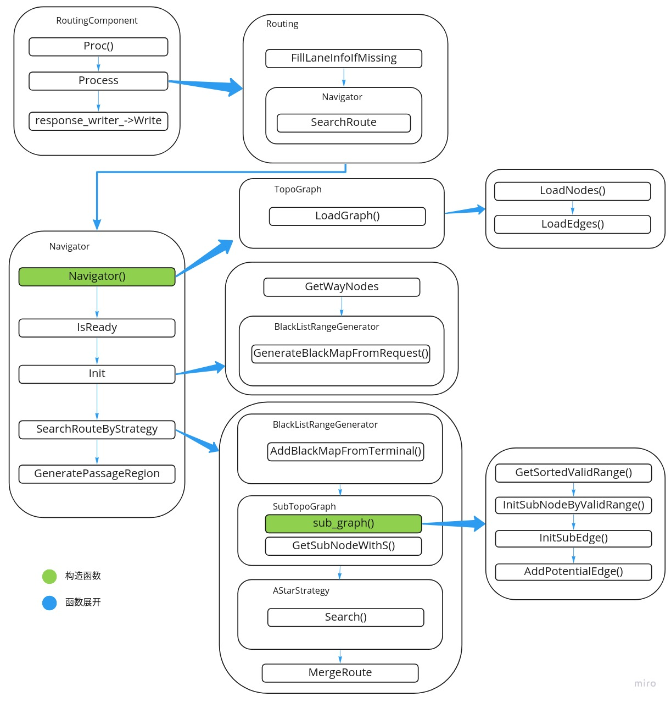

# Dig into Apollo - Routing 

> 青，取之于蓝而青于蓝；冰，水为之而寒于水。


## Table of Contents
- [Routing模块简介](#introduction)
- [基础知识](#base)
  - [地图](#map)
  - [最短距离](#shortest_path)
  - [Demo](#demo)
- [Routing模块分析](#routing)
  - [Routing类](#routing_class)
  - [Navigator类](#navigator_class)
  

<a name="introduction" />

## Routing模块简介
Routing类似于现在开车时用到的导航模块，通常考虑的是起点到终点的最优路径（通常是最短路径），Routing考虑的是起点到终点的最短路径，而Planning则是行驶过程中，当前一小段时间如何行驶，需要考虑当前路况，是否有障碍物。Routing模块则不需要考虑这些信息，只需要做一个长期的规划路径即可，过程如下：  

  

这也和我们开车类似，上车之后，首先搜索目的地，打开导航（Routing所做的事情），而开始驾车之后，则会根据当前路况，行人车辆信息来适当调整直到到达目的地（Planning所做的事情）。
* **Routing** - 主要关注起点到终点的长期路径，根据起点到终点之间的道路，选择一条最优路径。  
* **Planning** - 主要关注几秒钟之内汽车的行驶路径，根据当前行驶过程中的交通规则，车辆行人等信息，规划一条短期路径。  

<a name="base" />

## 基础知识

<a name="demo" />

#### Demo
[演示地址](https://daohu527.github.io/)  
我们通过"OSM Pathfinding"作为例子，来详细讲解整个过程，感谢@mplewis。  
首先我们通过如下的视频演示看下Routing寻找路径的过程，查找的是深圳南山区的地图：

1. 首先选择查找算法，有: A*, Breadth First Search, Greedy Best First Search, Uniform Cost Search, Depth First Search。
2. 选择起点
3. 选择终点
4. 选择开始，开始寻找路径

上面的项目是基于OSM(openstreetmap)获取的地图数据，如果需要自己制作地图，首先在OSM的[官网](https://www.openstreetmap.org/)导出地图，导出的文件格式为“map.osm”，可以通过浏览器打开查看，然后在项目的tools目录，把OSM地图转成项目用到的(Graph)图。制作demo的过程如下：
1. 获取地图信息 - 由于OSM的地图都是开源的，所以我们只需要找到对应的区域，并且选择导出，就可以导出地图的原始数据。地图的数据格式为OSM格式。
2. 构建图 - 根据上述的信息，构建有向图，下载的格式对渲染比较友好，但是对查找最短路径不友好，因此要转换成有向图的格式(apollo的routing模块也是经过了如下的转换)。
3. 查找最短路径 - 根据上述的信息，查找一条最短路径。
> 如果图的规模太大，以1000个举例，只算两个点之间互相有连接的情况，1000*1000就是100万个点，如果点的规模更大，那么就需要采用redis数据库来提高查找效率了。

下面我们先介绍上面的例子是如何工作的。
<a name="map" />

#### 地图
首先我们以openstreetmap为例来介绍下地图是如何组成的。[开放街道地图](https://www.openstreetmap.org/)（英语：OpenStreetMap，缩写为OSM）是一个建构自由内容之网上地图协作计划，目标是创造一个内容自由且能让所有人编辑的世界地图，并且让一般的移动设备有方便的导航方案。因为这个地图是一个开源地图，所以可以灵活和自由的获取地图资源。
接着看下openstreetmap的基本元素：
**Node**  
节点表示由其纬度和经度定义的地球表面上的特定点。每个节点至少包括id号和一对坐标。节点也可用于定义独立点功能。例如，节点可以代表公园长椅或水井。节点也可以定义道路(Way)的形状，节点是一切形状的基础。  
```
<node id="25496583" lat="51.5173639" lon="-0.140043" version="1" changeset="203496" user="80n" uid="1238" visible="true" timestamp="2007-01-28T11:40:26Z">
    <tag k="highway" v="traffic_signals"/>
</node>
```
**Way**  
道路是包含2到2,000个有序节点的折线组成，用于表示线性特征，例如河流和道路。道路也可以表示区域（实心多边形）的边界，例如建筑物或森林。在这种情况下，道路的第一个和最后一个节点将是相同的。这被称为“封闭的方式”。  
```
  <way id="5090250" visible="true" timestamp="2009-01-19T19:07:25Z" version="8" changeset="816806" user="Blumpsy" uid="64226">
    <nd ref="822403"/>
    <nd ref="21533912"/>
    <nd ref="821601"/>
    <nd ref="21533910"/>
    <nd ref="135791608"/>
    <nd ref="333725784"/>
    <nd ref="333725781"/>
    <nd ref="333725774"/>
    <nd ref="333725776"/>
    <nd ref="823771"/>
    <tag k="highway" v="residential"/>
    <tag k="name" v="Clipstone Street"/>
    <tag k="oneway" v="yes"/>
  </way>
```
**Relation**  
关系是记录两个或更多个数据元素（节点，方式和/或其他关系）之间的关系的多用途数据结构。例子包括：  
* 路线关系，列出形成主要（编号）高速公路，自行车路线或公交路线的方式。
* 转弯限制，表示你无法从一种方式转向另一种方式。
* 描述具有孔的区域（其边界是“外部方式”）的多面体（“内部方式”）。

**Tag**  
所有类型的数据元素（节点，方式和关系）以及变更集都可以包含标签。标签描述了它们所附着的特定元素的含义。标签由两个自由格式文本字段组成; 'Key'和'Vaule'。例如，“高速公路”=“住宅”定义了一条道路。元素不能有2个带有相同“key”的标签，“key”必须是唯一的。例如，您不能将元素标记为amenity = restaurant和amenity = bar。  

我们看到的地图，实际上是由一些Node和Way组成，需要展示地图时候，通过读取地图中的Node和Way的数据实时画(渲染)出来，例如2个Node组成了一条道路，那么就在这两点之间画一条直线，并且标记为道路，如果是封闭区域，并且根据数据，画出一个多边形，并把它标记为湖泊或者公园。  
有很多地图渲染引擎，以下是openstreet推荐的地图引擎：  
1. Osmarender: 一个基于可扩展样式表语言转换 (XSLT) 的渲染器,能够创建可缩放矢量图形(SVG), SVG可以用浏览器观看或转换成位图.
2. Mapnik: 一个用C++写的非常快的渲染器,可以生成位图(png, jpeg)和矢量图形(pdf, svg, postscript)。


<a name="shortest_path" />

#### 最短距离
我们先看一下经典的例子：最短路径。  
在图论中，最短路径问题是在图中的两个顶点之间找到路径，使得其边的权重之和最小化的问题。而在地图上找到两个点之间最短路径的问题可以被建模为图中最短路径问题的特殊情况，其中顶点对应于交叉点并且边缘对应于路段，每个路段对应于路段的长度。  
  

最短路径算法：  
* Dijkstra算法
* A*算法
* Bellman-Ford算法
* SPFA算法（Bellman-Ford算法的改进版本）
* Floyd-Warshall算法
* Johnson算法
* Bi-Direction BFS算法


在地图上查找两个点之间的最短距离，我们就可以把道路的长度当做边，路口当做节点，通过把道路抽象为一个有向图，然后通过上述算法，查找到当前2点之间的最短路径，并且输出，这就是每次我们查找起点和终点的过程。  
所以要查找起点到终点之间的路径，需要经过以下几个步骤：  
1. 获取地图的原始数据，节点和道路信息。
2. 通过上述信息，构建有向图。
3. 采用最短路径算法，找到2点之间的最短距离。

> 实际上，真实场景的地图导航，查找2点之间的路径，可能不是实时计算出来的，假设有100个人在查询“北京机场”到“天安门”的路线，第一个人的路线可能是实时计算得到的，而其他99个人都是用的缓存的数据，在第一个人查到之后，后面的99个人就不需要重复计算了。  
对于频繁查找的路线，也可以在晚上统一计算，然后保存起来，可以利用存储换速度，除非道路有变化（新修路或者道路维修，桥断了），然后再重新计算。  
多样化的需求，比如可以选择高速优先还是不走高速，地铁优先，少换乘等，这些都需要构建层次和结构化的信息。  
根据用户的反馈实时的更新路况，比如路上有10个人在用地图导航，发现在某一段大家都开的很慢，或者有用户反馈堵车，就更新当前路况。  
所以地图是一个强者越强的市场，用户越多，数据就更新的就越快，地图就越准确，用的人就越多；用的人越少，数据更新的就越慢，假设一条路上只有一个用户，一个人开的慢，并不能反馈当前道路拥堵，用该地图的其它用户过去之后，发现堵车，就导致用户体验很差，下次就不会再用这个地图了。所以地图必须需要一定的用户量才能活下去，而且强者越强。  


<a name="routing" />

## Routing模块分析
分析Routing模块之前，我们只需要能够解决以下几个问题，就算是把routing模块掌握清楚了。  
1. 如何从A点到B点
2. 如何规避某些点 - 查找的时候发现是黑名单里的节点，则选择跳过。
3. 如何途径某些点 - 采用分段的形式，逐段导航（改进版的算法是不给定点的顺序，自动规划最优的线路）。
4. 如何设置固定线路，而且不会变？最后routing输出的结果是什么？固定成文件的形式。


## 建图
通过上面的介绍可以知道，routing需要的是一个拓扑结构的图，要想做routing，第一步就是要把原始的地图转换成包含拓扑结构的图，apollo中也实现了类似的操作，把base_map转换为routing_map，这里的base_map就是高精度地图，而routing_map则是导航地图，routing_map的结构为一个有向图。对应的例子在"modules/map/data/demo"中，这个例子比较简陋，因为routing_map.txt中只包含一个节点(Node)，没有边(Edge)信息。  
apollo建图的实现在"routing/topo_creator"中，首先apollo的拓扑图中的节点和上面介绍的传统的节点不一样，我们前面的例子中，节点就是路的起点和终点，边就是路，而自动驾驶中的道路是车道线级别的，原来的这种定义点和边的方式就不适用了（定义不了车道），所以apollo中引用的新的概念，apollo中的点就是一条车道，而边则是车道和车道之间的连接，点对应具体的车道，而边则是一个虚拟的概念，表示车道之间的关系。下面我们可以先看下apollo中道路(road)和车道(lane)的概念。  
  
可以看到一条道路(road)，包含多个车道(lane)，图中一条道路分成了2段，每一段包含3条车道(lane)，车道的信息见图中，主要标识了车道唯一id，左边界，右边界，参考线，长度，前车道，后车道，左边相邻的车道，右边相邻的车道等，通过这些结构化的信息，我们就知道车道之间的相互关系，也就知道了我们能否到达下一个车道，从而规划出一条到达目的地的车道线级别的路线，Planning模块在根据规划好的线路进行行驶，因为已经到车道线级别了，所以相对规划起来就简单很多。最后我们会建立一张如下的图，其中**节点是一个个的lane，而边则代表lane之间的连接**。
  
其中节点和边的结构在protobuf中定义，在文件"modules/routing/proto/topo_graph.proto"中，其中：  
* **NODE** - 包括车道唯一id，长度，左边出口，右边出口（这里的出口对应车道虚线的部分，或者自己定义的一段允许变道的路段），路段代价（限速或者拐弯的路段会增加成本，代价系数在routing_config.pb.txt中定义)，中心线（虚拟的，用于生成参考线），是否可见，车道所属的道路id。  
* **EDGE** - 则包括起始车道id，到达车道id，切换代价，方向（向前，向左，向右）。  
我们以上图中的例子来说明：  
```
// 以lane2举例子
id                              = 2
predecessor_id                  = null // 上一车道id，不考虑变道的情况
successor_id                    = 5    // 下一车道id，不考虑变道的情况
left_neighbor_forward_lane_id   = 1    // 左边邻居车道
right_neighbor_forward_lane_id  = 3    // 右边邻居车道
type                            = CITY_DRIVING
turn                            = NO_TURN  // 没有拐弯，有些车道本身是曲线，如路口的左拐弯，右拐弯车道
direction                       = FORWARD  // 前向，反向，或者双向
speed_limit                     = 30       // 限速30km/h

// 以lane5举例子
id                              = 5
predecessor_id                  = 2 // 上一车道id，不考虑变道的情况
successor_id                    = null    // 下一车道id，不考虑变道的情况
left_neighbor_forward_lane_id   = 4    // 左边邻居车道
right_neighbor_forward_lane_id  = 6    // 右边邻居车道
type                            = CITY_DRIVING
turn                            = NO_TURN  // 没有拐弯，有些车道本身是曲线，如路口的左拐弯，右拐弯车道
direction                       = FORWARD  // 前向，反向，或者双向
speed_limit                     = 30       // 限速30km/h
```

#### 主流程
可以看到对比map结构中的lane，graph中的节点和边省去了很多信息，主要关注的是lane之间的关系。在理解了上述数据结构之后，理解建图的过程就轻松多了，下面我们结合代码来分析具体的建图流程。建图的代码目录为"routing/topo_creator"，其文件结构如下：  
```
.
├── BUILD
├── edge_creator.cc            // 建边 
├── edge_creator.h
├── graph_creator.cc           // 建图
├── graph_creator.h
├── graph_creator_test.cc
├── node_creator.cc            // 建节点
├── node_creator.h
└── topo_creator.cc           // main函数
```
编译生成可执行文件"topo_creator"，地图需要事先通过"topo_creator"把base_map转换为routing_map。其中建图的主流程在"graph_creator.cc"，并且创建节点和边。建图的主流程在函数"GraphCreator::Create()"中，下面我们具体分析这个函数。  
```
bool GraphCreator::Create() {
  // 这里注意，有2种格式，一种是openstreet格式，通过OpendriveAdapter来读取
  // 另外一种是apollo自己定义的格式。
  if (common::util::EndWith(base_map_file_path_, ".xml")) {
    if (!hdmap::adapter::OpendriveAdapter::LoadData(base_map_file_path_,
                                                    &pbmap_)) {
      AERROR << "Failed to load base map file from " << base_map_file_path_;
      return false;
    }
  } else {
    if (!common::util::GetProtoFromFile(base_map_file_path_, &pbmap_)) {
      AERROR << "Failed to load base map file from " << base_map_file_path_;
      return false;
    }
  }

  // graph_为最后保存的图，消息格式在topo_graph.proto中申明
  graph_.set_hdmap_version(pbmap_.header().version());
  graph_.set_hdmap_district(pbmap_.header().district());

  // 从base_map中读取道路和lane对应关系，base_map的消息结构在map.proto和map_road.proto中
  for (const auto& road : pbmap_.road()) {
    for (const auto& section : road.section()) {
      for (const auto& lane_id : section.lane_id()) {
        road_id_map_[lane_id.id()] = road.id().id();
      }
    }
  }

  // 初始化禁止的车道线，从配置文件中读取最小掉头半径
  InitForbiddenLanes();
  const double min_turn_radius =
      VehicleConfigHelper::GetConfig().vehicle_param().min_turn_radius();

  // 遍历base_map中的lane，并且创建节点。
  for (const auto& lane : pbmap_.lane()) {
    const auto& lane_id = lane.id().id();
    // 跳过不是城市道路(CITY_DRIVING)的车道
    if (forbidden_lane_id_set_.find(lane_id) != forbidden_lane_id_set_.end()) {
      ADEBUG << "Ignored lane id: " << lane_id
             << " because its type is NOT CITY_DRIVING.";
      continue;
    }
    // 跳过掉头曲率太小的车道
    if (lane.turn() == hdmap::Lane::U_TURN &&
        !IsValidUTurn(lane, min_turn_radius)) {
      ADEBUG << "The u-turn lane radius is too small for the vehicle to turn";
      continue;
    }
    
    // 存储图中节点index和lane_id的关系，因为跳过node可以找到lane，
    // 而通过lane_id需要遍历节点才能找到节点index。
    node_index_map_[lane_id] = graph_.node_size();
    
    // 如果从road_id_map_中找到lane_id，则把创建节点的时候指定道路id，
    // 如果没有找到那么road_id则为空。
    const auto iter = road_id_map_.find(lane_id);
    if (iter != road_id_map_.end()) {
      node_creator::GetPbNode(lane, iter->second, routing_conf_,
                              graph_.add_node());
    } else {
      AWARN << "Failed to find road id of lane " << lane_id;
      node_creator::GetPbNode(lane, "", routing_conf_, graph_.add_node());
    }
  }

  
  std::string edge_id = "";
  // 遍历base_map中的lane，并且创建边。
  for (const auto& lane : pbmap_.lane()) {
    const auto& lane_id = lane.id().id();
    // 跳过不是城市道路(CITY_DRIVING)的车道
    if (forbidden_lane_id_set_.find(lane_id) != forbidden_lane_id_set_.end()) {
      ADEBUG << "Ignored lane id: " << lane_id
             << " because its type is NOT CITY_DRIVING.";
      continue;
    }
    
    // 这里就是通过上面所说的通过lane_id找到node的index，得到节点，
    // 如果不保存，则需要遍历所有节点通过lane_id来查找节点，原因为node中有lane_id，
    // 而lane结构中没有node_id。
    const auto& from_node = graph_.node(node_index_map_[lane_id]);

    // 添加一条该节点到下一个节点的边，注意这里没有换道，所以方向为前。  
    AddEdge(from_node, lane.successor_id(), Edge::FORWARD);
    if (lane.length() < FLAGS_min_length_for_lane_change) {
      continue;
    }
    // 车道有左边界，并且允许变道
    // 添加一条该节点到左边邻居的边
    if (lane.has_left_boundary() && IsAllowedToCross(lane.left_boundary())) {
      AddEdge(from_node, lane.left_neighbor_forward_lane_id(), Edge::LEFT);
    }
    // 同上
    if (lane.has_right_boundary() && IsAllowedToCross(lane.right_boundary())) {
      AddEdge(from_node, lane.right_neighbor_forward_lane_id(), Edge::RIGHT);
    }
  }

  ...
  
  // 保存routing_map文件，有2种格式txt和bin
  if (!common::util::SetProtoToASCIIFile(graph_, txt_file)) {
    AERROR << "Failed to dump topo data into file " << txt_file;
    return false;
  }
  AINFO << "Txt file is dumped successfully. Path: " << txt_file;
  if (!common::util::SetProtoToBinaryFile(graph_, bin_file)) {
    AERROR << "Failed to dump topo data into file " << bin_file;
    return false;
  }
  AINFO << "Bin file is dumped successfully. Path: " << bin_file;
  return true;
}
```
小结一下创建的图的流程，首先是从base_map中读取道路信息，之后遍历道路，先创建节点，然后创建节点的边，之后把图(点和边的信息)保存到routing_map中，所以routing_map中就是grap_ protobuf格式的固化，后面routing模块会读取创建好的routing_map通过astar算法来进行路径规划。  

#### 创建节点
接下来看下创建节点的过程，在函数"GetPbNode()"中:  
```
void GetPbNode(const hdmap::Lane& lane, const std::string& road_id,
               const RoutingConfig& routingconfig, Node* const node) {
  // 1. 初始化节点信息
  InitNodeInfo(lane, road_id, node);
  // 2. 初始化节点代价
  InitNodeCost(lane, routingconfig, node);
}

```
1. 初始化哪些节点信息呢？  
```
void InitNodeInfo(const Lane& lane, const std::string& road_id,
                  Node* const node) {
  double lane_length = GetLaneLength(lane);
  node->set_lane_id(lane.id().id());
  node->set_road_id(road_id);
  // 根据lane的边界，添加能够变道的路段
  AddOutBoundary(lane.left_boundary(), lane_length, node->mutable_left_out());
  AddOutBoundary(lane.right_boundary(), lane_length, node->mutable_right_out());
  node->set_length(lane_length);
  node->mutable_central_curve()->CopyFrom(lane.central_curve());
  node->set_is_virtual(true);
  if (!lane.has_junction_id() ||
      lane.left_neighbor_forward_lane_id_size() > 0 ||
      lane.right_neighbor_forward_lane_id_size() > 0) {
    node->set_is_virtual(false);
  }
}
```
2. 如何计算节点的代价呢？  
```
void InitNodeCost(const Lane& lane, const RoutingConfig& routing_config,
                  Node* const node) {
  double lane_length = GetLaneLength(lane);
  double speed_limit = (lane.has_speed_limit()) ? lane.speed_limit()
                                                : routing_config.base_speed();
  double ratio = (speed_limit >= routing_config.base_speed())
                     ? (1 / sqrt(speed_limit / routing_config.base_speed()))
                     : 1.0;
  // 1. 根据道路长度和速度限制来计算代价
  double cost = lane_length * ratio;
  if (lane.has_turn()) {
    // 2. 掉头代价 > 左转代价 > 右转的代价
    // left_turn_penalty: 50.0
    // right_turn_penalty: 20.0
    // uturn_penalty: 100.0
    if (lane.turn() == Lane::LEFT_TURN) {
      cost += routing_config.left_turn_penalty();
    } else if (lane.turn() == Lane::RIGHT_TURN) {
      cost += routing_config.right_turn_penalty();
    } else if (lane.turn() == Lane::U_TURN) {
      cost += routing_config.uturn_penalty();
    }
  }
  node->set_cost(cost);
}
```

#### 创建节点的边
接下来分析如何创建边，创建边的流程在函数"GetPbEdge()"中  
```
void GetPbEdge(const Node& node_from, const Node& node_to,
               const Edge::DirectionType& type,
               const RoutingConfig& routing_config, Edge* edge) {
  // 设置起始，终止车道和类型
  edge->set_from_lane_id(node_from.lane_id());
  edge->set_to_lane_id(node_to.lane_id());
  edge->set_direction_type(type);

  // 默认代价为0，即直接向前开的代价
  edge->set_cost(0.0);
  if (type == Edge::LEFT || type == Edge::RIGHT) {
    const auto& target_range =
        (type == Edge::LEFT) ? node_from.left_out() : node_from.right_out();
    double changing_area_length = 0.0;
    for (const auto& range : target_range) {
      changing_area_length += range.end().s() - range.start().s();
    }
    double ratio = 1.0;
    // 计算代价
    if (changing_area_length < routing_config.base_changing_length()) {
      ratio = std::pow(
          changing_area_length / routing_config.base_changing_length(), -1.5);
    }
    edge->set_cost(routing_config.change_penalty() * ratio);
  }
}
```
我们可以看下edge cost的曲线，因为"changing_area_length / routing_config.base_changing_length() < 1"，这个函数最小值为1，最大值为无穷。  
  


到这里制作routing_map的流程就结束了，建图的主要目的是把base结构的map转换为graph结构的map，从而利用图结构来查找最佳路径，下面会分析如何通过routing_map得到规划好的路线。  


## Routing主流程
Routing模块的流程相对比较简单，主流程见下图：  
  
把一些主要的流程摘要如下：  
1. 在cyber中注册component，接收request请求，响应请求结果response
2. 读取routing_map并且建图graph
3. 获取request中的routing请求节点
4. 根据black_map生成子图sub_graph
5. 通过astar算法查找最短路径
6. 合并请求结果并且返回

下面在结合具体的流程进行分析，这里主要要弄清楚2点：1.为什么要生成子图？ 2.如何通过astar算法查找最优路径？  

首先我们从"routing_component.h"和"routing_component.cc"开始，apollo的功能被划分为各个模块，启动时候由cyber框架根据模块间的依赖顺序加载(每个模块的dag文件定义了依赖顺序)，**每次开始查看一个模块时，都是从component文件开始**。  
```
class RoutingComponent final
    : public ::apollo::cyber::Component<RoutingRequest> {
 public:
  // default用来控制默认构造函数的生成。显式地指示编译器生成该函数的默认版本。
  RoutingComponent() = default;
  ~RoutingComponent() = default;

 public:
  bool Init() override;
  // 收到routing request的时候触发
  bool Proc(const std::shared_ptr<RoutingRequest>& request) override;

 private:
  // routing消息发布handle
  std::shared_ptr<::apollo::cyber::Writer<RoutingResponse>> response_writer_ =
      nullptr;
  std::shared_ptr<::apollo::cyber::Writer<RoutingResponse>>
      response_history_writer_ = nullptr;
  // Routing类
  Routing routing_;
  std::shared_ptr<RoutingResponse> response_ = nullptr;
  // 定时器
  std::unique_ptr<::apollo::cyber::Timer> timer_;
  // 锁
  std::mutex mutex_;
};

// 在cyber框架中注册routing模块
CYBER_REGISTER_COMPONENT(RoutingComponent)
```
routing模块都按照cyber的模块申明和注册，cyber框架负责调用Init进行初始化，并且收到消息时候触发Proc执行。  
我们先看下"Init"函数:  
```
bool RoutingComponent::Init() {
  // 设置消息qos，控制流量，创建消息发布response_writer_
  apollo::cyber::proto::RoleAttributes attr;
  attr.set_channel_name(FLAGS_routing_response_topic);
  auto qos = attr.mutable_qos_profile();
  qos->set_history(apollo::cyber::proto::QosHistoryPolicy::HISTORY_KEEP_LAST);
  qos->set_reliability(
      apollo::cyber::proto::QosReliabilityPolicy::RELIABILITY_RELIABLE);
  qos->set_durability(
      apollo::cyber::proto::QosDurabilityPolicy::DURABILITY_TRANSIENT_LOCAL);
  response_writer_ = node_->CreateWriter<RoutingResponse>(attr);

  ...
  // 历史消息发布，和response_writer_类似
  response_history_writer_ = node_->CreateWriter<RoutingResponse>(attr_history);
  
  // 创建定时器
  std::weak_ptr<RoutingComponent> self =
      std::dynamic_pointer_cast<RoutingComponent>(shared_from_this());
  timer_.reset(new ::apollo::cyber::Timer(
      FLAGS_routing_response_history_interval_ms,
      [self, this]() {
        auto ptr = self.lock();
        if (ptr) {
          std::lock_guard<std::mutex> guard(this->mutex_);
          if (this->response_.get() != nullptr) {
            auto response = *response_;
            auto timestamp = apollo::common::time::Clock::NowInSeconds();
            response.mutable_header()->set_timestamp_sec(timestamp);
            this->response_history_writer_->Write(response);
          }
        }
      },
      false));
  timer_->Start();

  // 执行Routing类
  return routing_.Init().ok() && routing_.Start().ok();
}
```

接下来当routing模块收到routing_request时，会触发"Proc()"，返回routing_response:  
```
bool RoutingComponent::Proc(const std::shared_ptr<RoutingRequest>& request) {
  auto response = std::make_shared<RoutingResponse>();
  // 响应routing_请求
  if (!routing_.Process(request, response.get())) {
    return false;
  }
  // 填充响应头部信息，并且发布
  common::util::FillHeader(node_->Name(), response.get());
  response_writer_->Write(response);
  {
    std::lock_guard<std::mutex> guard(mutex_);
    response_ = std::move(response);
  }
  return true;
}
```
从上面的分析可以看出，"RoutingComponent"模块实现的**主要功能**:  
1. 实现"Init"和"Proc"函数
2. 接收"RoutingRequest"消息，输出"RoutingResponse"响应。

接下来我们来看routing的具体实现。  

<a name="routing_class" />

#### Routing类
"Routing"类的实现在"routing.h"和"routing.cc"中，首先看下"Routing"类引用的头文件：  
```
#include "modules/common/monitor_log/monitor_log_buffer.h"
#include "modules/common/status/status.h"
#include "modules/map/hdmap/hdmap_util.h"
#include "modules/routing/core/navigator.h"
#include "modules/routing/proto/routing_config.pb.h"
```
看代码之前先看下头文件是个很好的习惯。通过头文件，我们可以知道当前模块的依赖项，从而搞清楚各个模块之间的依赖关系。可以看到"Routing"模块是一个相对比较独立的模块，只依赖于地图。我们先看下Routing的初始化函数。  
```
apollo::common::Status Routing::Init() {
  // 读取routing_map，也就是点和边
  const auto routing_map_file = apollo::hdmap::RoutingMapFile();
  navigator_ptr_.reset(new Navigator(routing_map_file));

  // 读取地图，用来查找routing request请求的点距离最近的lane，
  // 并且返回对应的lane id，这里很好理解，比如你在小区里面，需要打车，
  // 需要找到最近的乘车点，说直白点，就是找到最近的路。
  hdmap_ = apollo::hdmap::HDMapUtil::BaseMapPtr();
}
```

之后会执行"Process"主流程，执行的过程如下：  
```
bool Routing::Process(const std::shared_ptr<RoutingRequest>& routing_request,
                      RoutingResponse* const routing_response) {
  // 找到routing_request节点最近的路
  const auto& fixed_request = FillLaneInfoIfMissing(*routing_request);
  // 是否能够找到规划路径
  if (!navigator_ptr_->SearchRoute(fixed_request, routing_response)) {

    monitor_logger_buffer_.WARN("Routing failed! " +
                                routing_response->status().msg());
    return false;
  }
  monitor_logger_buffer_.INFO("Routing success!");
  return true;
}
```
上述的过程总结一下就是，首先读取routing_map并初始化Navigator类，接着遍历routing_request，因为routing_request请求为一个个的点，所以先查看routing_request的点是否在路上，不在路上则找到最近的路，并且补充信息（不在路上的点则过不去），最后调用"navigator_ptr_->SearchRoute"返回routing响应。  


<a name="navigator_class" />

#### Navigator类
Navigator初始化
```
bool Navigator::Init(const RoutingRequest& request, const TopoGraph* graph,
                     std::vector<const TopoNode*>* const way_nodes,
                     std::vector<double>* const way_s) {
  // 获取routing请求，对应图中的节点
  if (!GetWayNodes(request, graph_.get(), way_nodes, way_s)) {
    AERROR << "Failed to find search terminal point in graph!";
    return false;
  }
  // 根据请求生成对应的黑名单lane
  black_list_generator_->GenerateBlackMapFromRequest(request, graph_.get(),
                                                     &topo_range_manager_);
}
```
在routing请求中可以指定黑名单路和车道，这样routing请求将不会计算这些车道。应用场景是需要避开拥堵路段，这需要能够根据情况实时请求，在routing_request中可以设置黑名单也刚好可以满足上面的需求，如果直接把黑名单路段固定，则是一个比较蠢的设计。  
剩下的一些过程比较简单，我们直接看主函数"SearchRouteByStrategy":  
```
bool Navigator::SearchRouteByStrategy(
    const TopoGraph* graph, const std::vector<const TopoNode*>& way_nodes,
    const std::vector<double>& way_s,
    std::vector<NodeWithRange>* const result_nodes) const {

  // 通过Astar算法来查找路径
  strategy_ptr.reset(new AStarStrategy(FLAGS_enable_change_lane_in_result));


  std::vector<NodeWithRange> node_vec;
  // 编译routing_request节点
  for (size_t i = 1; i < way_nodes.size(); ++i) {
    const auto* way_start = way_nodes[i - 1];
    const auto* way_end = way_nodes[i];
    double way_start_s = way_s[i - 1];
    double way_end_s = way_s[i];

    TopoRangeManager full_range_manager = topo_range_manager_;
    // 添加黑名单，这里主要是把车道根据起点和终点做分割。
    black_list_generator_->AddBlackMapFromTerminal(
        way_start, way_end, way_start_s, way_end_s, &full_range_manager);
    // 因为对车道做了分割，这里会创建子图，比如一个车道分成2个子节点，
    // 2个子节点会创建一张子图。
    SubTopoGraph sub_graph(full_range_manager.RangeMap());
    
    // 获取起点
    const auto* start = sub_graph.GetSubNodeWithS(way_start, way_start_s);

    // 获取终点
    const auto* end = sub_graph.GetSubNodeWithS(way_end, way_end_s);

    // 通过Astar查找最优路径
    std::vector<NodeWithRange> cur_result_nodes;
    if (!strategy_ptr->Search(graph, &sub_graph, start, end,
                              &cur_result_nodes)) {
      return false;
    }
    // 保存结果到node_vec
    node_vec.insert(node_vec.end(), cur_result_nodes.begin(),
                    cur_result_nodes.end());
  }

  // 合并Route
  if (!MergeRoute(node_vec, result_nodes)) {
    return false;
  }
  return true;
}
```

#### 子节点
下面我们把子图的概念讲解一下，"AddBlackMapFromTerminal"中会把节点(这里的节点就是lane)切分，切分之后的数据保存在"TopoRangeManager"中，而"SubTopoGraph"会根据"TopoRangeManager"中的数据初始化子图。我们先理解下子节点的概念，节点就是一条lane，而子节点是对lane做了切割，把一条lane根据黑名单区域，生成几个子节点。用图来说明很形象：  


#### 节点切分
节点的切分是根据TopoRangeManager生成好的区间，然后进行切分生成子节点。我们先看下如何生成"TopoRangeManager"，在"AddBlackMapFromTerminal"**输入参数为routing_request的开始lane，结束的lane，开始位置，结束位置，输出参数为分段好的区间(range)**，在"range_map_"中保存lane和lane中range的关系，其中key为节点，value为区间(range)。我们还是先看一张图，来描述这个过程：  
  
可以看到上图中有2条lane，lane1为[0, length1]，lan2为[0, length2]，routing_request的起点为start_s，终点为end_s（注意这里的起点和终点都是在对应lane中的位置，而不是整条路的长度）。之后会生成一个range_map，其中的键为node即对应的lane，值为切分好的range，只是这里的range比较特殊，拿lane1举例子，这里range的起点和终点都是start_s。之后再通过"GetSortedValidRange"找到合法的区间，这里就看到找到range为[0,start_s],[start_s,length1]。这样这个节点就切分成2个子节点。
实际上上述特殊的例子只是为了把routing请求的起点和终点对lane做切分，这样做的好处可能是模块的功能能够统一，方便计算节点的代价。实际上真正的功能没用到，我们还是根据图来解释这个过程：  
  
上述的过程是根据一段range[a,b]，即[a,b]为黑名单，或者禁止停车区域，那么最后生成的range_map，其中的键为node即对应的lane，值为黑名单的range[a,b]，和上面的例子不一样的地方在于，这里起点和终点不是一个点，而是一个range，这样生成的valid_range则为[0,a],[b,length1]，生成的2个子节点就是可以通过的区域，而这2个节点不是连续的，不能直接通过。也就是说routing_request是这种情况的特例，即黑名单range的起点和终点都是一个点，生成的2个子节点也就是连续的。apollo的代码做了冗余设计，但是实际没有用到，我们在总结下2种添加黑名单的设计:  
1. **GenerateBlackMapFromRequest** - 通过request请求传入黑名单lane和road，每次直接屏蔽一整条road或者lane。
2. **AddBlackMapFromTerminal** - 虽然range_manager支持传入range，但是这种场景只是针对routing_request传入的点对lane做切割，方便计算，每次切割的区间的起点和终点重合，是一个特殊场景，后续应该有用到比如在一条lane里，有某一段不能行驶的功能。  
接下来看具体的实现：  
```
void BlackListRangeGenerator::AddBlackMapFromTerminal(
    const TopoNode* src_node, const TopoNode* dest_node, double start_s,
    double end_s, TopoRangeManager* const range_manager) const {
  double start_length = src_node->Length();
  double end_length = dest_node->Length();
  ...

  double start_cut_s = MoveSBackward(start_s, 0.0);
  // 注意这里range的起点和终点是同一个点，为routing的起点
  range_manager->Add(src_node, start_cut_s, start_cut_s);
  // 把平行的节点也按照比例做相同的切分
  AddBlackMapFromOutParallel(src_node, start_cut_s / start_length,
                             range_manager);
  
  // 注意这里range的起点和终点是同一个点，为routing的终点
  double end_cut_s = MoveSForward(end_s, end_length);
  range_manager->Add(dest_node, end_cut_s, end_cut_s);
  AddBlackMapFromInParallel(dest_node, end_cut_s / end_length, range_manager);
  
  // 排序并且合并
  range_manager->SortAndMerge();
}
```
接着就是根据上面的range生成valid_range，在"GetSortedValidRange"中实现：  
```
void GetSortedValidRange(const TopoNode* topo_node,
                         const std::vector<NodeSRange>& origin_range,
                         std::vector<NodeSRange>* valid_range) {
  std::vector<NodeSRange> block_range;
  MergeBlockRange(topo_node, origin_range, &block_range);
  double start_s = topo_node->StartS();
  double end_s = topo_node->EndS();
  std::vector<double> all_value;
  // 添加node起点，边界和node终点
  all_value.push_back(start_s);
  for (const auto& range : block_range) {
    all_value.push_back(range.StartS());
    all_value.push_back(range.EndS());
  }
  all_value.push_back(end_s);
  
  // **核心在这里，每次i+2，即跳过balck_range，生成valid_range**
  for (size_t i = 0; i < all_value.size(); i += 2) {
    NodeSRange new_range(all_value[i], all_value[i + 1]);
    valid_range->push_back(std::move(new_range));
  }
}
```

#### 生成子图
然后我们再回过头去看下如何生成子图，生成子图的流程如下：  
  
生成子图主要在构造函数中：  
```
SubTopoGraph::SubTopoGraph(
    const std::unordered_map<const TopoNode*, std::vector<NodeSRange>>&
        black_map) {
  std::vector<NodeSRange> valid_range;
  for (const auto& map_iter : black_map) {
    valid_range.clear();
    GetSortedValidRange(map_iter.first, map_iter.second, &valid_range);
    // 生成子节点
    InitSubNodeByValidRange(map_iter.first, valid_range);
  }

  for (const auto& map_iter : black_map) {
    // 生成子边
    InitSubEdge(map_iter.first);
  }

  for (const auto& map_iter : black_map) {
    AddPotentialEdge(map_iter.first);
  }
}
```
上述过程比较简单，浏览代码即可以理解。我们主要看下如何使用subgraph。  

由于Graph节点中已经有边的信息，因此原先的Graph中的边的信息实际上已经保存在节点中了，最后Astar实际上只用到了子图的信息，因为节点有自己边的信息。subgraph的核心是通过边找到子边，如果节点不存在子节点，那么返回原先的边，通过该函数可以同时找到边和子边，这样节点和子节点都可以找到了。我们下面重点分析下"GetSubInEdgesIntoSubGraph"，另外一个类似:  
```
void SubTopoGraph::GetSubInEdgesIntoSubGraph(
    const TopoEdge* edge,
    std::unordered_set<const TopoEdge*>* const sub_edges) const {
  const auto* from_node = edge->FromNode();
  const auto* to_node = edge->ToNode();
  std::unordered_set<TopoNode*> sub_nodes;
  if (from_node->IsSubNode() || to_node->IsSubNode() ||
      !GetSubNodes(to_node, &sub_nodes)) {
    sub_edges->insert(edge);
    return;
  }
  for (const auto* sub_node : sub_nodes) {
    for (const auto* in_edge : sub_node->InFromAllEdge()) {
      if (in_edge->FromNode() == from_node) {
        sub_edges->insert(in_edge);
      }
    }
  }
}
```


#### Astar算法
apollo的最短路径算法采用的是Astar算法，代码实现在"routing/strategy"目录。可以看到strategy中实现了一个"Strategy"的基类，也就是说后面可以扩展其他的路径策略。  
```
class Strategy {
 public:
  virtual ~Strategy() {}
  // 在派生类中实现查找方法
  virtual bool Search(const TopoGraph* graph, const SubTopoGraph* sub_graph,
                      const TopoNode* src_node, const TopoNode* dest_node,
                      std::vector<NodeWithRange>* const result_nodes) = 0;
};
```
下面看"AStarStrategy"的"Search"方法：  
```
bool AStarStrategy::Search(const TopoGraph* graph,
                           const SubTopoGraph* sub_graph,
                           const TopoNode* src_node, const TopoNode* dest_node,
                           std::vector<NodeWithRange>* const result_nodes) {

  std::priority_queue<SearchNode> open_set_detail;

  SearchNode src_search_node(src_node);
  src_search_node.f = HeuristicCost(src_node, dest_node);
  open_set_detail.push(src_search_node);

  open_set_.insert(src_node);
  g_score_[src_node] = 0.0;
  enter_s_[src_node] = src_node->StartS();

  SearchNode current_node;
  std::unordered_set<const TopoEdge*> next_edge_set;
  std::unordered_set<const TopoEdge*> sub_edge_set;
  while (!open_set_detail.empty()) {
    current_node = open_set_detail.top();
    const auto* from_node = current_node.topo_node;
    if (current_node.topo_node == dest_node) {
      if (!Reconstruct(came_from_, from_node, result_nodes)) {
        AERROR << "Failed to reconstruct route.";
        return false;
      }
      return true;
    }
    open_set_.erase(from_node);
    open_set_detail.pop();

    if (closed_set_.count(from_node) != 0) {
      // if showed before, just skip...
      continue;
    }
    closed_set_.emplace(from_node);

    // if residual_s is less than FLAGS_min_length_for_lane_change, only move
    // forward
    const auto& neighbor_edges =
        (GetResidualS(from_node) > FLAGS_min_length_for_lane_change &&
         change_lane_enabled_)
            ? from_node->OutToAllEdge()
            : from_node->OutToSucEdge();
    double tentative_g_score = 0.0;
    next_edge_set.clear();
    for (const auto* edge : neighbor_edges) {
      sub_edge_set.clear();
      sub_graph->GetSubInEdgesIntoSubGraph(edge, &sub_edge_set);
      next_edge_set.insert(sub_edge_set.begin(), sub_edge_set.end());
    }

    for (const auto* edge : next_edge_set) {
      const auto* to_node = edge->ToNode();
      if (closed_set_.count(to_node) == 1) {
        continue;
      }
      if (GetResidualS(edge, to_node) < FLAGS_min_length_for_lane_change) {
        continue;
      }
      tentative_g_score =
          g_score_[current_node.topo_node] + GetCostToNeighbor(edge);
      if (edge->Type() != TopoEdgeType::TET_FORWARD) {
        tentative_g_score -=
            (edge->FromNode()->Cost() + edge->ToNode()->Cost()) / 2;
      }
      double f = tentative_g_score + HeuristicCost(to_node, dest_node);
      if (open_set_.count(to_node) != 0 && f >= g_score_[to_node]) {
        continue;
      }
      // if to_node is reached by forward, reset enter_s to start_s
      if (edge->Type() == TopoEdgeType::TET_FORWARD) {
        enter_s_[to_node] = to_node->StartS();
      } else {
        // else, add enter_s with FLAGS_min_length_for_lane_change
        double to_node_enter_s =
            (enter_s_[from_node] + FLAGS_min_length_for_lane_change) /
            from_node->Length() * to_node->Length();
        // enter s could be larger than end_s but should be less than length
        to_node_enter_s = std::min(to_node_enter_s, to_node->Length());
        // if enter_s is larger than end_s and to_node is dest_node
        if (to_node_enter_s > to_node->EndS() && to_node == dest_node) {
          continue;
        }
        enter_s_[to_node] = to_node_enter_s;
      }

      g_score_[to_node] = f;
      SearchNode next_node(to_node);
      next_node.f = f;
      open_set_detail.push(next_node);
      came_from_[to_node] = from_node;
      if (open_set_.count(to_node) == 0) {
        open_set_.insert(to_node);
      }
    }
  }

}
```


## 调试工具
在routing/tools目录实现了如下3个功能：
```
routing_cast.cc // 定时发送routing response响应
routing_dump.cc // 保存routing请求
routing_tester.cc // 定时发送routing request请求
```


## 问题
如果是曲线转弯，并且需要变道的情况，是否可以规划？比如在十字路口，左转中途有车挡住，这时候需要变道，就是edge左转，再加上node是曲线的情况，是否能够实现，这应该是planning应该考虑的情况？  
答： 可以实现，lane有直道和弯道的区别，edge有左转和右转的区别，在转弯过程中如果需要左转，继续左转就可以了，这里只描述了道路的信息，不关注是直道还是弯道。  


## openstreetmap数据查找
通过下面的链接，替换掉网址最后的id，就可以查找到对应的way，node和relation。
* If it's a polygon, then it's a closed way in the OSM database. You can find ways by id as simple as this: http://www.openstreetmap.org/way/305293190
* If a specific node (the building blocks of ways) is giving a problem, the link would be : http://www.openstreetmap.org/node/305293190
* If it is a multipolygon (for example a building with a hole in it), the link would be :   http://www.openstreetmap.org/relation/305293190
  
地图可以在下面的链接选择导出，导出格式为OSM格式:  
* You can download the osm from: https://www.openstreetmap.org/export#map=15/22.5163/113.9380


## Reference
[OSM地图介绍](https://blog.csdn.net/scy411082514/article/details/7484497)
[OSM Routing](https://wiki.openstreetmap.org/wiki/Routing)  
[OSM Pathfinding](https://github.com/daohu527/osm-pathfinding)
[OpenstreetMap](https://www.openstreetmap.org/)  
[OpenstreetMap Elements](https://wiki.openstreetmap.org/wiki/Elements)  
[OpenstreetMap地图渲染](https://wiki.openstreetmap.org/wiki/Zh-hans:Beginners_Guide_1.5)  
[最短路径问题](https://en.wikipedia.org/wiki/Shortest_path_problem)  
