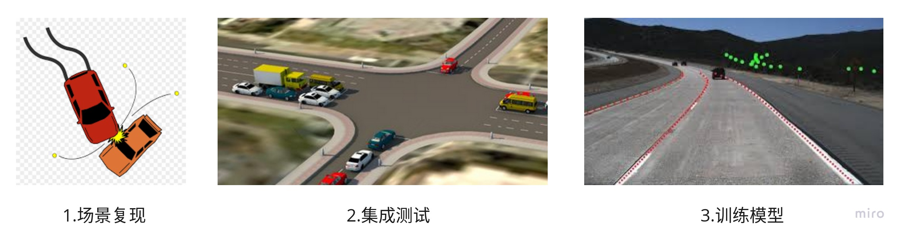
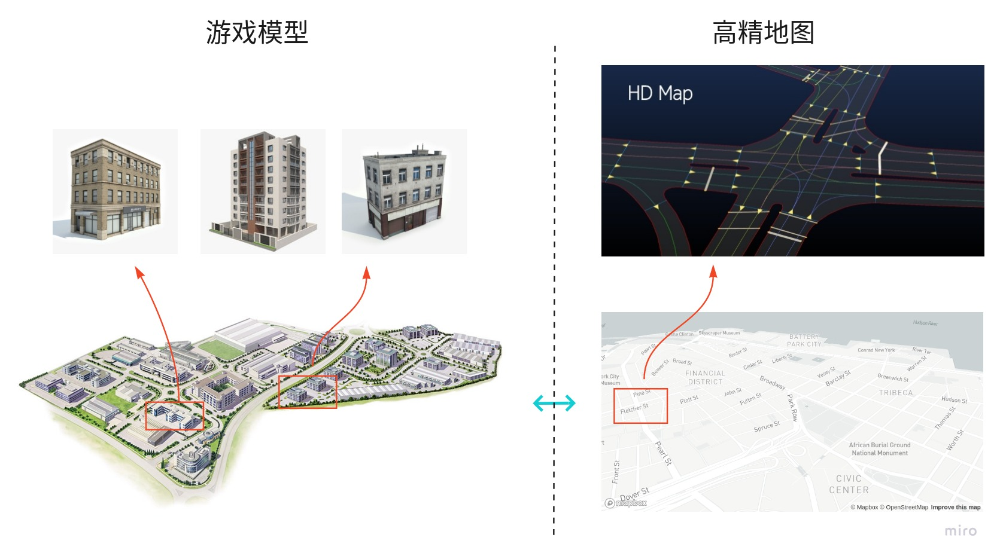

# Dig into Apollo - Simulation 

> 古之学者必有师。师者，所以传道受业解惑也。

## 目录
- [为什么需要仿真](#why_simulation)
- [如何仿真](#how_simulation)
    - [仿真软件](#simulator)
    - [工作方式](#simulator_work)
    - [工作原理](#simulator_principle)
- [如何使用](#how_to)
    - [桥接器](#adapter)
    - [制作地图](#make_map)
    - [测试场景](#test_case)
    - [功能多样化](#features)
- [如何构建自动驾驶仿真系统？](#how_build)
- [地图](#simulation_map)
- [真实场景地图生成](#map_generate)
    - [地图模型制作](#model_build)
    - [高精度地图制作](#hdmap_build)
- [虚拟场景地图生成](#virtual_map_build)
- [车](#car)
- [行为](#behavior)
    - [NPC](#npc)
    - [天气](#weather)
    - [红绿灯](#traffic_light)
- [API](#api)
- [部署](#deploy)
- [总结](#summary)
- [参考](#reference)

<a name="why_simulation" />

## 为什么需要仿真
  
1. 想象一下当你发现了一个新的算法，但还不确认它是否有效，你是否会直接找一辆自动驾驶汽车，更新软件，并且进行测试呢？这样做可能并不安全，你必须把所有的场景测试一遍以保证它足够好，这可需要大量的时间。仿真的好处显而易见，**它通过软件模拟来发现和复现问题，而不需要真实的环境和硬件，可以极大的节省成本和时间**。  
2. 随着现在深度学习的兴起，仿真在自动驾驶领域有了新的用武之地。**自动驾驶平台通过仿真采集数据，可以把训练时间大大提高，远远超出路测的时间，加快模型迭代速度**。先利用集群训练模型，然后再到实际的路测中去检验，采用数据驱动的方式来进行自动驾驶研究。  

自动驾驶的仿真的论文可以参考英伟达的[End to End Learning for Self-Driving Cars](https://arxiv.org/abs/1604.07316)，主要的目的是通过软件来模拟车以及车所在的环境，实现自动驾驶的集成测试，训练模型，模拟事发现场等功能。那么我们是如何模拟车所在的环境的呢？  

<a name="how_simulation" />

## 如何仿真
**要模拟车所在的环境，就得把真实世界投影到虚拟世界，并且需要构造真实世界的物理规律**。例如需要模拟真实世界的房子，车，树木，道路，红绿灯，不仅需要大小一致，还需要能够模拟真实世界的物理规律，比如树和云层会遮挡住阳光，房子或者障碍物会阻挡你的前进，车启动和停止的时候会有加减速曲线。  
**总之，这个虚拟世界得满足真实世界的物理规律才足够真实，模拟才足够好**。而这些场景恰恰和游戏很像，游戏就是模拟真实世界，并且展示出来，游戏做的越好，模拟的也就越真实。实现这一切的就是游戏引擎，通过游戏引擎模拟自然界的各种物理规律，可以让游戏世界和真实世界差不多。这也是越来越多的人沉迷游戏的原因，因为有的时候根本分不清是真实世界还是游戏世界。  
现在我们找到了一条捷径，用游戏来模拟自动驾驶，这看起来是一条可行的路，我们把自动驾驶中的场景复制到游戏世界，然后模拟自动驾驶中各种传感器采集游戏世界中的数据，看起来我们就像是在真实世界中开着自动驾驶汽车在测试了。  

<a name="simulator" />

#### 仿真软件
我们已经知道可以用游戏来模拟自动驾驶，而现在大家也都是这么做的，目前主流的仿真软件都是根据游戏引擎来开发，下面是主要的几个仿真软件：  

| 仿真软件                                                   | 引擎    | 介绍                              |
|------------------------------------------------------------|---------|-----------------------------------|
| [Udacity](https://github.com/udacity/self-driving-car-sim) | Unity   | 优达学城的自动驾驶仿真平台        |
| [Carla](https://github.com/carla-simulator/carla)          | Unreal4 | Intel和丰田合作的自动驾驶仿真平台 |
| [AirSim](https://github.com/Microsoft/AirSim)              | Unreal4 | 微软的仿真平台，还可以用于无人机  |
| [lgsvl](https://github.com/lgsvl/simulator)                | Unity   | LG的自动驾驶仿真平台              |
| [Apollo](https://github.com/ApolloAuto/apollo)             |         | Dreamview百度的自动驾驶仿真平台   |

* **Unreal4** - 主要的编程方式是c++，源码完全开源，还可以通过蓝图来编程。比较著名的游戏有：《鬼泣5》《绝地求生：刺激战场》
* **Unity**   - 主要的编程方式是c#和脚本，源码不开放，超过盈利上限收费。比较著名的游戏有：《王者荣耀》《炉石传说》

<a name="simulator_work" />

#### 工作方式
那么仿真软件是如何工作的呢？大部分的仿真软件分为2部分：server端和client端。  
* server端主要就是游戏引擎，提供模拟真实世界的传感器数据，并且提供控制车辆，红绿灯以及行人的接口，还提供一些辅助接口，例如改变天气状况，检测车辆是否有碰撞等。
* client端则根据server端返回的传感器数据进行具体的控制，调整参数等。  

可以认为server就是游戏机，而client则是游戏手柄，根据游戏中的情况，选择适当的控制方式，直到游戏通关。  

<a name="simulator_principle" />

#### 工作原理
我们知道游戏引擎模拟了传感器的数据，那么游戏引擎是如何实现模拟真实世界中的传感器数据的呢？  
* 摄像头深度信息
* 摄像头场景分割
* 摄像头长短焦
* Lidar点云
* radar毫米波
* Gps信息

除了传感器数据，还需要模拟真实世界的物理规律：  
* 碰撞检测
* 光线和天气变化
* 汽车动力学模型

> TODO: 补充原理

下面分析下carla中如何实现上述的模拟，其实也可以看做Unreal4中如何实现上述功能，carla传感器的实现在"carla/Unreal/CarlaUE4/Plugins/Carla/Source/Carla/Sensor"中。  
1. 其中摄像头深度信息是通过投影"carla/Unreal/CarlaUE4/Plugins/Carla/Content/PostProcessingMaterials"中的材质实现的，这里有点疑惑就是难道深度信息是实现就生成的，还是说材质类似做一层滤镜的操作？  
2. 而Lidar是通过Raycast来实现的，即发送射线检测距离。主要的疑问是如何模拟点云的角度，参数等信息？  
3. 天气的变化直接是通过"蓝图"实现的，没有找到具体的地方？  
4. 汽车动力学模型暂时也没有找到地方？  

<a name="how_to" />

## 如何使用

<a name="adapter" />

#### 桥接器
如果是单独实现或者测试一个算法，直接拿写好的算法在仿真软件上进行测试就可以了，但是如果是需要测试已经开发好的软件，比如apollo和autoware系统，则需要实现仿真软件和自动驾驶系统的对接。一个简单的想法就是增加一个桥接器，就像手机充电器的转换头一样，通过桥接器来连接仿真软件和自动驾驶系统。目前carla和lgsvl都实现了通过桥接器和自动驾驶系统的对接，可以直接通过仿真软件来测试自动驾驶系统。  

> 目前carla和lgsvl都是单独把apollo和autoware拉了一个分支，然后在其中集成一个适配器(ROS桥接)，来实现仿真软件和自动驾驶系统的对接。当然apollo3.5切换到cyber框架之后，可以通过cyber桥接来实现。

<a name="make_map" />

#### 制作地图
仿真中另外一个问题经常遇到的问题就是制作地图，以上的仿真软件都提供了地图编辑器来构建自己想要测试的地图。目前地图格式主要采用的是OpenDrive格式的地图，如果是和Apollo集成的化，需要把OpenDrive格式的地图转换为Apollo中能够使用的地图格式。现在的主要问题是地图编辑器不是那么好用，大部分好用的地图编辑软件都需要收费。  

<a name="test_case" />

#### 测试场景
根据我们的测试需求，我们可以构建以下几种测试场景：  
  
* **场景复现** - 假如自动驾驶过程中出现了一次接管（自动驾驶遇到突发状况解决不了，被人类驾驶员接管），首先我们需要复现当时的场景，这时候不可能再重新回去构建相同的场景，这时候就需要仿真去模拟当时的场景，找到问题之后，我们也可以通过仿真来看针对上述接管的情况是否解决。仿真通过模拟当时接管的场景，可以复现当时出现的问题，同时判断修改软件之后是否对当时的场景有所改善。  
* **集成测试** - 每次开发一个新的功能和迭代之后，通过仿真构造全部场景的测试用例，例如:红绿灯，超车，停车，左拐弯，右拐弯，掉头，十字路口等情况来测试所有场景是否都没有问题，可以在软件真正上车测试之前保证软件的可靠性，检验新开发的功能，提高软件质量，减少测试成本。  
* **训练模型** - 通过仿真软件来生成数据训练模型，真实场景的数据采集需要大量的车和时间，而软件可以通过分布式部署就可以实现模拟真实场景的大量数据，特别是针对目前感知的深度学习算法需要大量数据训练的情况，所以通过仿真可以加快模型训练和部署的速度。另外斯坦福大学还通过仿真来模拟汽车失控的情况下，尽量避免碰撞的场景，做一些新的研究和尝试。  

<a name="features" />

#### 功能多样化
我们需要仿真软件能够适应不同的测试场景，就必须要求仿真软件能够提供灵活和多样化的功能，我们要提供哪些功能呢？  
* **多机控制** - 不仅可以控制自己，还可以控制游戏中的其他角色。控制多辆车在一个地图里面跑，好处是可以多辆车竞争，有点类似遗传算法，把一些车放到里面跑，然后其中选出最好的，如此往复，得到最好的模型。同时多机控制还可以帮助我们控制游戏中的其他车辆，构建不同的测试场景，比如：行人横穿马路，超车等情况。  
* **传感器参数调整** - 通过调整传感器参数实现不同硬件配置下的自动驾驶模拟，例如调整摄像头的参数，调整激光雷达的位置等，增加了传感器的灵活性。  
* **汽车模型** - 根据需要导入不同的汽车模型，包括卡车，三轮车，小汽车的3D模型和动力学模型。  
* **地图模型** - 如果纯手工制作模型太难了，是否可以根据3D点云的数据，然后根据软件来虚拟生成道路模型。  

<a name="how_build" />

## 如何构建自动驾驶仿真系统？
仿真最主要的目的是：**通过模拟真实环境和构建汽车模型，找出自动驾驶过程中可能出现的问题**。那么如何构建自动驾驶仿真系统呢？目前主流的实现方式是**通过游戏引擎来模拟真实环境，通过CarSim等软件构建汽车的动力学模型来实现自动驾驶仿真**。下面我们先看下自动驾驶仿真系统的整体结构。
  
我们需要自动驾驶仿真系统满足：
1. 场景丰富 
2. 接口灵活
3. 恢复快速
4. 部署方便 

首先我们关注仿真器本身，仿真器无非是模拟支持各种场景，其中场景分为：可以定义的场景和随机场景。可以定义的场景又分为：单元场景和真实场景。下面我们分别介绍下这几种场景：
* **可定义的场景** - 主要是针对驾驶过程中遇到的不同情况，比如会车，超车，红绿灯，变道等，这些场景一般都比较简单，类似于单元测试，主要是测试单个场景是否能够满足要求，这一部分业界已经有规范，可以参考[openscenario](http://www.openscenario.org/)。拿超车的场景举例子，可以创建一辆NPC车辆在本车的前面，在不同的速度和距离条件下，测试本车超车是否成功。
* **真实场景** - 复现真实场景中遇到的问题，比如真实路测过程中遇到问题，需要复现当时的情况，并且验证问题是否已经解决，可以回放真实场景的数据来进行测试。
* **随机场景** - 这种场景类似于路测，模拟真实环境中的地图，并且随机生成NPC，天气，交通情况等，模拟汽车在虚拟的环境中进行路测，由于可以大规模部署，可以快速的发现问题。

我们可以看到不管是哪个场景，都是"地图+车+行为"的模式，场景的需求复杂多变，因此能够灵活的加载地图，车和行为就成为仿真器易用的关键。
   
我们的需求是能够根据不同的要求创建不同的场景，动态的添加地图，车和行为。场景生成器是一个框架，支持通过不同的配置，动态创建不同的场景，来满足我们的要求。除了场景生成器，我们还需要仿真器具备以下几个基本功能：
* **复位** - 在故障发生之后，我们能够复位环境和车辆到初始状态，同时也要求我们能够复位对应的自动驾驶系统。这样再每次故障后，可以不用人工操作，而自动恢复测试。  
* **快照** - 能够生成对应帧的信息，保存快照的好处是能够恢复事故现场，同时也可以用于自动驾驶数据集的建设。保存的点云和图片由于有groundtruth，可以作为机器学习的输入来训练模型。
* **回放** - 回放功能主要是用于故障定位，在发生碰撞之后，回放信息用于定位问题。
* **统计** - 统计主要是用于作为benchmark，来衡量系统的稳定性。

有了这些基础功能还不够，我们还需要关心具体的场景，下面我们分别对地图、车以及行为来详细描述需要实现的具体功能：

<a name="simulation_map" />

## 地图
地图是场景中第一个需要考虑的，地图包括2部分，其中一部分是游戏中的模型，另外一部分是这些模型的高精度地图。换一种说法就是，首先我们需要在游戏中构建一个1:1的虚拟世界，然后再绘制出这个世界的高精度地图。其实游戏中的模型是游戏引擎的需求，游戏引擎是根据模型来渲染游戏画面的，没有模型也就渲染不出地图。而高精度地图是自动驾驶系统所需要的，高精度地图可以采用根据现场绘制的地图，也可以先得到游戏模型，然后在模型中绘制。下面是游戏中的地图和高精度地图的对应关系。
  

<a name="map_generate" />

## 真实场景地图生成

<a name="model_build" />

#### 地图模型制作
游戏中地图模型的制作相对来说是工作量比较大的工作，涉及到以下2点：
* **单个模型制作** - 单个模型包括地图中的建筑物、道路、树木、信号灯、交通牌、以及其他的信息。这些信息如果是要完全模拟真实环境，需要大量的材质和贴图，一般是在maya和3d-max等软件中建模，然后再导入模型到游戏引擎中使用。
* **地图布局** - 有了单个模型，当需要把单个模型组合成地图的时候，首先需要解决的是道路的位置信息，比如这个道路有多长，道路的曲率是多少？比较简单点的方法是直接导入2维地图（百度，高德，OSM），然后对照着2维地图放模型，最后生成整个地图的布局。而实际的问题是2维地图的精度往往达不到要求，国内的地图还加入了GPS偏置，所以生成的地图布局必定会不太准确。

<a name="hdmap_build" />

#### 高精度地图制作
* **根据模型生成地图** - 接着上面的地图布局来讲，虽然得到的地图布局不准确，但是我们再根据游戏中的模型布局，绘制出高精度地图，然后把这个高精度地图给自动驾驶系统使用，基本上也能满足我们的要求。
* **根据地图生成模型** - 上述的问题就是游戏中的真实位置和实际道路的位置有轻微的误差。要解决上面的问题，我们可以反其道而行之，先生成高精度地图，即根据真实环境先绘制出高精度地图，然后再把高精度地图导入游戏引擎，动态的生成模型，这个方案的好处是地图100%是真实场景，而且不需要在游戏引擎中重新绘制高精度地图，坏处是建筑的模型无法生成。

关于真实场景的地图生成，目前还没有一个比较完美的解决方案，都需要大量的工作。下面我们再看下虚拟场景的地图生成。

<a name="virtual_map_build" />

## 虚拟场景地图生成
虚拟场景的道路生成就比较简单，主要的应用场景是一些园区，或者一些测试场景。这一部分完全可以制作一个地图编辑器，类似游戏中的地图编辑器，玩家可以根据自己的需求创建游戏中的地图，然后再由脚本动态的生成高精度地图。**这部分的功能主要是对标Carsim等仿真软件的地图编辑功能**。
  

说完了地图，接下来看下车

<a name="car" />

## 车
车主要分为2部分：车的动力学模型，以及传感器。接下来我们详细分析下这2部分：
* **车的动力学模型** - 这一部分是传统仿真软件的强项，由于应用已经非常成熟，游戏中的汽车动力学模型都比较简单，由于CarSim等软件没有开源，所以目前短期内一个比较好的解决方案是，仿真器提供API接口，调用CarSim和Simulink等软件的动力学模型，实现对汽车的模拟。
* **传感器** - 传感器主要是GPS、IMU、LIDAR、RADAR、CAMERA等，涉及到传感器的位置，校准参数等。当然这一部分也可以仿真传感器视野范围(FOV)，也可以仿真传感器的校准算法。

<a name="behavior" />

## 行为
现在我们加载了地图，车辆，接着我们需要定义一些行为来模拟真实世界。

<a name="npc" />

#### NPC
npc包括行人和车辆。
* **行人** - 目前主要是模拟行人过马路，以及在路边行走，以及更加复杂的场景，例如下雨天打伞的行人，对于这些异常场景，感知模块不一定能够正常识别。
* **车辆** - 车辆的行为可以由一些简单的行为来模拟复杂的行为，例如停车，变道，加速，减速，来组合出超车，会车等复杂行为。也可以通过模拟真实情况的交通流数据，来模拟整个行为。前一种测试的行为比较成熟，后一种需要根据实际的情况提取出行为，再加入补全信息，才能够正常工作。

<a name="weather" />

#### 天气
天气主要是影响传感器的感知，最主要的就是摄像头。对LIDAR的影响由于目前没有阅读相关平台是否有加入噪声，这里就先不展开了。
* **天气** - 雨、雪、雾、云层 调整不同的比率来模拟不同的天气情况对传感器的影响，云层主要是会影响光照变化，多云投射的阴影对车道线识别等会有影响。
* **时间** - 白天和夜晚不同光照场景下对传感器的影响。

<a name="traffic_light" />

#### 红绿灯
这一部分可以归纳为交通信号的行为，其中分为:
* **有保护的红绿灯** - 各大城市是最普遍的，即有箭头的红绿灯，根据对应车道的红绿灯直行或者拐弯。
* **无保护的红绿灯** - 即圆形的红绿灯，对面可以直线的同时，你可以拐弯，需要注意对面直行的车辆，选择让车之后再拐弯。
* **无红绿灯** - 这种常见于郊区路口，需要判断有没有车辆经过而让行或者停止，然后再通过路口。

关于仿真器就介绍完毕了，那么我们如何控制仿真器来实现这些呢？

<a name="api" />

## API
目前主要是通过python API的方式来控制仿真器加载模型，控制仿真器的行为。好处是不用图形界面手工操作，可以实现自动化部署。API的主要是根据上述所说仿真器的功能实现统一的接口，实现交互。

<a name="deploy" />

## 部署
为了提高测试效率，我们还需要大规模部署，一个比较好的方式是通过容器化的方式部署。针对于多台机器，一个显而易见的需求就是创建一个管理平台来实现对仿真器的管理。容器部署平台可以监控对应仿真器的状态，并且提供可视化的配置界面，生成和部署不同的场景。
* **监控** - 可以监控仿真器的监控状态，显示正常和有问题的集群，保存日志，维护集群的稳定。
* **可视化** - 首先是配置可视化，可以方便的选择不同的配置（不同的地图，车，行为）来生成不同的场景，其次是通过可视化反馈仿真结果，屏蔽仿真集群的细节，使用起来更加直观方便。
  

<a name="summary" />

## 总结
最后根据功能划分，我们可以单独仿真自动驾驶系统的规划控制模块，也可以单独仿真感知模块，可以仿真传感器校准，也可以端到端的仿真所有模块。可以仿真单个受限的场景，也可以仿真整个地图。总之，仿真系统需要提供灵活的场景生成框架，统一的API接口，以及大规模部署的能力。
  

<a name="reference" />

## 参考
[虚幻引擎游戏列表](https://zh.wikipedia.org/wiki/%E8%99%9A%E5%B9%BB%E5%BC%95%E6%93%8E%E6%B8%B8%E6%88%8F%E5%88%97%E8%A1%A8)  
[Unity3D](https://baike.baidu.com/item/Unity3D)  
[Udacity](https://github.com/udacity/self-driving-car-sim)  
[Carla](https://github.com/carla-simulator/carla)  
[AirSim](https://github.com/Microsoft/AirSim)  
[lgsvl](https://github.com/lgsvl/simulator)  
[Apollo](https://github.com/ApolloAuto/apollo)  
[EventSystem](https://docs.unity3d.com/ScriptReference/EventSystems.EventSystem.html)  
[openscenario](http://www.openscenario.org/)  
