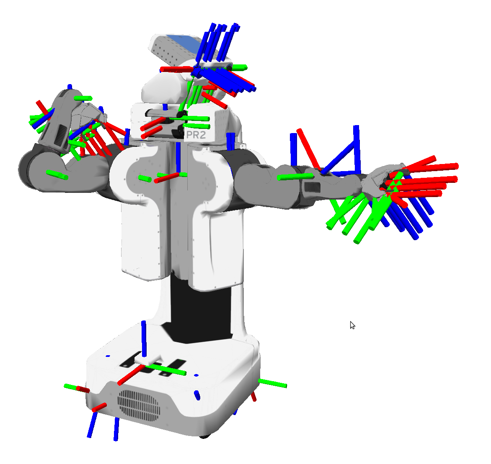

# Dig into Apollo - Transform 

> 温故而知新，可以为师矣。


## Table of Contents
- [Transform模块简介](#introduction)
- [Transform(静态变换)](#static_transform)
- [transform_broadcaster（广播）](#no_static_transform)
- [Buffer（接收缓存）](#buffer)
  - [缓存接口](#buffer_interface)
  - [缓存实现](#buffer_class)
- [总结](#summary)
- [Reference](#reference)


<a name="introduction" />

## Transform模块简介
关于transform模块开始一直不知道是干啥的，一直看到一个"/tf"的TOPIC，还以为是tensorflow的缩写，想着是不是和神经网络有关系，后来才知道tf是transform的缩写，主要的用途是进行坐标转换，原型即是大名鼎鼎的"ros/tf2"库。那么为什么要进行坐标转换呢？  
  
在机器人系统中，经常需要用到坐标转换，比如一个机器人的手臂要去拿一个运动的物体，控制的时候我们需要手臂的当前坐标，同时还需要知道手臂和身体的坐标，这个时候就需要用到坐标转换，把手臂的坐标转换为身体的坐标系，这样控制起来就方便一点。当然这里是动态的情况，也存在静态的情况，比如机器人头顶的摄像头，转换到身体的坐标系，那么位置关系是相对固定的，所以可以一开始就写到固定的位置。这里就引入了以下几个问题：  
1. 有固定转换关系的文件放在哪里？如果都是集中放在一个地方，那么这个地方损坏会导致所有的转换关系失效，一个比较好的方法是各个节点自己广播自己的转换关系。而其实静态的转换关系只需要发送一次就可以了，因为不会变化。
2. 有动态转换关系的节点，需要实时动态发布自己的转换关系，这样会涉及到时间戳，以及过时。
3. 转换关系的拓扑结构如何确定？是树型还是网络型的，这涉及到转换关系传递的问题。


<a name="static_transform" />

## Transform(静态变换)

TransformComponent模块的入口在"static_transform_component.cc"和"static_transform_component.h"中。实现了"StaticTransformComponent"类，我们接下来看下它的实现。
```c++
class StaticTransformComponent final : public apollo::cyber::Component<> {
 public:
  StaticTransformComponent() = default;  // 构造函数
  ~StaticTransformComponent() = default; // 析构函数

 public:
  bool Init() override;  // 初始化函数

 private:
  void SendTransforms();  // 发送变换
  void SendTransform(const std::vector<TransformStamped>& msgtf);  //发送变换，参数为数组
  bool ParseFromYaml(const std::string& file_path, TransformStamped* transform);  // 从yaml中解析

  apollo::static_transform::Conf conf_;  // 配置文件
  std::shared_ptr<cyber::Writer<TransformStampeds>> writer_;  // cyber node写句柄
  TransformStampeds transform_stampeds_;  // 变换关系，在proto中定义
};
```

下面我们来分析StaticTransformComponent类具体的实现，首先是Init函数，Init函数做了2件事情，一是读取conf配置，二是发布"/tf_static"消息。
```c++
bool StaticTransformComponent::Init() {
  // 读取配置
  if (!GetProtoConfig(&conf_)) {
    AERROR << "Parse conf file failed, " << ConfigFilePath();
    return false;
  }
  // 发布消息
  cyber::proto::RoleAttributes attr;
  attr.set_channel_name("/tf_static");
  attr.mutable_qos_profile()->CopyFrom(
      cyber::transport::QosProfileConf::QOS_PROFILE_TF_STATIC);
  // 注意这里的node_继承至apollo::cyber::Component
  writer_ = node_->CreateWriter<TransformStampeds>(attr);
  SendTransforms();
  return true;
}
```

接着看SendTransforms()函数，主要就是遍历conf文件，判断extrinsic_file(实际上对应各种传感器的外参)是否使能，如果使能则根据提供的文件路径解析对应的转换关系"ParseFromYaml"，把转换关系添加到数组"tranform_stamped_vec"中，然后发送。
```c++
void StaticTransformComponent::SendTransforms() {
  std::vector<TransformStamped> tranform_stamped_vec;
  // 遍历对应的文件，实际上对应各种传感器的外参
  for (auto& extrinsic_file : conf_.extrinsic_file()) {
    // 是否使能
    if (extrinsic_file.enable()) {
      AINFO << "Broadcast static transform, frame id ["
            << extrinsic_file.frame_id() << "], child frame id ["
            << extrinsic_file.child_frame_id() << "]";
      TransformStamped transform;
      // 解析yaml文件，获取转换，并且添加到数组中
      if (ParseFromYaml(extrinsic_file.file_path(), &transform)) {
        tranform_stamped_vec.emplace_back(transform);
      }
    }
  }
  // 发送对应的转换
  SendTransform(tranform_stamped_vec);
}
```

解析yaml需要注意的地方，在conf中的frame_id和child_id实际上没有使用，最后还是以yaml文件中的为准。其中yaml文件的格式为
```
child_frame_id: novatel
transform:
  translation:
    x: 0.0
    y: 0.0
    z: 0.0
  rotation:
    x: 0.0
    y: 0.0
    z: 0.0
    w: 1.0
header:
  frame_id: localization
```
我们在看下如何解析yaml文件：  
```c++
bool StaticTransformComponent::ParseFromYaml(
    const std::string& file_path, TransformStamped* transform_stamped) {
  ...
  YAML::Node tf = YAML::LoadFile(file_path);
  try {
    // 读取yaml文件中的frame_id和child_frame_id
    transform_stamped->mutable_header()->set_frame_id(
        tf["header"]["frame_id"].as<std::string>());
    transform_stamped->set_child_frame_id(
        tf["child_frame_id"].as<std::string>());
    // translation 位置
    auto translation =
        transform_stamped->mutable_transform()->mutable_translation();
    translation->set_x(tf["transform"]["translation"]["x"].as<double>());
    translation->set_y(tf["transform"]["translation"]["y"].as<double>());
    translation->set_z(tf["transform"]["translation"]["z"].as<double>());
    // rotation 角度
    auto rotation = transform_stamped->mutable_transform()->mutable_rotation();
    rotation->set_qx(tf["transform"]["rotation"]["x"].as<double>());
    rotation->set_qy(tf["transform"]["rotation"]["y"].as<double>());
    rotation->set_qz(tf["transform"]["rotation"]["z"].as<double>());
    rotation->set_qw(tf["transform"]["rotation"]["w"].as<double>());
  } catch (...) {
    AERROR << "Extrinsic yaml file parse failed: " << file_path;
    return false;
  }
  return true;
}
```
最后我们再看下如何发送转换关系：
```c++
void StaticTransformComponent::SendTransform(
    const std::vector<TransformStamped>& msgtf) {
  for (auto it_in = msgtf.begin(); it_in != msgtf.end(); ++it_in) {
    bool match_found = false;
    int size = transform_stampeds_.transforms_size();

    // 如果child_frame_id重复，那么则覆盖对应的配置
    for (int i = 0; i < size; ++i) {
      if (it_in->child_frame_id() ==
          transform_stampeds_.mutable_transforms(i)->child_frame_id()) {
        auto it_msg = transform_stampeds_.mutable_transforms(i);
        *it_msg = *it_in;
        match_found = true;
        break;
      }
    }
    if (!match_found) {
      // 获取增加的指针地址，并且赋值
      auto ts = transform_stampeds_.add_transforms();
      *ts = *it_in;
    }
  }
  writer_->Write(std::make_shared<TransformStampeds>(transform_stampeds_));
}
```
所以这里需要注意**child_frame_id的值一定不要一样，否则会覆盖之前的配置**。


按照流程总结一下就如下图所示，首先遍历conf，获取传感器的外参数文件路径，然后解析对应的yaml文件，并且发布到"/tf_static"。
  


<a name="no_static_transform" />

## transform_broadcaster（广播）
**各个模块通过广播的方式来发布动态变换，实际上就是各个模块通过调用transform_broadcaster的库函数来实现广播转换消息**，我们接下来看下transform_broadcaster是如何实现的，transform_broadcaster做为一个lib库，入口在"transform_broadcaster.h"和"transform_broadcaster.cc"中。
```c++
class TransformBroadcaster {
 public:
  // 这里注意构造的时候需要传入node
  explicit TransformBroadcaster(const std::shared_ptr<cyber::Node>& node);

  // 发送单个转换关系
  void SendTransform(const TransformStamped& transform);

  // 发送一组转换关系
  void SendTransform(const std::vector<TransformStamped>& transforms);

 private:
  std::shared_ptr<cyber::Node> node_;
  std::shared_ptr<cyber::Writer<TransformStampeds>> writer_;
};
```
从上面的分析可以看出，构造TransformBroadcaster的时候需要传入node。为什么需要传入node呢，因为cyber的一个module不能同时创建2个node，所以这里谁调用，就用谁的node创建reader和writer。如果是自己创建node，那么其他模块自己的node和引用该模块创建的node就打破了cyber上述的限制，这里的node是否可以理解为一个进程？
下面我们分析具体的实现，首先是TransformBroadcaster构造函数：  
```c++
TransformBroadcaster::TransformBroadcaster(
    const std::shared_ptr<cyber::Node>& node)
    : node_(node) {
  cyber::proto::RoleAttributes attr;
  // 发布的topic为"/tf"
  attr.set_channel_name("/tf");
  writer_ = node_->CreateWriter<TransformStampeds>(attr);
}
```
创建writer并且往"/tf"发消息。这里可以看到，这里存在多个节点往一个topic发消息的情况。  
发送消息比较简单，直接写对应的消息：  
```c++
void TransformBroadcaster::SendTransform(
    const std::vector<TransformStamped>& transforms) {
  auto message = std::make_shared<TransformStampeds>();
  *message->mutable_transforms() = {transforms.begin(), transforms.end()};
  writer_->Write(message);
}
```

<a name="buffer" />

## Buffer（接收缓存）
Buffer实际上提供了一个工具类给其它模块，它的主要作用是接收"/tf"和"/tf_static"的消息，并且保持在buffer中，提供给其它节点进行查找和转换到对应的坐标系，我们先看BufferInterface的实现：  


<a name="buffer_interface" />

#### 缓存接口
BufferInterface类定义了缓存需要实现的接口：  
```c++
class BufferInterface {
 public:
  // 根据frame_id获取2帧的转换关系
  virtual apollo::transform::TransformStamped lookupTransform(
      const std::string& target_frame, const std::string& source_frame,
      const cyber::Time& time, const float timeout_second = 0.01f) const = 0;

  // 根据frame_id获取2帧的转换关系，假设固定帧？？？
  virtual apollo::transform::TransformStamped lookupTransform(
      const std::string& target_frame, const cyber::Time& target_time,
      const std::string& source_frame, const cyber::Time& source_time,
      const std::string& fixed_frame,
      const float timeout_second = 0.01f) const = 0;

  // 测试转换是否可行
  virtual bool canTransform(const std::string& target_frame,
                            const std::string& source_frame,
                            const cyber::Time& time,
                            const float timeout_second = 0.01f,
                            std::string* errstr = nullptr) const = 0;

  // 测试转换是否可行
  virtual bool canTransform(const std::string& target_frame,
                            const cyber::Time& target_time,
                            const std::string& source_frame,
                            const cyber::Time& source_time,
                            const std::string& fixed_frame,
                            const float timeout_second = 0.01f,
                            std::string* errstr = nullptr) const = 0;

  // Transform, simple api, with pre-allocation
  // 预分配内存
  template <typename T>
  T& transform(const T& in, T& out, const std::string& target_frame,  // NOLINT
               float timeout = 0.0f) const {
    // do the transform
    tf2::doTransform(in, out, lookupTransform(target_frame, tf2::getFrameId(in),
                                              tf2::getTimestamp(in), timeout));
    return out;
  }

  // transform, simple api, no pre-allocation
  // 没有预分配内存
  template <typename T>
  T transform(const T& in, const std::string& target_frame,
              float timeout = 0.0f) const {
    T out;
    return transform(in, out, target_frame, timeout);
  }

  // transform, simple api, different types, pre-allocation
  // 不同的类型
  template <typename A, typename B>
  B& transform(const A& in, B& out, const std::string& target_frame,  // NOLINT
               float timeout = 0.0f) const {
    A copy = transform(in, target_frame, timeout);
    tf2::convert(copy, out);
    return out;
  }

  // Transform, advanced api, with pre-allocation
  template <typename T>
  T& transform(const T& in, T& out, const std::string& target_frame,  // NOLINT
               const cyber::Time& target_time, const std::string& fixed_frame,
               float timeout = 0.0f) const {
    // do the transform
    tf2::doTransform(
        in, out, lookupTransform(target_frame, target_time, tf2::getFrameId(in),
                                 tf2::getTimestamp(in), fixed_frame, timeout));
    return out;
  }

  // transform, advanced api, no pre-allocation
  template <typename T>
  T transform(const T& in, const std::string& target_frame,
              const cyber::Time& target_time, const std::string& fixed_frame,
              float timeout = 0.0f) const {
    T out;
    return transform(in, out, target_frame, target_time, fixed_frame, timeout);
  }

  // Transform, advanced api, different types, with pre-allocation
  template <typename A, typename B>
  B& transform(const A& in, B& out, const std::string& target_frame,  // NOLINT
               const cyber::Time& target_time, const std::string& fixed_frame,
               float timeout = 0.0f) const {
    // do the transform
    A copy = transform(in, target_frame, target_time, fixed_frame, timeout);
    tf2::convert(copy, out);
    return out;
  }
};
```
BufferInterface实现的功能主要是查找转换关系，以及查看转换关系是否存在，以及做最后的转换。  

<a name="buffer_class" />

#### 缓存实现
下面我们接着看buffer类的实现，可以看到buffer类继承了"BufferInterface"和"tf2::BufferCore"，其中"tf2::BufferCore"就是大名鼎鼎的ROS中的tf2库。  
```c++
class Buffer : public BufferInterface, public tf2::BufferCore {
 public:
  using tf2::BufferCore::canTransform;
  using tf2::BufferCore::lookupTransform;

  // 构造buffer object
  int Init();

  // 根据frame_id获取2帧的转换关系，继承至BufferInterface
  virtual apollo::transform::TransformStamped lookupTransform(
      const std::string& target_frame, const std::string& source_frame,
      const cyber::Time& time, const float timeout_second = 0.01f) const;

  // 继承至BufferInterface
  virtual apollo::transform::TransformStamped lookupTransform(
      const std::string& target_frame, const cyber::Time& target_time,
      const std::string& source_frame, const cyber::Time& source_time,
      const std::string& fixed_frame, const float timeout_second = 0.01f) const;

  // 继承至BufferInterface
  virtual bool canTransform(const std::string& target_frame,
                            const std::string& source_frame,
                            const cyber::Time& target_time,
                            const float timeout_second = 0.01f,
                            std::string* errstr = nullptr) const;

  // 继承至BufferInterface
  virtual bool canTransform(const std::string& target_frame,
                            const cyber::Time& target_time,
                            const std::string& source_frame,
                            const cyber::Time& source_time,
                            const std::string& fixed_frame,
                            const float timeout_second = 0.01f,
                            std::string* errstr = nullptr) const;

 private:
  // 转换回调？？？
  void SubscriptionCallback(
      const std::shared_ptr<const apollo::transform::TransformStampeds>&
          transform);
  void StaticSubscriptionCallback(
      const std::shared_ptr<const apollo::transform::TransformStampeds>&
          transform);
  void SubscriptionCallbackImpl(
      const std::shared_ptr<const apollo::transform::TransformStampeds>&
          transform,
      bool is_static);
  void AsyncSubscriptionCallbackImpl(
      const std::shared_ptr<const apollo::transform::TransformStampeds>&
          transform,
      bool is_static);

  // 转换tf2消息为cyber protobuf格式
  void TF2MsgToCyber(
      const geometry_msgs::TransformStamped& tf2_trans_stamped,
      apollo::transform::TransformStamped& trans_stamped) const;  // NOLINT

  std::unique_ptr<cyber::Node> node_;
  std::shared_ptr<cyber::Reader<apollo::transform::TransformStampeds>>
      message_subscriber_tf_;
  std::shared_ptr<cyber::Reader<apollo::transform::TransformStampeds>>
      message_subscriber_tf_static_;

  cyber::Time last_update_;
  std::vector<geometry_msgs::TransformStamped> static_msgs_;
  // 单例
  DECLARE_SINGLETON(Buffer)
};  // class
```
这里注意buffer为单例模式，即接收转换消息，并且放到buffer中保存。其他模块需要用到转换的时候，则从buffer中查找是否存在转换关系，并且进行对应的转换。  

下面我们看buffer类的具体实现，buffer类的初始化在Init函数中：  
```c++
int Buffer::Init() {
  std::string node_name =
      "transform_listener_" + std::to_string(cyber::Time::Now().ToNanosecond());
  // 创建node节点
  node_ = cyber::CreateNode(node_name);
  cyber::ReaderConfig tf_reader_config;

  // 读取"/tf"消息
  tf_reader_config.channel_name = "/tf";
  tf_reader_config.pending_queue_size = 5;

  message_subscriber_tf_ =
      node_->CreateReader<apollo::transform::TransformStampeds>(
          tf_reader_config,
          [&](const std::shared_ptr<const apollo::transform::TransformStampeds>&
                  msg_evt) { SubscriptionCallbackImpl(msg_evt, false); });

  // 读取"/tf_static"消息
  apollo::cyber::proto::RoleAttributes attr_static;
  attr_static.set_channel_name("/tf_static");
  attr_static.mutable_qos_profile()->CopyFrom(
      apollo::cyber::transport::QosProfileConf::QOS_PROFILE_TF_STATIC);
  message_subscriber_tf_static_ =
      node_->CreateReader<apollo::transform::TransformStampeds>(
          attr_static,
          [&](const std::shared_ptr<apollo::transform::TransformStampeds>&
                  msg_evt) { SubscriptionCallbackImpl(msg_evt, true); });

  return cyber::SUCC;
}
```
可以看到在Init函数中主要实现的功能是创建节点，并且订阅"/tf"和"/tf_static"消息，由于Buffer为单例，在cyber初始化的时候创建的node，不是在模块内部创建的node（关于这块，后面有时间在详细论述下，cyber可以存在多个node，而启动的模块则不能，是不是因为cyber做为调度器，为了方便控制）。

回调函数都是SubscriptionCallbackImpl，我们看下它是如何缓存消息的？
```c++
void Buffer::SubscriptionCallbackImpl(
    const std::shared_ptr<const apollo::transform::TransformStampeds>& msg_evt,
    bool is_static) {
  cyber::Time now = cyber::Time::Now();
  // authority的用途？？？
  std::string authority =
      "cyber_tf";  // msg_evt.getPublisherName(); // lookup the authority

  // 看起来不可能进入这个条件，除非多线程？？？
  if (now.ToNanosecond() < last_update_.ToNanosecond()) {
    AINFO << "Detected jump back in time. Clearing TF buffer.";
    clear();
    // cache static transform stamped again.
    for (auto& msg : static_msgs_) {
      setTransform(msg, authority, true);
    }
  }
  last_update_ = now;

  for (int i = 0; i < msg_evt->transforms_size(); i++) {
    try {
      // 封装消息
      geometry_msgs::TransformStamped trans_stamped;

      // header
      const auto& header = msg_evt->transforms(i).header();
      trans_stamped.header.stamp =
          static_cast<uint64_t>(header.timestamp_sec() * kSecondToNanoFactor);
      trans_stamped.header.frame_id = header.frame_id();
      trans_stamped.header.seq = header.sequence_num();

      // child_frame_id
      trans_stamped.child_frame_id = msg_evt->transforms(i).child_frame_id();

      // translation
      const auto& transform = msg_evt->transforms(i).transform();
      trans_stamped.transform.translation.x = transform.translation().x();
      trans_stamped.transform.translation.y = transform.translation().y();
      trans_stamped.transform.translation.z = transform.translation().z();

      // rotation
      trans_stamped.transform.rotation.x = transform.rotation().qx();
      trans_stamped.transform.rotation.y = transform.rotation().qy();
      trans_stamped.transform.rotation.z = transform.rotation().qz();
      trans_stamped.transform.rotation.w = transform.rotation().qw();

      // 保存静态转换，用于上面判断条件的时候，重新设置静态转换
      if (is_static) {
        static_msgs_.push_back(trans_stamped);
      }
      // 调用tf2的函数，保存转换到cache，区分静态和动态的转换
      setTransform(trans_stamped, authority, is_static);
    } catch (tf2::TransformException& ex) {
      std::string temp = ex.what();
      AERROR << "Failure to set recieved transform:" << temp.c_str();
    }
  }
}
```
接着是lookupTransform和canTransform分别调用tf2的库函数，实现查找转换和判断是否能够转换的实现，由于函数功能比较简单这里就不介绍了。  
可以看到主要的缓存实现都是在tf2的库函数中，后面有时间再分析下tf2具体的实现。  

<a name="summary" />

## 总结
接下来我们用一张图来总结Apollo中的坐标变换关系，即静态坐标转换由"StaticTransform"模块提供，而动态转换由需要发布的模块自行发布如"NDTLocalization","RTKLocalization"和""Gnss，可以看到动态变换主要是世界坐标到本地坐标的转换，而静态转换主要是各个传感器之间的转换。最后转换关系统一由Buffer模块接收，并且提供查询。  
  

<a name="reference" />

## Reference
[tf2](http://wiki.ros.org/tf2)  

