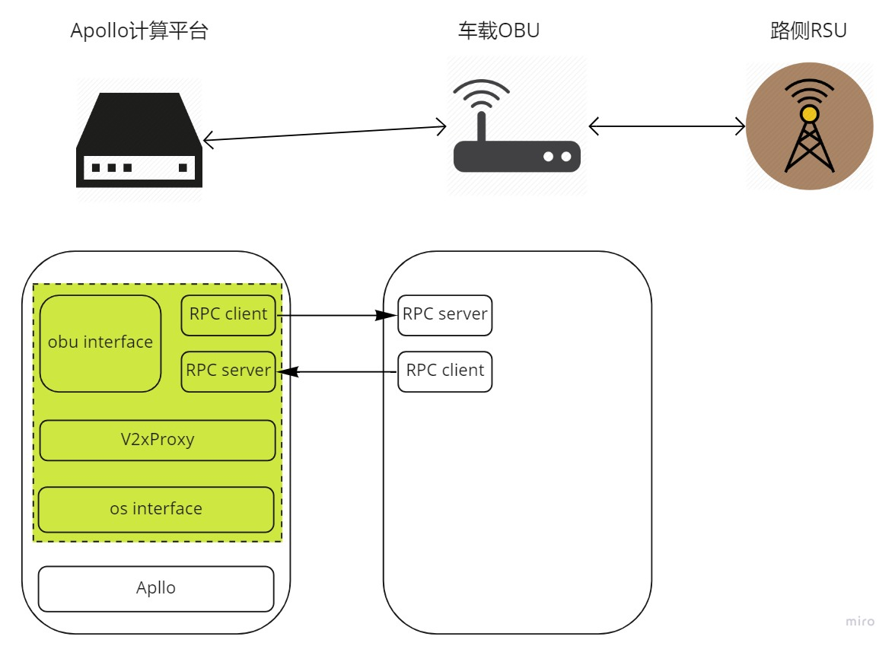

# Dig into Apollo - Perception   

> 业精于勤，荒于嬉；行成于思，毁于随。  

## Table of Contents
- [v2x目录结构](#introduction)  
- [v2x_proxy](#v2x_proxy)
  - [app](#app)
  - [TrafficLightTimer](#trafficlight_timer)
  - [OnV2xCarStatusTimer](#onv2xcar_timer)
- [OBU接口(ObuInterFaceGrpcImpl)](#obu_interface)
  - [远程调用服务(grpc_interface)](#grpc_interface)
- [系统接口(OsInterFace)](#os_interface)
  - [SendMsgToOs](#send_msg_to_os)
  - [GetMsgFromOs](#get_msg_from_os)


<a name="introduction" />

## v2x目录结构
v2x的目录结构如下。  
```
.
├── BUILD        // 编译
├── common       // 公共目录
├── conf         // 配置
├── launch       
├── proto        // protobuf文件
└── v2x_proxy    // v2x代理
```

主要的实现在"v2x_proxy"中，无人驾驶车主要是OBU单元，和路侧RSU单元进行交互。  


<a name="v2x_proxy" />

## v2x_proxy
v2x_proxy的目录结构如下。  
```
.
├── app
├── obu_interface
└── os_interface
```

<a name="app" />

#### app
v2x模块的入口函数在"app/main.cc"中，在主函数中读取参数并且初始化v2x proxy。在"v2x_proxy.h"和"v2x_proxy.cc"中实现了"V2xProxy"类。  

1. 初始化  
首先我们看"V2xProxy"的初始化过程。
```c++
V2xProxy::V2xProxy()
    : node_(cyber::CreateNode("v2x_proxy")), init_flag_(false) {
  // 1. 红绿灯到车的定时器
  x2v_trafficlight_timer_.reset(
      new cyber::Timer(static_cast<uint32_t>(x2v_trafficlight_timer_period),
                       [this]() { this->OnX2vTrafficLightTimer(); }, false));
  // 2. 车的状态上报定时器
  v2x_carstatus_timer_.reset(
      new cyber::Timer(static_cast<uint32_t>(v2x_carstatus_timer_period),
                       [this]() { this->OnV2xCarStatusTimer(); }, false));

  os_interface_.reset(new OsInterFace());
  obu_interface_.reset(new ObuInterFaceGrpcImpl());

  x2v_trafficlight_ = std::make_shared<IntersectionTrafficLightData>();
  v2x_carstatus_ = std::make_shared<CarStatus>();
   
  // 3. 加载高精度地图
  hdmap_.reset(new apollo::hdmap::HDMap());

  // 4. 初始化os接口和obu接口
  if (!os_interface_->InitFlag() || !obu_interface_->InitFlag()) {
    AFATAL << "Failed to init os interface or obu interface";
    return;
  }
  
  // 5. 收到同步信号后，启动红绿灯定时器  
  first_flag_reader_ = node_->CreateReader<StatusResponse>(
      "/apollo/v2x/inner/sync_flag",
      [this](const std::shared_ptr<const StatusResponse>& msg) {
        x2v_trafficlight_timer_->Start();
      });

  // 6. 启动车辆上报定时器  
  v2x_carstatus_timer_->Start();

  init_flag_ = true;
}
```
可以看到"V2xProxy"初始化了2个定时器，一个是RSU发送给车的红绿灯信息，一个是主动上报的车辆状态信息，另外还初始化了os接口和obu接口。  


<a name="trafficlight_timer" />

#### TrafficLightTimer
交通灯的定时器会定时回调"OnX2vTrafficLightTimer"，下面我们看定时回调里面执行了什么？  
```c++
void V2xProxy::OnX2vTrafficLightTimer() {
  x2v_trafficlight_->Clear();
  // 1. 从obu接口中获取红绿灯的状态
  obu_interface_->GetV2xTrafficLightFromObu(x2v_trafficlight_);
  if (!x2v_trafficlight_->has_current_lane_trafficlight()) {
    AERROR << "Error:v2x trafficlight ignore, no traffic light contained.";
    return;
  }
  // 2. 当前红绿灯状态
  auto current_traff = x2v_trafficlight_->mutable_current_lane_trafficlight();
  if (current_traff->single_traffic_light().empty()) {
    AERROR << "Error:v2x trafficlight ignore, no traffic light contained.";
    return;
  }
  ADEBUG << x2v_trafficlight_->DebugString();
  // 3. 执行红绿灯逻辑
  if (!TrafficLightProc(current_traff)) {
    return;
  }
  // 4. 发送红绿灯状态到OS接口
  os_interface_->SendV2xTrafficLightToOs(x2v_trafficlight_);
}
```
下面是红绿灯的处理过程。先根据接收到的坐标信息查找前面一定距离的所有红绿灯，然后把当前范围内的所有红绿灯改为接收到的颜色。该过程可能较少的考虑到一些逻辑，估计后面会继续完善。  
```c++
bool V2xProxy::TrafficLightProc(CurrentLaneTrafficLight* msg) {
  // 1. 获取rsu发送的红绿灯坐标
  apollo::common::PointENU point;
  point.set_x(msg->gps_x_m());
  point.set_y(msg->gps_y_m());
  std::vector<apollo::hdmap::SignalInfoConstPtr> signals;
  // 2. 获取当前范围内所有的红绿灯
  if (hdmap_->GetForwardNearestSignalsOnLane(point, 1000.0, &signals) != 0) {
    AERROR << "Error::v2x trafficlight ignore, hdmap get no signals";
    AERROR << "traffic light size : " << signals.size();
    return false;
  }
  // 3. 如果只有一个信号灯，则设置id，并且返回
  if (signals.size() == 1) {
    auto single = msg->mutable_single_traffic_light(0);
    single->set_id(signals[0]->id().id());
    return true;
  }
  // 4. 如果有多个信号灯，则把所有的信号灯设置为发送的颜色
  auto color = msg->single_traffic_light(0).color();
  msg->clear_single_traffic_light();

  for (auto i = signals.begin(); i != signals.end(); i++) {
    auto single = msg->add_single_traffic_light();
    single->set_id((*i)->id().id());
    single->set_color(color);
  }
  return true;
}
```
疑问：  
1. 按照代码RSU只发送了一个信号灯状态，并且RSU没有高精度地图信息，不知道无人车中高精度地图的signal_id，所以一方面要填充signal_id信息，一方面找到多个红绿灯时候，需要把所有的红绿灯信息都修改为发送的状态。  
2. RSU应该发送多个红绿灯的状态，而不仅仅只发送一个，这样就需要RSU侧也需要高精度地图，并且和车的高精度信息要同步。  


<a name="onv2xcar_timer" />

#### OnV2xCarStatusTimer
发送本车的状态到RSU。  
```c++
void V2xProxy::OnV2xCarStatusTimer() {
  v2x_carstatus_->Clear();
  auto localization = std::make_shared<LocalizationEstimate>();
  // 1. 获取本车的位置信息
  os_interface_->GetLocalizationFromOs(localization);
  if (!localization || !localization->has_header() ||
      !localization->has_pose()) {
    AERROR << "Error:localization ignore, no pose or header in it.";
    return;
  }
  // 2. 发送当前的位置信息到OBU
  v2x_carstatus_->mutable_localization()->CopyFrom(*localization);
  obu_interface_->SendCarStatusToObu(v2x_carstatus_);
}
```

通过上述分析，我们可以清晰的了解到"V2xProxy"实际上相当于一个桥梁，通过"os_interface_"获取车的信息，通过"obu_interface_"发送消息。下面是流程图。  
  


<a name="obu_interface" />

## OBU接口(ObuInterFaceGrpcImpl)
OBU实际上是车和RSU的桥梁，当前OBU可能和车是单独的设备通过网络连接的，所以这里通过grpc实现调用。 主要实现了从OBU发送和接收障碍物信息，红绿灯信息。ObuInterFaceBase是纯虚类，定义了和OBU通信的接口。  
```c++
class ObuInterFaceGrpcImpl : public ObuInterFaceBase {
 public:
  ObuInterFaceGrpcImpl();
  ~ObuInterFaceGrpcImpl();
  // 1. 初始化grpc服务端
  bool InitialServer() override;
  // 2. 初始化grpc客户端
  bool InitialClient() override;

  // 3. 从OBU获取障碍物信息
  void GetV2xObstaclesFromObu(
      const std::shared_ptr<apollo::perception::PerceptionObstacles> &msg)
      override;
  // 4. 从OBU获取红绿灯信息
  void GetV2xTrafficLightFromObu(
      const std::shared_ptr<IntersectionTrafficLightData> &msg) override;

  // 5. 发送车的状态到OBU
  void SendCarStatusToObu(const std::shared_ptr<CarStatus> &msg) override;

  // 6. 发送障碍物信息到OBU
  void SendObstaclesToObu(
      const std::shared_ptr<apollo::perception::PerceptionObstacles> &msg)
      override;
};
```

ObuInterFaceGrpcImpl中创建了一个grpc客户端和服务端，服务端监听OBU发送过来的消息，并且保存。grpc客户端则发送消息到OBU。  


<a name="grpc_interface" />

#### 远程调用服务(grpc_interface)
主要实现了grpc的客户端和服务端，后面看下grpc的介绍之后再详细介绍。  
1. 其中GrpcServerImpl提供rpc服务，当OBU发送请求获取障碍物信息时候，返回无人车感知到的障碍物信息，反之同理。（OBU提供请求）  
2. GrpcClientImpl向OBU发出请求，获取红绿灯和障碍物信息。（OBU提供grpc服务）  

上述过程中无人车客户端会启动2个定时器，通过rpc客户端去获取OBU提供的红绿灯和障碍物信息，这里又回到之前的问题，为什么需要红绿灯做同步？如果无人车和OBU的检测不一致，那么理论上应该听谁的？  


<a name="os_interface" />

## 系统接口(OsInterFace)
OsInterFace中实现了2个模板，分别接收和发布消息给apollo，下面我们主要看下发布和订阅函数。


<a name="send_msg_to_os" />

#### SendMsgToOs
发布函数非常简单，就是通过reader发送指定的topic，**需要注意一定要对RSU发布的消息做融合了之后才能输出**，如果不做融合，一个简单的例子如果RSU发布的障碍物apollo没有看到，当RSU发布之后，Apollo的感知如果不做融合，下次发送的是apollo自己的感知结果，会出现一帧的障碍物存在，而下一帧不存在的情况，因此要对结果做融合。 另一个疑问是如何保证融合的时间戳一致，因为RSU的频率可能和激光雷达的时间戳不一致。  
```c++
  template <typename MessageT>
  void SendMsgToOs(cyber::Writer<MessageT> *writer,
                   const std::shared_ptr<MessageT> &msg) {
    if (writer == nullptr) {
      AERROR << "Writer in not valid";
      return;
    }
    // 1. 发送消息
    if (writer->Write(msg) == true) {
      ADEBUG << "Write msg success to: " << writer->GetChannelName();
    } else {
      AERROR << "Write msg failed to: " << writer->GetChannelName();
    }
  }
```

<a name="get_msg_from_os" />

#### GetMsgFromOs
从Apollo系统接收消息，这部分的消息接收没有采用事件驱动的方式，而是采用定时发布的方式。  
```c++
  template <typename MessageT>
  void GetMsgFromOs(const cyber::Reader<MessageT> *reader,
                    const std::shared_ptr<MessageT> &msg) {
    node_->Observe();
    if (reader->Empty()) {
      AINFO_EVERY(100) << "Has not received any data from "
                       << reader->GetChannelName();
      return;
    }
    msg->CopyFrom(*(reader->GetLatestObserved()));
  }
```